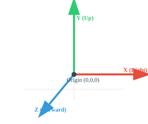
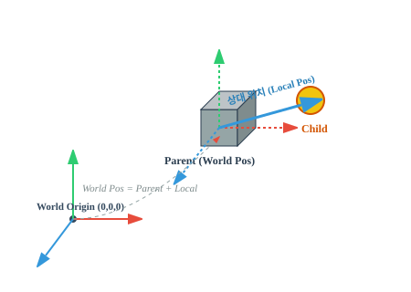
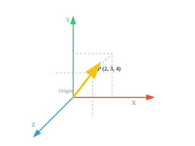
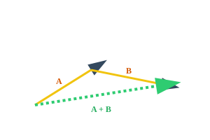
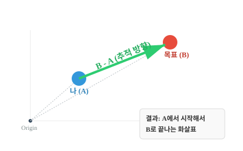
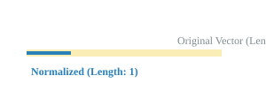

# 🚀 Day 01: 게임 수학 기초 (벡터와 공간)

오늘의 목표는 "**게임 공간을 구성하는 핵심 수학인 벡터 (Vector)를 이해하고, 유니티 엔진에서 오브젝트를 이동시키는 실습을 진행한다**"입니다. 전체 학습의 30%는 이론, 70%는 유니티 엔진 기반 실습으로 진행됩니다.

---

## 1. 벡터와 행렬 변환

### 📍 유니티의 3차원 좌표계
유니티는 **왼손 좌표계**(Left-handed)를 사용하며, 각 축은 고유한 색상으로 구분됩니다.

<div align="center">

  

  *[그림 1-1] 유니티 엔진의 표준 좌표축 (X:빨강, Y:초록, Z:파랑)*

</div>

### 📍 절대 좌표 vs 상대 좌표
게임 오브젝트가 어디에 있는지 말할 때, 기준이 누구냐에 따라 좌표가 달라집니다.

1. **절대 좌표 (World Space)**: 
   - **기준**: 전체 월드의 중심 (0, 0, 0).
   - **특징**: 변하지 않는 우주의 중심 원점입니다. `transform.position`으로 접근합니다.
2. **상대 좌표 (Local Space)**:
   - **기준**: 나를 감싸고 있는 **부모**(Parent)의 위치.
   - **특징**: 부모가 움직이면 나도 따라 움직이지만, 부모와의 거리는 변하지 않습니다. `transform.localPosition`으로 접근합니다.

<div align="center">

  

  *[그림 1-2] 3D 공간에서의 절대 좌표와 상대 좌표의 관계*

</div>

> 🚌 **비유**: 달리는 버스 안에서 내가 앞으로 한 걸음(Local +1m) 걸어갔을 때, 나의 실제 위치(World)는 버스가 달린 거리까지 포함한 값이 됩니다.

### 📍 벡터(Vector)란 무엇인가?
벡터는 공간에서 '**크기** (Magnitude)'와 '**방향** (Direction)'을 동시에 가진 화살표와 같습니다. 유니티에서 캐릭터의 위치, 이동할 방향, 가할 힘 등을 모두 이 벡터로 표현합니다.

- **성분 표현**: 3D 공간에서는 (x, y, z)라는 세 개의 숫자로 벡터를 나타냅니다.
- **예시**: (2, 3, 4) 벡터는 "원점에서 X축으로 2, Y축으로 3, Z축으로 4만큼 이동한 지점을 가리키는 화살표"입니다.

<div align="center">

  

  *[그림 1-3] 공간상의 한 점(2, 3, 4)을 가리키는 벡터 화살표*

</div>

### 📍 벡터의 주요 연산 (Vector Operations)
게임 개발에서 벡터 연산은 오브젝트의 이동, 방향 전환, 거리 계산 등에 필수적으로 사용됩니다.

#### 1. 벡터의 덧셈 (Addition)
- **방법**: 각 성분(x, y, z)끼리 더합니다. ($A + B = (x_1+x_2, y_1+y_2)$)
- **의미**: **연속적인 이동**. A만큼 이동한 후 B만큼 더 이동했을 때의 최종 위치를 나타냅니다.

<div align="center">

  

</div>

#### 2. 벡터의 뺄셈 (Subtraction) ⭐️ 핵심 중의 핵심
- **방법**: 각 성분끼리 뺍니다. ($B - A = (x_2-x_1, y_2-y_1)$)
- **의미**: "**A에서 B로 가려면 어디로 얼마나 가야 하는가?**" (방향과 거리)
- **실무 활용**: 몬스터가 플레이어를 추적할 때, (**플레이어 위치 - 몬스터 위치**)를 계산하면 몬스터가 움직여야 할 방향이 나옵니다.
- **암기법**: **"타겟(Target) - 나(Self)"** 또는 **"나중 - 처음"**

<div align="center">

  

</div>

> 🎯 **직관적 이해**: "내가(A) 목표(B)를 맞추기 위해 쏴야 하는 화살표가 바로 **B - A**입니다." 거꾸로 **A - B**를 하면 목표가 나를 쏘는 방향(도망쳐야 할 방향)이 됩니다.

#### 3. 스칼라 곱 (Scalar Multiplication)
- **방법**: 벡터에 숫자(스칼라)를 곱합니다. ($k \cdot A = (kx, ky)$)
- **의미**: 방향은 유지한 채 **길이**(**크기**)만 늘리거나 줄입니다. (예: 이동 속도 조절)

#### 4. 정규화 (Normalization)
- **의미**: 벡터의 크기를 **1**로 만드는 과정입니다. 이를 **단위 벡터** (**Unit Vector**)라고 부릅니다.
- **용도**: 순수하게 **'방향'** 정보만 필요할 때 사용합니다.
- **유니티**: `Vector3.normalized` 속성을 사용합니다.

<div align="center">

  

</div>

---

## 2. 유니티 Transform 제어

### 📍 Transform 컴포넌트 이해
유니티의 모든 게임 오브젝트는 반드시 **Transform** 컴포넌트를 가집니다. 이 컴포넌트는 오브젝트가 게임 세상(World) 또는 부모 공간(Local)에서 어디에 있고, 어느 방향을 보고 있으며, 얼마나 큰지를 결정합니다.

| 프로퍼티 명 | 기준 공간 | 데이터 타입 | 설명 |
| :--- | :--- | :--- | :--- |
| **position** | **World** | `Vector3` | 전체 월드의 원점(0,0,0) 기준 좌표 |
| **rotation** | **World** | `Quaternion` | 월드 절대 기준의 회전값 |
| **localPosition** | **Local** | `Vector3` | **부모** (**Parent**)의 위치를 (0,0,0)으로 본 상대 좌표 |
| **localRotation** | **Local** | `Quaternion` | 부모의 회전 상태를 기준(0,0,0)으로 본 상대 회전값 |
| **localScale** | **Local** | `Vector3` | 부모 대비 크기 배율 (기본값 1,1,1) |
| **lossyScale** | **World** | `Vector3` | 월드 기준의 최종 크기 (**Read Only**) |

> 💡 **꿀팁**: 
> 1. 부모가 없는 오브젝트는 `position`과 `localPosition` 값이 같습니다.
> 2. 에디터의 인스펙터(Inspector) 창에 표시되는 수치는 부모 기준인 **Local** 값들입니다.
> 3. `rotation`은 내부적으로 **Quaternion**을 사용하므로, 각도를 직접 수정할 때는 `localEulerAngles`를 자주 사용합니다.

### 📍 Transform의 계층 구조와 행렬
Transform은 부모-자식 관계를 통해 **계층 구조** (**Hierarchy**)를 형성합니다. 
- 자식의 `position`은 부모의 위치와 회전, 크기에 영향을 받아 최종적인 **World Position**이 계산됩니다.
- 이 계산 과정에는 수학의 **행렬(Matrix)** 연산이 숨어 있으며, 유니티가 이를 자동으로 처리해 줍니다.

---

**미션:** 유니티 엔진의 `Transform` 컴포넌트와 `Vector3` 구조체를 활용하여 플레이어 오브젝트를 키보드 입력에 따라 이동시키세요.

<details>
<summary>코드 보기</summary>

```csharp
using UnityEngine;
using UnityEngine.InputSystem; // 최신 인풋 시스템 네임스페이스

public class PlayerMovement : MonoBehaviour
{
    public float moveSpeed = 5f;

    void Update()
    {
        // 1. 사용자 입력 받기 (New Input System - Direct Read 방식)
        Vector2 inputVector = Vector2.zero;
        
        // 키보드 장치가 연결되어 있는지 확인 후 입력값 계산 (현대적인 is not null 사용)
        if (Keyboard.current is not null)
        {
            float h = 0;
            float v = 0;

            if (Keyboard.current.aKey.isPressed) h = -1;
            if (Keyboard.current.dKey.isPressed) h = 1;
            if (Keyboard.current.wKey.isPressed) v = 1;
            if (Keyboard.current.sKey.isPressed) v = -1;

            inputVector = new Vector2(h, v);
        }

        // 2. 방향 벡터 만들기 (입력은 2D 평면이지만 이동은 3D 공간의 X, Z축)
        Vector3 moveDir = new Vector3(inputVector.x, 0, inputVector.y).normalized;

        // 3. 실제 이동 처리 (벡터 * 스칼라(속도) * 시간)
        if (moveDir.magnitude > 0)
        {
            transform.Translate(moveDir * moveSpeed * Time.deltaTime, Space.World);
        }
    }
}
```

</details>

---

## ✍️ 평가 문항 대비 퀴즈
1. **문제:** 3D 공간에서 물체의 위치나 방향을 나타낼 때 사용하는 수학적 개념은 무엇입니까?
   - **정답:** 벡터(Vector)
2. **문제:** 부모 오브젝트의 위치를 기준으로 하는 자식 오브젝트의 좌표계를 무엇이라 합니까?
   - **정답:** 상대 좌표계 (Local Space)
