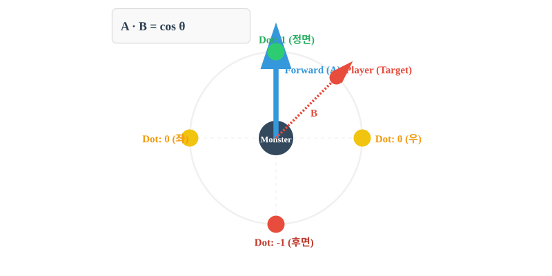
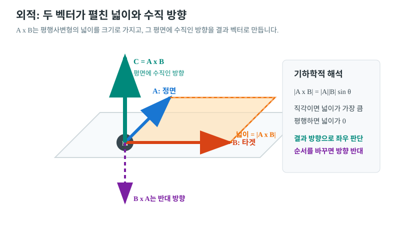

# 🚀 Day 02: 게임 수학 심화 (내적/외적과 회전)

오늘의 목표는 "**벡터의 내적과 외적을 통해 적의 시야를 판별하고, 쿼터니언 (Quaternion)을 이용해 짐벌락 현상 없이 물체를 회전시키는 법을 마스터한다**"입니다.

---

## 1. 벡터의 기초 연산 (Review)

본격적인 내적/외적 학습에 앞서, 계산에 필수적인 벡터의 크기와 방향을 구하는 공식을 복습합니다.

### 📍 벡터의 길이 (Magnitude)
공간상의 두 점 사이의 거리를 구할 때 사용하며, 피타고라스의 정리를 3차원으로 확장한 것과 같습니다.
- **공식**: 벡터 $A = (x, y, z)$ 일 때,
  $$|A| = \sqrt{x^2 + y^2 + z^2}$$
- **유니티**: `Vector3.magnitude` 속성으로 접근합니다.

### 📍 벡터의 정규화 (Normalization)
벡터의 크기를 **1**로 만들어 순수한 **'방향'** 정보만 남기는 과정입니다.
- **공식**: 벡터 $A$를 자신의 길이($|A|$)로 나눕니다.
  $$\hat{A} = \frac{A}{|A|} = \left( \frac{x}{|A|}, \frac{y}{|A|}, \frac{z}{|A|} \right)$$
- **유니티**: `Vector3.normalized` 속성을 사용합니다.

---

## 2. 벡터 연산과 쿼터니언

### 📍 내적 (Dot Product): "너 내 시야에 있니?"
두 벡터의 내적은 타겟이 나의 정면을 기준으로 어느 각도에 있는지 판별하는 데 사용됩니다.

- **공식 1 (기하학)**: $A \cdot B = |A||B| \cos \theta$
- **공식 2 (성분별)**: $A \cdot B = (x_1 \times x_2) + (y_1 \times y_2) + (z_1 \times z_2)$

#### 💡 내적 결과값의 의미 (단위 벡터 기준)
두 벡터의 크기가 1일 때(Normalized), 내적값은 오직 **두 벡터 사이의 각도** ($\cos \theta$)에 의해 결정됩니다.

| 내적값 | 각도 ($\theta$) | 방향 관계 | 의미 |
| :--- | :--- | :--- | :--- |
| **1** | $0^\circ$ | **동일 방향** | 두 벡터가 완전히 겹침 (정면) |
| **0.7** | $45^\circ$ | 대각선 방향 | 시야 범위 내에 있음 |
| **0** | $90^\circ$ | **직교 (수직)** | 내 옆에 있음 |
| **-1** | $180^\circ$ | **반대 방향** | 내 뒤에 있음 |

<div align="center">

  

  <p><i>[그림 2-1] 타겟 위치에 따른 내적 결과값 변화</i></p>

</div>

- **활용**: 몬스터 전방 벡터($A$)와 플레이어 방향 벡터($B$)의 내적값이 **0.5 이상이면 시야각 60도 이내**로 판단할 수 있습니다.
  - **벡터 $B$ 구하기**: `(플레이어 위치 - 몬스터 위치).normalized`
  - **원리**: 1일차에 배운 **벡터의 뺄셈**(Target - Me)을 통해 방향을 구하고, 이를 **정규화**(Normalization)하여 크기를 1로 맞춰야 정확한 $\cos\theta$ 값을 얻을 수 있습니다.

### 📍 외적 (Cross Product): "수직인 뿔 만들기"
두 벡터에 모두 수직인 세 번째 벡터를 구합니다. 유니티(왼손 좌표계)에서는 주로 **좌우 판별**이나 **표면의 방향**(Normal)을 구할 때 사용합니다.

- **공식 1 (기하학)**: $|A \times B| = |A||B| \sin \theta$ (결과값의 '크기'는 두 벡터가 만드는 평행사변형의 넓이)
- **공식 2 (성분별)**: $A \times B = (y_1z_2 - z_1y_2, z_1x_2 - x_1z_2, x_1y_2 - y_1x_2)$

#### 💡 좌우 판별 원리 (Left-Hand Rule)
유니티의 왼손 좌표계에서 **나의 정면**($A$)과 **타겟 방향**($B$)을 외적하면, 결과 벡터의 **Y축 값**을 통해 좌우를 알 수 있습니다.

| 외적 결과 (Y축) | 타겟의 위치 | 의미 |
| :--- | :--- | :--- |
| **양수 (+)** | **오른쪽 (Right)** | 타겟이 나의 우측에 있음 |
| **음수 (-)** | **왼쪽 (Left)** | 타겟이 나의 좌측에 있음 |
| **0** | **정면 또는 후면** | 두 벡터가 평행함 (내적값이 1 또는 -1인 상태) |

<div align="center">

  

  <p><i>[그림 2-2] 왼손 법칙을 이용한 외적 결과 방향(엄지) 판별</i></p>

</div>


---

## 2. 적 시야 판별 및 부드러운 회전
**미션:** 몬스터가 플레이어를 향해 부드럽게 회전하고, 플레이어가 몬스터의 시야각(전방 60도) 내에 들어왔는지 내적(`Vector3.Dot`)을 이용해 판별하세요.

<details>
<summary>코드 보기</summary>

```csharp
using UnityEngine;

public class MonsterSight : MonoBehaviour
{
    public Transform player;
    public float sightAngle = 60f; // 시야각 (좌우 합쳐 120도)
    public float rotSpeed = 3f;

    void Update()
    {
        Vector3 dirToPlayer = (player.position - transform.position).normalized;

        // 1. 내적을 이용한 시야 판별
        float dot = Vector3.Dot(transform.forward, dirToPlayer);
        float angle = Mathf.Acos(dot) * Mathf.Rad2Deg; // 아크코사인으로 각도 추출

        if (angle < sightAngle)
        {
            Debug.Log("플레이어 발견!");
            
            // 2. 쿼터니언을 이용한 부드러운 회전(Slerp)
            Quaternion targetRot = Quaternion.LookRotation(dirToPlayer);
            transform.rotation = Quaternion.Slerp(transform.rotation, targetRot, rotSpeed * Time.deltaTime);
        }
    }
}
```

</details>

---

## ✍️ 평가 문항 대비 퀴즈
1. **문제:** 두 벡터 사이의 각도를 구하거나, 타겟이 내 앞/뒤 어디에 있는지 판별할 때 주로 쓰이는 수학 연산은?
   - **정답:** 내적 (Dot Product)
2. **문제:** 3D 회전 시 축이 겹쳐 회전 자유도를 잃는 현상을 방지하기 위해 유니티 엔진에서 내부적으로 사용하는 회전 체계는?
   - **정답:** 쿼터니언 (Quaternion)
