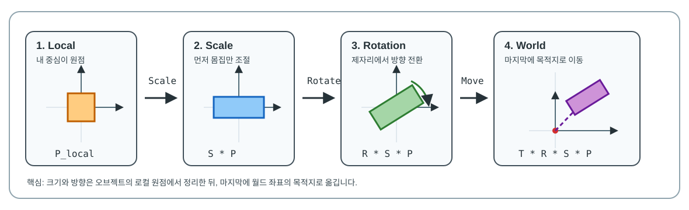
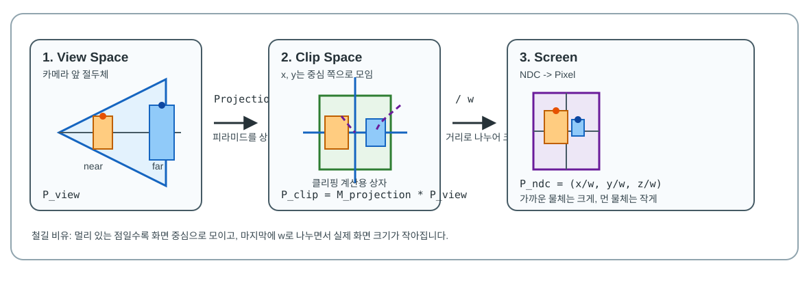

# 🚀 Day 03: 게임 수학 - 행렬과 변환 (Matrix & Transform)

오늘의 목표는 "**공간의 변환을 담당하는 행렬 (Matrix)의 원리를 이해하고, 월드 (World)와 로컬 (Local) 좌표계 간의 변환 과정을 마스터한다**"입니다.

---

## 1. 행렬(Matrix)이란? : "공간의 지도"
행렬은 여러 개의 숫자를 사각형 모양으로 배열한 것입니다. 게임에서는 주로 4x4 행렬을 사용하여 오브젝트의 **위치** (Translation), **회전** (Rotation), **크기** (Scale) 정보를 하나로 합쳐서 관리합니다.

### 📍 행렬 연산의 의미
- **행렬의 곱**: 두 변환을 합치는 과정입니다. (예: 회전시킨 후 이동하기)
- **변환 순서 (SRT)**: 유니티를 포함한 대부분의 엔진은 **Scale -> Rotation -> Translation** 순서로 행렬을 곱하여 최종 위치를 계산합니다. 순서가 바뀌면 오브젝트가 찌그러지거나 원하지 않는 궤도로 이동할 수 있습니다.

#### 💡 왜 SRT 순서인가요? (유니티 Transform 예시)


1. **Scale (크기)**: 먼저 오브젝트 자체의 크기를 결정합니다. (`transform.localScale`)
   - 만약 이동(T) 후에 크기(S)를 키우면, 원점으로부터의 거리까지 함께 커져버려 오브젝트가 엉뚱한 곳으로 날아갑니다.
2. **Rotation (회전)**: 결정된 크기를 바탕으로 제자리에서 회전합니다. (`transform.localRotation`)
   - 만약 이동(T) 후에 회전(R)을 하면, 오브젝트가 자신의 중심이 아닌 '세상의 중심(원점)'을 기준으로 크게 원을 그리며 회전하게 됩니다.
3. **Translation (이동)**: 크기와 회전이 완료된 오브젝트를 최종 목적지로 옮깁니다. (`transform.localPosition`)
   - 모든 로컬 변형이 끝난 상태에서 옮겨야 우리가 의도한 "그 자리"에 정확히 배치됩니다.

> 💡 **그림 읽기:** 행렬은 오브젝트를 잡아당기는 보이지 않는 손잡이입니다. 먼저 로컬 원점에서 몸집을 맞추고, 그 자리에서 방향을 돌린 다음, 마지막에 월드 좌표의 목적지로 옮기면 "내 중심 기준 변형"과 "세상 기준 배치"가 서로 섞이지 않습니다.

---

## 2. 좌표계 변환 (Coordinate Space Transformation)
오브젝트가 렌더링되기 위해서는 여러 좌표계를 거쳐야 합니다.

1. **로컬 공간** (Local Space): 오브젝트 자신의 중심이 (0,0,0)인 공간. (`transform.localPosition`)
2. **월드 공간** (World Space): 게임 세상의 절대 원점이 기준인 공간. (`transform.position`)
3. **뷰 공간** (View Space): 카메라가 원점이 되는 공간.
4. **투영 공간** (Projection Space): 3D 공간을 2D 화면으로 찌그러뜨린 공간.

> 💡 **핵심**: 부모-자식 관계에서 자식의 월드 위치는 **[부모의 월드 행렬] x [자식의 로컬 행렬]**로 계산됩니다.

---

## 💻 실습 예제: 행렬을 이용한 좌표 변환 시뮬레이션
유니티의 `Matrix4x4` 클래스를 활용하여 로컬 좌표를 월드 좌표로 직접 계산해 봅니다. 에디터에서 오브젝트를 움직여보며 실시간으로 변화를 확인하세요.

<details>
<summary>코드 보기</summary>

```csharp
using UnityEngine;

public class MatrixTest : MonoBehaviour
{
    // 기즈모를 사용하여 에디터 뷰에서 실시간으로 확인
    // OnDrawGizmos는 씬 뷰에 디버그용 도형을 그릴 때 유니티가 자동 호출하는 메서드입니다.
    void OnDrawGizmos()
    {
        // 1. 현재 오브젝트의 로컬->월드 변환 행렬 가져오기
        // (내부적으로 Translation * Rotation * Scale이 결합된 상태)
        // transform.localToWorldMatrix는 로컬 좌표를 월드 좌표로 바꾸는 변환 행렬 프로퍼티입니다.
        Matrix4x4 worldMatrix = transform.localToWorldMatrix;

        // 2. 로컬 상의 특정 점 (예: 내 오른쪽으로 2미터 지점)
        Vector3 localPos = new Vector3(2f, 0, 0);

        // 3. 행렬 곱을 통해 월드 좌표로 변환
        // MultiplyPoint3x4는 4x4 행렬을 3D 점에 적용하는 가장 일반적인 방법입니다.
        Vector3 worldPos = worldMatrix.MultiplyPoint3x4(localPos);

        // 시각화
        // Gizmos.color는 이후에 그릴 기즈모 도형의 색상을 지정하는 프로퍼티입니다.
        // Color.yellow는 유니티가 미리 제공하는 노란색 값입니다.
        Gizmos.color = Color.yellow;
        // Gizmos.DrawLine은 씬 뷰에 두 점을 잇는 선을 그리는 메서드입니다.
        Gizmos.DrawLine(transform.position, worldPos); // 원점에서 변환된 점까지 선 그리기
        // Gizmos.DrawSphere는 씬 뷰에 작은 구를 그려 특정 위치를 표시하는 메서드입니다.
        Gizmos.DrawSphere(worldPos, 0.1f);            // 변환된 최종 위치에 구체 그리기
        
        // 결과 출력 (프레임마다 찍히지 않도록 필요 시에만 사용)
        // Debug.Log($"로컬(2,0,0) -> 월드({worldPos})");
    }
}
```

</details>

---

## 💻 추가 실습 예제: `TransformPoint` 계열 메서드 한 번에 비교하기
앞 예제는 행렬로 로컬 좌표를 월드 좌표로 직접 바꾸는 방법을 확인했습니다. 유니티에서는 이 작업을 더 쉽게 하기 위해 `TransformPoint`, `TransformDirection`, `TransformVector`와 그 반대 방향인 `Inverse...` 메서드를 제공합니다.

이름이 비슷해서 헷갈리기 쉽지만, 기준은 간단합니다. **점(Point)** 은 "어디에 있는가", **방향(Direction)** 은 "어느 쪽을 보는가", **벡터(Vector)** 는 "얼마나 밀리는가"를 뜻합니다.

| 메서드 | 변환 방향 | 위치 이동 반영 | 회전 반영 | 크기 반영 | 언제 쓰나요? |
| :--- | :--- | :---: | :---: | :---: | :--- |
| `TransformPoint` | 로컬 -> 월드 | O | O | O | 내 기준 `(2, 0, 0)` 지점에 이펙트 생성 |
| `InverseTransformPoint` | 월드 -> 로컬 | O | O | O | 대상이 내 기준 앞/뒤/좌/우 어디에 있는지 판정 |
| `TransformDirection` | 로컬 -> 월드 | X | O | X | 내 앞 방향을 월드 방향으로 변환 |
| `InverseTransformDirection` | 월드 -> 로컬 | X | O | X | 월드 방향 입력을 내 기준 방향으로 변환 |
| `TransformVector` | 로컬 -> 월드 | X | O | O | 내 기준 밀림량, 넉백량, 오프셋 벡터 변환 |
| `InverseTransformVector` | 월드 -> 로컬 | X | O | O | 월드 속도나 이동량을 내 기준 값으로 분석 |

위 메서드들은 모두 `Vector3`를 넣는 방식과 `x, y, z` 값을 따로 넣는 방식 두 가지를 지원합니다. 예를 들어 `transform.TransformPoint(new Vector3(2f, 0f, 0f))`와 `transform.TransformPoint(2f, 0f, 0f)`는 같은 의미입니다.

> 💡 **기억법:** `Point`는 지도 위의 핀이라서 위치 이동까지 영향을 받습니다. `Direction`은 화살표의 방향만 보는 것이므로 크기와 위치 이동은 무시합니다. `Vector`는 이동량 화살표라서 위치 이동은 무시하지만, 크기 배율은 영향을 받습니다.

<details>
<summary>코드 보기</summary>

```csharp
using UnityEngine;

public class TransformSpaceMethodTest : MonoBehaviour
{
    public Transform target;

    void Update()
    {
        if (target == null)
        {
            return;
        }

        // 1. Point: 위치 좌표를 변환합니다. 이동, 회전, 크기의 영향을 모두 받습니다.
        Vector3 localSpawnPoint = new Vector3(2f, 0f, 0f);
        Vector3 worldSpawnPoint = transform.TransformPoint(localSpawnPoint);
        Vector3 targetLocalPoint = transform.InverseTransformPoint(target.position);

        // 2. Direction: 방향만 변환합니다. 위치와 크기는 무시하고 회전만 반영합니다.
        Vector3 localForwardDirection = Vector3.forward;
        Vector3 worldForwardDirection = transform.TransformDirection(localForwardDirection);
        Vector3 targetDirectionInWorld = (target.position - transform.position).normalized;
        Vector3 targetDirectionInLocal = transform.InverseTransformDirection(targetDirectionInWorld);

        // 3. Vector: 이동량이나 힘의 크기를 변환합니다. 위치 이동은 무시하고 회전과 크기를 반영합니다.
        Vector3 localKnockbackVector = new Vector3(0f, 0f, 3f);
        Vector3 worldKnockbackVector = transform.TransformVector(localKnockbackVector);
        Vector3 localVelocityVector = transform.InverseTransformVector(worldKnockbackVector);

        string forwardState = targetLocalPoint.z >= 0f ? "앞" : "뒤";
        string sideState = targetLocalPoint.x >= 0f ? "오른쪽" : "왼쪽";

        Debug.Log($"TransformPoint: 로컬 {localSpawnPoint} -> 월드 {worldSpawnPoint}");
        Debug.Log($"InverseTransformPoint: 대상은 내 기준 {forwardState}, {sideState} / 로컬 좌표 {targetLocalPoint}");
        Debug.Log($"TransformDirection: 내 앞 방향 -> 월드 방향 {worldForwardDirection}");
        Debug.Log($"InverseTransformDirection: 대상 방향 -> 내 기준 방향 {targetDirectionInLocal}");
        Debug.Log($"TransformVector: 로컬 넉백량 {localKnockbackVector} -> 월드 넉백량 {worldKnockbackVector}");
        Debug.Log($"InverseTransformVector: 월드 넉백량 -> 로컬 이동량 {localVelocityVector}");
    }

    void OnDrawGizmos()
    {
        Vector3 worldSpawnPoint = transform.TransformPoint(2f, 0f, 0f);
        Vector3 worldForwardDirection = transform.TransformDirection(Vector3.forward);
        Vector3 worldKnockbackVector = transform.TransformVector(0f, 0f, 3f);

        Gizmos.color = Color.yellow;
        Gizmos.DrawSphere(worldSpawnPoint, 0.12f);

        Gizmos.color = Color.blue;
        Gizmos.DrawLine(transform.position, transform.position + worldForwardDirection * 2f);

        Gizmos.color = Color.red;
        Gizmos.DrawLine(transform.position, transform.position + worldKnockbackVector);
    }
}
```

</details>

### 실행해 볼 것
1. 빈 GameObject를 만들고 `TransformSpaceMethodTest` 스크립트를 붙입니다.
2. `target` 칸에 플레이어나 다른 큐브 Transform을 연결합니다.
3. 이 오브젝트의 Position, Rotation, Scale을 바꿔 보며 Console과 Scene 뷰의 노란 점, 파란 선, 빨간 선이 어떻게 달라지는지 확인합니다.
4. Scale을 `(2, 1, 1)`처럼 바꿨을 때 `Direction` 결과와 `Vector` 결과가 어떻게 다르게 반응하는지 비교합니다.

> 💡 **핵심:** 무언가의 "**위치**"를 바꾸면 `Point`, "**방향**"만 바꾸면 `Direction`, "**이동량이나 힘의 크기**"를 바꾸면 `Vector`를 고릅니다. 반대로 되돌릴 때는 이름 앞에 `Inverse`가 붙습니다.

---

## 🎯 [심화 미션] 몬스터 사냥 시스템: 공간 변환과 위치 추적
### [요구 사항]
- 보스 몬스터가 소환하는 '마법진'의 위치를 월드 좌표가 아닌 보스 몬스터의 로컬 좌표계를 기준으로 배치하는 시스템을 설계하세요.
- 보스가 회전하거나 이동하더라도 마법진들이 보스의 주변에 일정한 간격으로 유지되어야 합니다.
- 행렬 변환(TRS) 순서가 결과에 미치는 영향을 고려하여 설계하세요.

### [프로그래밍 힌트]
- `transform.localToWorldMatrix`를 사용하여 로컬 좌표의 점을 월드 좌표로 변환할 수 있습니다.
- 반대로 이미 월드에 있는 대상의 위치를 보스 기준 로컬 좌표로 확인하려면 `transform.InverseTransformPoint(target.position)`를 사용할 수 있습니다.
- 자식 오브젝트로 등록하지 않고 코드상에서 행렬 연산만으로 위치를 계산해 보세요.

## ✍️ 평가 문항 대비 퀴즈
1. **문제:** 오브젝트의 이동, 회전, 크기 변환 정보를 하나의 수식으로 처리하기 위해 사용하는 수학적 도구는 무엇입니까?
   - **정답:** 행렬 (Matrix)
2. **문제:** 유니티에서 자식 오브젝트의 좌표를 월드 좌표로 변환할 때 사용하는 행렬 프로퍼티 이름은?
   - **정답:** `transform.localToWorldMatrix`
3. **문제:** 월드 좌표의 대상을 현재 오브젝트 기준 로컬 좌표로 바꿀 때 사용하는 Transform 메서드 이름은?
   - **정답:** `transform.InverseTransformPoint`

---

## 📎 별첨 1: 월드 좌표에서 화면(Screen)까지의 여정 (심화)

3D 세상의 한 점이 모니터 픽셀로 변환되는 과정은 **그래픽스 파이프라인** (Graphics Pipeline)의 핵심이며, 총 4단계의 수학적 변환을 거칩니다.



### 1단계: 뷰 변환 (View Transform)
- **공간 이동:** 월드 공간 -> **뷰 공간** (View/Eye Space)
- **상세 설명:** 카메라를 시점의 원점으로 만듭니다. 카메라의 월드 행렬의 역행렬을 곱하여 모든 물체를 카메라 기준으로 재정렬합니다.
- **직관적 비유 (상대성 원리):** 
  - 컴퓨터는 무조건 원점 `(0, 0, 0)` 에서 앞을 바라보는 카메라 기준으로만 화면을 그릴 수 있는 한계가 있습니다.
  - 이를 해결하기 위해 카메라는 제자리에 두고, **"카메라가 움직인 정반대의 방향"** (역행렬) 으로 세상의 모든 사물을 통째로 밀고 돌려서 카메라 코앞에 갖다 대령하는 방식입니다. (카메라맨이 우측으로 3걸음 가면 세상 전체를 좌측으로 3걸음 밀어버리는 원리)
- **핵심:** `P_view = ViewMatrix * P_world` (여기서 `ViewMatrix` 는 카메라 월드 행렬의 **역행렬** (Inverse Matrix) 입니다.)

### 2단계: 투영 변환 (Projection Transform) - 🔍 심층 분석
- **공간 이동:** 뷰 공간 -> **클립 공간** (Clip Space)
- **수학적 목적:** 카메라의 시야 범위인 피라미드 모양의 **절두체** (Frustum) 공간을, 연산하기 편한 정육면체 모양의 **정규 뷰 볼륨** (Canonical View Volume)으로 매핑하는 단계입니다.
- **왜 상자로 만드나요?** 상자 모양의 **NDC** (Normalized Device Coordinates) 공간으로 매핑하기 전 단계인 클립 공간으로 옮겨놓아야, 화면 밖의 물체를 잘라내는 **클리핑** (Clipping) 계산이 매우 빠르고 효율적으로 처리되기 때문입니다.
  - **NDC (Normalized Device Coordinates, 정규화된 장치 좌표계) 의 핵심 기술적 의의:**
    - **하드웨어 독립성 (Device Independence):** 최종 출력되는 디바이스의 모니터 해상도(예: 1920x1080, 3840x2160 등)나 화면 비율에 구애받지 않도록 모든 3D 공간 좌표를 가로/세로/깊이 `[-1, 1]` 범위(Direct3D의 Z축은 `[0, 1]`)의 표준화된 정육면체 상자 안으로 맞추는 좌표계입니다.
    - 덕분에 그래픽 카드는 모니터 규격이 무엇이든 상관없이 동일한 표준 수식으로 투영 및 클리핑 연산을 신속하게 재사용할 수 있습니다.
- **원근감의 비밀 (철길의 비유):** 
  - 카메라의 시야 공간(절두체)은 뒤로 갈수록 피라미드처럼 넓어집니다. 이 넓은 뒤쪽 공간의 물체들을 일정한 크기의 정육면체 상자(NDC)에 강제로 매핑하려면, **멀리 있는 물체일수록 원래의 x, y 좌표를 중심 쪽으로 강하게 압축하여 좁게 모아야만** 상자 안에 예쁘게 들어갑니다.
  - 이것은 마치 쭉 뻗은 기차 선로를 바라볼 때, 내 발밑의 철길은 양옆으로 넓게 벌어져 보이지만 **멀리 있는 철길은 지평선의 한 점으로 좁게 모여 보이는 원리**와 같습니다.
  - 즉, 투영 행렬은 멀리 있을수록 x, y 좌표를 중심 쪽으로 조이고, 대신 4차원 벡터의 `w` 값에 카메라로부터의 거리를 따로 저장해 둡니다. 나중에 이 `w` 값으로 실제 나누기 연산(투영 분할)을 하면서 멀리 있는 물체가 극적으로 작아 보이는 원근법이 최종 구현됩니다.
- **그림 읽기:** 왼쪽의 절두체에서는 뒤쪽 공간이 넓지만, 가운데의 클립 공간에서는 같은 계산 규칙을 쓰기 위해 상자 안으로 모입니다. 이때 먼 물체의 위치가 중심 쪽으로 먼저 당겨지고, 오른쪽 화면 단계에서 `w` 로 나누며 최종 크기가 작아집니다.
- **핵심 파라미터:** FOV (시야각), Aspect Ratio (가로세로비), Near/Far (절단면) 설정이 이 행렬의 모양을 결정합니다.

### 3단계: 투영 분할 (Perspective Division)
- **공간 이동:** 클립 공간 -> **NDC 공간** (Normalized Device Coordinates)
- **상세 설명:** 4차원 벡터의 x, y, z를 w로 나눕니다. 이 나눗셈을 통해 멀리 있는 물체는 작아지고 가까운 물체는 커지는 실제 원근법이 시각적으로 완성됩니다. 모든 좌표는 -1 ~ 1 사이로 고정됩니다.
- **핵심:** `P_ndc = (x/w, y/w, z/w)`
- **💡 1분 직관 요약 (원근 표현의 핵심 메커니즘):**
  - **원근 투영 (Perspective):** **투영 변환** 단계에서 멀리 있는 사물을 시선 중심으로 모아 **상대적인 위치를 조정**하고 ➡️ **투영 분할** 단계에서 실제 거리 정보(`w` 성분)로 모든 좌표를 나누어 화면상의 **최종 크기를 조정**함으로써 원근감을 완성합니다.
  - **직교 투영 (Orthographic):** 시야가 늘 평행하므로, 거리에 따른 **위치 조정과 크기 조정 과정이 모두 생략**됩니다.

### 4단계: 뷰포트 변환 (Viewport Transform)
- **공간 이동:** NDC 공간 -> **화면 공간** (Screen/Pixel Space)
- **상세 설명:** -1 ~ 1 사이의 비율 값을 실제 모니터 해상도 (예: 1920x1080)의 픽셀 위치로 매핑합니다.
- **수식:** `Pixel_X = (x + 1) * Width / 2`, `Pixel_Y = (1 - y) * Height / 2`

---

## 📎 별첨 2: 직교 투영 (Orthographic Projection)

모든 카메라가 원근감을 가지는 것은 아닙니다. **직교 투영**은 거리와 상관없이 물체의 크기를 일정하게 유지하는 방식입니다.

### 1. 주요 특징
- **평행 투영:** 모든 투영선이 카메라 방향과 평행합니다. 따라서 멀리 있는 물체와 가까이 있는 물체의 크기가 화면상에서 동일하게 보입니다.
- **시야 공간:** 절두체(Frustum)가 아닌 **직육면체(Box)** 형태의 시야 공간을 가집니다.
- **x, y 좌표 축소(왜곡) 생략:** 
  - 원근 투영과 달리 뒤로 갈수록 공간이 넓어지지 않기 때문에, 멀리 있는 물체라고 해서 **x, y 좌표를 시선 중심으로 좁히고 압축하는 왜곡 과정이 완전히 생략**됩니다.
  - 모든 물체가 카메라 방향과 평행하게 그대로 상자 안에 매핑됩니다.
- **w 값의 역할:** 직교 투영 행렬은 `w` 값을 보통 `1`로 고정하거나 거리와 무관하게 처리합니다. 즉, 3단계의 **원근 나눗셈** (Perspective Division) 을 진행해도 좌표 값에 크기 변화가 발생하지 않습니다.

### 2. 언제 사용하나요?
- **2D 게임:** 캐릭터나 배경의 깊이와 상관없이 일관된 크기로 보여야 할 때.
- **UI / HUD:** 화면 위에 고정된 정보를 표시할 때.
- **쿼터뷰 / 아이소메트릭:** 《디아블로》나 《문명》처럼 일정한 비율의 부감 시점을 유지해야 할 때.
- **CAD / 설계:** 치수와 비율이 정밀하게 유지되어야 하는 도면 제작 시.

### 3. 비교 요약
| 구분 | 원근 투영 (Perspective) | 직교 투영 (Orthographic) |
| :--- | :--- | :--- |
| **시야 모양** | 절두체 (피라미드) | 직육면체 (박스) |
| **거리와 크기** | 멀수록 작아짐 (원근감 있음) | 거리에 상관없이 일정 (원근감 없음) |
| **주요 용도** | 3D 액션, 레이싱, VR/AR | 2D 플랫포머, UI, 시뮬레이션 |
| **유니티 설정** | Camera - Projection - Perspective | Camera - Projection - Orthographic |

---

### 📌 요약: 최종 렌더링 공식
> `P_screen = M_viewport * (M_projection * M_view * M_world * P_local) / w`

이 과정을 통해 3D 월드의 한 점이 우리가 보는 2D 화면의 정확한 픽셀 위치로 결정됩니다.

---

