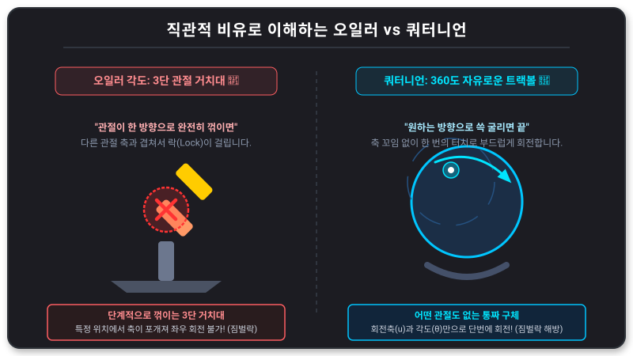

# 🚀 Day 04: 게임 수학 - 회전과 사원수 (Quaternion & Slerp)

오늘의 목표는 "**오일러 각도의 한계를 극복하는 쿼터니언 (사원수)의 개념을 이해하고, 부동 소수점 오차 없는 부드러운 회전을 구현한다**"입니다.

---

## 1. 오일러 각도 (Euler Angles)와 짐벌락 (Gimbal Lock)
우리가 흔히 쓰는 (x, y, z) 각도 표현은 직관적이지만 치명적인 단점이 있습니다.

- **오일러 각도**: 세 축을 순서대로 회전시키는 방식.
- **짐벌락 현상**: 두 회전축이 겹쳐지면서 한 축의 자유도를 상실하는 현상입니다. (예: 위를 쳐다볼 때 좌우 회전이 꼬이는 경우)



### 💡 실생활 비유로 단박에 이해하는 회전의 차이
1. **오일러 각도는 "3단 꺾임 스마트폰 거치대" 입니다.**
   - 상하, 좌우, 기울임용 관절 쇠막대가 하나씩 연결되어 있어, 폰이 하늘을 보게 90도로 완전히 꺾어버리는 순간, 원래 좌우로 돌리는 축과 기울임축이 일직선으로 포개져서 좌우 조작이 먹통이 되는 **짐벌락** (Gimbal Lock) 이 발생합니다.
2. **쿼터니언은 "손바닥 위에 얹은 둥근 농구공 (트랙볼)" 입니다.**
   - 애초에 엉킬 관절 자체가 없는 완벽한 원형 구체이므로, 원하는 방향으로 손끝 하나로 쓱 굴려버리면 단 한 번의 움직임으로 꼬임 없이 부드럽게 회전합니다.

### 🎮 실전 FPS 게임의 꼼수: "왜 카메라 상하 각도는 89도에서 멈출까?"
- FPS 게임에서 마우스를 끝까지 올려 하늘을 똑바로 쳐다보는 순간(Pitch 90도), 카메라 좌우 축과 기울임 축이 겹치는 짐벌락이 일어납니다. 이 상태에서 마우스를 돌리면 화면이 제자리에서 팽이처럼 빙글빙글 돌고 조작이 튀게 됩니다.
- 전 세계 모든 FPS 게임 개발자들은 이 현상을 방지하기 위해, 카메라 상하 각도가 정확히 90도에 도달하기 전인 **`89도 ~ 89.9도`** 에서 강제로 멈추도록 **클램프** (Clamp) 제약을 걸어두는 정교한 우회 전략을 사용합니다!

---

## 2. 쿼터니언 (Quaternion): "**4차원 복소수 회전**"
유니티는 내부적으로 회전을 처리할 때 4개의 성분(x, y, z, w)을 가진 쿼터니언을 사용합니다.

### 📍 쿼터니언의 장점
1. **짐벌락이 없습니다.**
2. **회전 보간** (Interpolation)이 매우 부드럽고 정확합니다.
3. 행렬보다 메모리를 적게 사용하고 연산 속도가 빠릅니다.

---

## 3. 부드러운 회전의 핵심: Slerp
단순한 숫자 더하기가 아닌, 구면 위를 따라 최단 거리로 회전하는 기술입니다.

- **Lerp** (Linear Interpolation): 직선 보간.
- **Slerp** (Spherical Linear Interpolation): 구면 선형 보간. (회전에서 주로 사용)

---

## 💻 실습 예제: 대상을 향해 부드럽게 고개 돌리기
```csharp
using UnityEngine;

public class SmoothRotation : MonoBehaviour
{
    public Transform target;
    public float rotationSpeed = 2f;

    void Update()
    {
        if (target == null) return;

        // 1. 목표 방향 계산 (Target - Me)
        Vector3 direction = (target.position - transform.position).normalized;

        // 2. 방향을 쿼터니언 회전값으로 변환
        Quaternion targetRotation = Quaternion.LookRotation(direction);

        // 3. 현재 회전에서 목표 회전까지 부드럽게 보간 (Slerp)
        transform.rotation = Quaternion.Slerp(transform.rotation, targetRotation, rotationSpeed * Time.deltaTime);
    }
}
```

---

## 🎯 [심화 미션] 몬스터 사냥 시스템: 짐벌락 없는 정밀한 조준
### [요구 사항]
- 하늘을 나는 비행 몬스터가 지상의 플레이어를 조준할 때, 수직 방향 (Pitch)으로 90도 근처에서도 회전 오류 없이 부드럽게 바라보는 시스템을 구상하세요.
- 단순히 방향만 보는 것이 아니라, 몬스터의 날개 수평 (Roll)을 지면과 평행하게 유지하면서 조준해야 합니다.

### [프로그래밍 힌트]
- `Quaternion.LookRotation`의 두 번째 매개변수 (Up 벡터)를 활용하여 수평을 제어할 수 있습니다.
- `Quaternion.Slerp`를 사용하여 회전 속도를 조절해 보세요.

## ✍️ 평가 문항 대비 퀴즈
1. **문제:** 오일러 각도 방식으로 회전할 때 두 축이 겹쳐 회전이 불가능해지는 현상을 무엇이라 합니까?
   - **정답:** 짐벌락 (Gimbal Lock)
2. **문제:** 두 회전값 사이를 최단 경로로 부드럽게 연결해 주는 보간 함수의 이름은?
   - **정답:** Slerp (구면 선형 보간)

---

## 📎 별첨: 사원수의 수학적 원리와 회전 계산 (심화)

사원수 (Quaternion)는 1843년 윌리엄 로언 해밀턴이 발견한 수 체계로, 3차원 공간상의 회전을 표현하는 가장 효율적인 도구입니다.

### 1. 사원수의 정의
사원수는 하나의 실수부와 세 개의 허수부로 구성된 4차원 복소수입니다.
- **수식:** `q = w + xi + yj + zk` (단, `i^2 = j^2 = k^2 = ijk = -1`)
- 유니티에서는 `(x, y, z, w)` 순서로 표시하지만, 수학적으로는 `w`가 회전량과 관련된 실수부이며 `(x, y, z)`는 회전축과 관련된 허수부 벡터입니다.

### 2. 회전의 표현 (Axis-Angle)
임의의 축 `u = (ux, uy, uz)`를 기준으로 `θ`만큼 회전하고자 할 때, 이를 사원수로 변환하는 공식은 다음과 같습니다.
- `w = cos(θ / 2)`
- `x = ux * sin(θ / 2)`
- `y = uy * sin(θ / 2)`
- `z = uz * sin(θ / 2)`
- **특징:** 모든 유효한 회전 사원수의 크기 (Magnitude)는 항상 "**1**" (Unit Quaternion)이어야 합니다.

### 3. 실제 회전 계산 과정 (Hamilton Product)
3차원 상의 한 점 `v`를 사원수 `q`를 이용하여 회전시키는 수학적 과정은 다음과 같습니다.

1. **점의 사원수화:** 3차원 위치 벡터 `v(vx, vy, vz)`를 실수부가 0인 사원수 `p = (vx, vy, vz, 0)`로 변환합니다.
2. **회전 적용:** 사원수 곱셈을 사용하여 다음과 같이 계산합니다.
   - `p' = q * p * q^-1` (여기서 `q^-1`은 `q`의 역사원수입니다.)
3. **결과 추출:** 계산된 `p'`의 허수부 `(x', y', z')`가 바로 회전된 새로운 좌표값이 됩니다.

### 4. 왜 쿼터니언을 쓰는가?
- **연속성:** 오일러 각도는 특정 각도 (90도 등)에서 값이 튀는 현상이 있지만, 쿼터니언은 4차원 구면 위를 매끄럽게 이동하므로 회전이 끊기지 않습니다.
- **보간:** 두 회전 사이의 중간값을 찾을 때, `Slerp`를 이용하면 속도가 일정한 완벽한 구면 회전을 계산할 수 있습니다.

### 5. 유니티에서의 활용과 "**업 벡터 (Up Vector)**"의 중요성
쿼터니언 회전에서 가장 중요한 것은 "**어떤 축을 기준으로 돌릴 것인가**"가 명확하다는 점입니다.
- **LookRotation과 기준면:** 유니티의 `Quaternion.LookRotation(forward, up)` 함수는 앞 (Forward) 방향뿐만 아니라 위 (Up) 방향을 함께 입력받습니다. `up` 벡터를 명시함으로써 회전의 **기준면**을 고정하고, 물체가 의도치 않게 구르는 (Roll) 현상을 방지하여 유일한 회전 해를 찾습니다.
- **오른손 법칙과 방향성:** 명확한 축 (Up)이 세워지면 회전의 방향이 유일하게 결정되므로, 오일러 방식처럼 회전 중에 축이 겹쳐 예측 불가능해지는 짐벌락 현상을 원천적으로 차단합니다.

> 💡 **요약:** 쿼터니언은 "**축 (Axis)**"과 "**각도 (Angle)**" 정보를 4차원 공간에 압축하여 저장하고, 허수 연산을 통해 짐벌락 없이 점을 회전시키는 수학적 마법입니다. 특히 기준이 되는 축 (Up Vector)이 확실할 때 그 주변을 도는 궤적이 단 하나로 결정되어 완벽한 회전 제어가 가능합니다.

---

## 🎯 NCS 수행준거 평가 가이드

본 4일차 수업 내용은 NCS 게임 알고리즘 능력단위의 **"게임 수학 적용하기"** 및 **"렌더링 파이프라인 수행 (사원수, 절두체 차폐 선별, URP 커스텀 렌더링)"** 준거와 깊이 연계됩니다.

### 1. 서술형 평가 대비 포인트
* **짐벌락(Gimbal Lock)의 발생 원인과 쿼터니언 해결 원리**: 오일러 각도의 고유 한계(특정 회전 시 두 축이 정렬되어 자유도가 2D로 상실되는 현상)를 서술하고, 쿼터니언이 4차원 복소수 공간상의 단일 회전축 및 각도 정보로 짐벌락을 회피하는 원리를 기술해야 합니다.
* **구면 선형 보간(Slerp)의 장점**: Lerp(직선형) 대비 Slerp(구면형)의 최단 구면 경로 회전 및 각속도 일정 유지 특성을 비교 설명할 수 있어야 합니다.
* **절두체 차폐 선별(Frustum Culling)**: 카메라 시야 범위(View Frustum)의 6개 평면 방정식($Ax + By + Cz + D = 0$)과 물체의 바운딩 볼륨(AABB/OBB) 간의 내적 부호 판정($d > 0$ 이면 절두체 내부, $d < 0$ 이면 외부 Culling) 원리를 서술할 수 있어야 합니다.

### 2. 포트폴리오(실기) 평가 포인트
* `Quaternion.LookRotation`과 `Quaternion.Slerp`를 활용하여 몬스터나 카메라가 타겟을 향해 축 꼬임(Gimbal Lock) 없이 부드러운 회전 보간으로 자동 타겟팅하는 기능을 실시간 C# 코드로 올바르게 작성을 마쳐야 합니다. (Unity 6 URP 셰이더 연동 및 렌더링 시각화 안정성 필수 판정)
