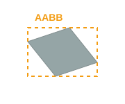
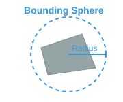
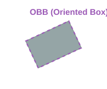
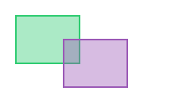

# 🚀 Day 07: 게임 물리 - 충돌 감지 기초 (Bounding Box & Sphere)

오늘의 목표는 "**물체 간의 겹침을 수학적으로 판별하는 충돌 알고리즘의 원리를 이해하고, 가장 효율적인 바운딩 볼륨 방식을 구현한다**"입니다.

---

## 1. 충돌 판별의 원리: "경계 영역 (Bounding Volume)"
모든 물체의 정교한 표면을 실시간으로 계산하는 것은 매우 무겁습니다. 따라서 단순한 형태의 '상자'나 '구'로 감싸서 먼저 계산합니다.

### 📍 대표적인 충돌 영역 방식

#### AABB (Axis-Aligned Bounding Box)

<p align="center">
  
</p>

- **특징**: 세상의 X, Y, Z축에 나란하게 고정된 상자입니다.
- **장점**: 물체가 회전해도 상자는 회전하지 않으므로 계산이 "**가장 빠르고 단순**"합니다.

#### Bounding Sphere (경계 구)

<p align="center">
  
</p>

- **특징**: 물체를 완전히 감싸는 최소 크기의 구입니다.
- **장점**: "**중심점 사이의 거리**"만 측정하면 되므로 연산 효율이 극대화됩니다.

#### OBB (Oriented Bounding Box)

<p align="center">
  
</p>

- **특징**: 물체의 "**회전 방향에 맞춰 상자도 함께 회전**"합니다.
- **장점**: 빈 공간이 가장 적어 "**정확한 충돌 범위**"를 제공합니다.
- **비용**: 복잡한 수학 연산이 필요하여 연산 비용이 높습니다.

---

## 2. 알고리즘 구현 원리

### 📍 원 충돌 (Circle/Sphere Collision)

<p align="center">
  
</p>

- **공식**: `Distance <= (Radius A + Radius B)`
- **최적화**: 루트 연산을 피하기 위해 "**거리의 제곱**"을 비교합니다.

### 📍 AABB 충돌 (축 정렬 상자 충돌)

<p align="center">
  
</p>

- **판정 조건**: 모든 축 (X, Y, Z)에서 범위가 겹쳐야 충돌입니다.
- **수식 (X축)**: `A.max.x > B.min.x && A.min.x < B.max.x`

---

## 3. 유니티 물리 이벤트 (Unity Physics Events)
유니티 물리 엔진(PhysX)은 충돌이 감지되었을 때 스크립트로 신호를 보내줍니다.

| 구분 | "Collision" (물리 충돌) | "Trigger" (트리거/센서) |
| :--- | :--- | :--- |
| **반응** | 튕겨 나감 (물리적 실체) | 그냥 통과 (영역 감지) |
| **설정** | `Is Trigger` 체크 해제 | `Is Trigger` 체크 필수 |
| **필수 조건** | \- | 적어도 한쪽은 "**Rigidbody**"가 있어야 함 |

### 📍 주요 이벤트 메서드
```csharp
// 1. 물리적 충돌 발생 시
private void OnCollisionEnter(Collision collision) { /* 충돌 시작 */ }
private void OnCollisionStay(Collision collision) { /* 충돌 중 */ }
private void OnCollisionExit(Collision collision) { /* 충돌 종료 */ }

// 2. 트리거 영역 진입 시 (isTrigger ON)
private void OnTriggerEnter(Collider other) { /* 영역 진입 */ }
private void OnTriggerStay(Collider other) { /* 영역 내부 */ }
private void OnTriggerExit(Collider other) { /* 영역 퇴장 */ }
```

---

## 💻 실습 예제: 거리 제곱을 이용한 최적화된 충돌 체크
```csharp
using UnityEngine;

public class SimpleCollision : MonoBehaviour
{
    public Transform other;
    public float radiusA = 1.0f;
    public float radiusB = 1.0f;

    void Update()
    {
        if (other == null) return;

        // 1. 두 물체 사이의 차이 벡터 구하기
        Vector3 diff = transform.position - other.position;

        // 2. 거리의 제곱 계산 (Magnitude보다 빠름)
        float distanceSq = diff.sqrMagnitude;
        
        // 3. 반지름 합의 제곱 계산
        float radiusSumSq = Mathf.Pow(radiusA + radiusB, 2);

        // 4. 비교 (두 중심점 사이 거리가 반지름 합보다 작으면 충돌)
        if (distanceSq <= radiusSumSq)
        {
            Debug.Log("<color=red>충돌 발생!</color>");
        }
    }
}
```

---

## ✍️ 평가 문항 대비 퀴즈
1. **문제**: 물체의 충돌 계산을 효율적으로 하기 위해 축에 정렬된 사각형 형태로 경계 영역을 잡는 방식을 무엇이라 합니까?
   - **정답**: AABB (Axis-Aligned Bounding Box)
2. **문제**: 원(구) 충돌 판정 시 성능 최적화를 위해 비교하는 두 값의 거리는 어떻게 처리하는 것이 좋습니까?
   - **정답**: 제곱근 계산을 피하기 위해 "**거리의 제곱**" 값을 사용합니다.
