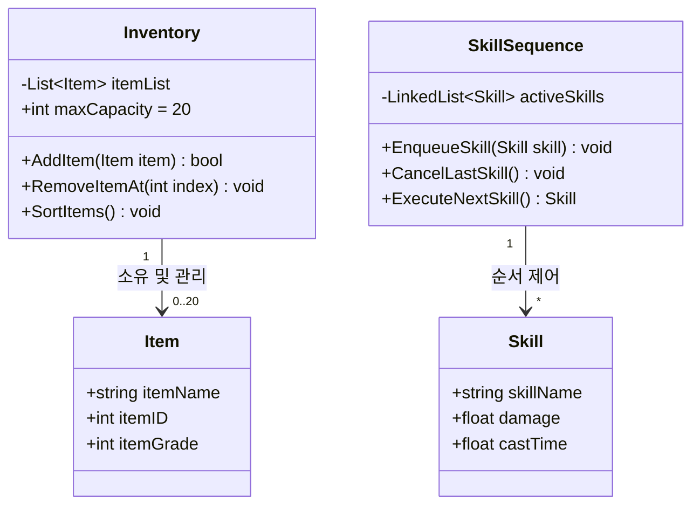

# 🚀 Day 10: 게임 자료구조 - 선형 구조 (List, Stack, Queue) 및 기획서 데이터 모델링

오늘의 목표는 **"자연어로 기술된 게임 기획서를 분석하여 핵심 아이템/몬스터 데이터를 추출하고, 이를 C# 클래스 구조와 자료구조 도면(UML)으로 변환 및 최적의 선형 자료구조를 선택하여 게임 시스템을 설계하는 능력을 배양한다"**입니다.

---

## 1. 💡 기획 단계 (30%): 자연어 기획서 분석 및 데이터 추출

실무 개발자는 게임 기획자로부터 받은 문서(자연어)를 기반으로 데이터 구조를 설계합니다. 아래의 모의 기획서를 분석해봅시다.

> 📝 **[게임 기획서 일부: 인벤토리 및 스킬 시퀀스 시스템]**
> 1. 플레이어는 최대 20개의 **아이템**을 보관할 수 있는 **가방(인벤토리)**을 가집니다. 아이템은 획득 시 가방의 빈 공간에 차례대로 쌓이지만, 플레이어가 원하는 대로 순서를 정렬하거나 중간에 있는 아이템을 버릴 수 있어야 합니다.
> 2. 보스 몬스터는 분노 시 **연계 스킬**을 사용합니다. 예를 들어 `[1단계: 포효] -> [2단계: 지진] -> [3단계: 휩쓸기]` 순으로 미리 예약된 스킬들이 순차적으로 실행되어야 합니다. 단, 플레이어가 보스의 캐스팅을 차단(Stun)하면 가장 마지막에 예약된 단계의 스킬이 취소되어야 합니다.

### 🔍 기획서에서 명사(Data)와 동사(Behavior) 추출하기
기획서 분석을 통해 코드 모델로 변환할 객체와 행동을 정의합니다.

- **명사 추출 (클래스 속성 및 변수)**:
  - 아이템 (`Item`): 이름, 등급, 슬롯 번호
  - 인벤토리 (`Inventory`): 아이템의 모음 (최대 20개 제한)
  - 스킬 (`Skill`): 스킬 이름, 피해량, 캐스팅 시간
  - 스킬 시퀀스 (`SkillSequence`): 대기 중인 스킬의 집합
- **동사 추출 (메서드 및 자료구조 동작)**:
  - 아이템 차례대로 추가 (`Add`), 중간 아이템 버리기/정렬 (`RemoveAt`, `Sort`)
  - 연계 스킬 순차 실행 (`ExecuteNext`), 마지막 예약 스킬 취소 (`Pop/CancelLast`)

---

## 2. 📊 데이터 구조 도면 설계 (UML Class Diagram)

추출한 명사와 동사를 바탕으로 객체 간의 관계와 적합한 자료구조 흐름을 도식화합니다.



---

## 3. 🛠️ 자료구조 선정 의사결정 매트릭스 (Decision Matrix)

기획서의 기능적 요구사항을 만족하기 위해 어떤 자료구조를 선택해야 하는지 물리적/시간적 연산 비용($O$)을 계산하여 결정합니다.

| 자료구조 | 메모리 특징 | 삽입 / 삭제 성능 ($O$) | 검색 성능 ($O$) | 추천 게임 기획 요구사항 |
| :--- | :--- | :--- | :--- | :--- |
| **배열 (Array)** | 연속된 메모리 공간. 크기 고정. | $O(N)$ (크기 변경 및 밀기 필요) | $O(1)$ (인덱스 접근) | 크기가 변하지 않는 고정 옵션, 요일/계절 정의 등 |
| **동적 리스트 (List)** | 연속 메모리 공간. 크기 자동 확장. | $O(N)$ (중간 삽입/삭제 시 이동) | $O(1)$ (인덱스 접근) | **인벤토리** (중간 제거 및 정렬, 인덱스 접근 잦음) |
| **연결 리스트 (LinkedList)** | 비연속 노드 연결. | $O(1)$ (포인터 재연결) | $O(N)$ (처음부터 탐색) | **스킬 시퀀스** (끝 노드의 잦은 추가 및 중간 노드 즉각 삭제) |
| **스택 (Stack)** | LIFO (후입선출) 구조. | $O(1)$ | N/A (상단만 조회) | UI 뒤로 가기 팝업, 취소 가능한 명령 히스토리 |
| **큐 (Queue)** | FIFO (선입선출) 구조. | $O(1)$ | N/A (전단만 조회) | 매칭 대기열, 순서대로 처리해야 하는 이벤트 및 알림창 |

---

## 💻 4. 실습 (70%): 스킬 시퀀스 제어 시스템 구현

**미션:** 연결 리스트(`LinkedList<T>`)의 물리적 이점을 활용하여, 스킬을 순차적으로 등록하고 실행하되 `Stun` 발생 시 마지막에 등록된 연계 스킬을 빠르게 취소하는 클래스를 작성하세요.

```csharp
using System;
using System.Collections.Generic;
using UnityEngine;

public class Skill
{
    public string SkillName { get; }
    public float Damage { get; }

    public Skill(string name, float damage)
    {
        SkillName = name;
        Damage = damage;
    }
}

public class BossSkillController : MonoBehaviour
{
    // 양방향 연결 리스트를 활용하여 마지막 노드의 탐색 및 제거를 O(1)에 수행
    private LinkedList<Skill> skillSequence = new LinkedList<Skill>();

    void Start()
    {
        Debug.Log("=== 보스 스킬 빌드업 시작 ===");
        RegisterSkill(new Skill("대지 파쇄", 150f));
        RegisterSkill(new Skill("마력 폭발", 300f));
        RegisterSkill(new Skill("종말의 메테오", 999f)); // 최고 위력 스킬
    }

    /// <summary>
    /// 연계 스킬 시퀀스에 새로운 스킬 추가
    /// </summary>
    public void RegisterSkill(Skill newSkill)
    {
        skillSequence.AddLast(newSkill);
        Debug.Log($"[예약 완료] {newSkill.SkillName} (위력: {newSkill.Damage})가 연계 큐에 등록되었습니다.");
    }

    /// <summary>
    /// 플레이어의 차단 공격에 의한 최종 연계 스킬 취소 (LIFO 응용)
    /// </summary>
    public void CancelLastSkill()
    {
        if (skillSequence.Count > 0)
        {
            string canceledName = skillSequence.Last.Value.SkillName;
            skillSequence.RemoveLast(); // O(1)의 성능으로 맨 끝 노드 즉각 제거
            Debug.Log($"<color=red>[시퀀스 차단!]</color> 보스의 연계 스킬 '{canceledName}'이 차단 및 취소되었습니다.");
        }
        else
        {
            Debug.LogWarning("취소할 예약 스킬이 없습니다.");
        }
    }

    /// <summary>
    /// 연계 스킬 순서대로 실행 (FIFO 응용)
    /// </summary>
    public void ExecuteNextSkill()
    {
        if (skillSequence.Count > 0)
        {
            Skill currentSkill = skillSequence.First.Value;
            skillSequence.RemoveFirst(); // O(1) 처리
            Debug.Log($"<color=yellow>[스킬 발동]</color> 보스가 '{currentSkill.SkillName}'(을)를 사용하여 {currentSkill.Damage}의 피해를 입혔습니다.");
        }
        else
        {
            Debug.Log("모든 연계 스킬이 소진되었습니다.");
        }
    }
}
```

---

## 🎯 NCS 능력단위 학습 가이드 & 평가 만족 요건

본 강의 내용은 **"게임 알고리즘 프로그래밍(NCS 0803020526_18v4)"**의 **게임 데이터 분석 및 자료구조 설계**에 대응합니다.

| NCS 평가 준거 | 학습 대응 영역 | 만족 기법 및 로직 |
| :--- | :--- | :--- |
| **요구사항 분석 및 설계** | 기획의 조건과 제약 분석 및 명사/동사 기반 모델링 | 자연어 기획 문서 해독 및 Mermaid를 활용한 UML 클래스 설계 |
| **자료구조 선정의 적합성** | 시간 복잡도($O$) 기반 최적의 자료구조 선택 | 의사결정 매트릭스 도출 및 복잡도 비교, C# `LinkedList` 최적성 분석 |

---

## ✍️ 평가 문항 대비 핵심 퀴즈

1. **문제:** 게임 기획 요구사항을 기술한 자연어 문서에서 데이터의 속성과 기능을 모델링하기 위해 클래스의 '멤버 변수'와 '메서드'로 변환되는 언어적 구성 요소는 각각 무엇인가요?
   - **정답:** 멤버 변수는 **명사(Noun)**, 메서드는 **동사(Verb)**

2. **문제:** 연결 리스트(Linked List) 자료구조가 일반 배열(Array)에 비해 '중간 데이터 삽입 및 삭제'에서 시간적 성능 이점($O(1)$)을 가지는 물리적 이유는 무엇인가요?
   - **정답:** 배열은 중간 데이터를 변경할 때 메모리 공간을 유지하기 위해 나머지 모든 데이터를 한 칸씩 밀거나 당겨야 하지만, 연결 리스트는 이전 노드와 다음 노드가 가리키는 **참조 주소(Link) 포인터**만 바꾸어 주면 되기 때문입니다.

3. **문제:** 인벤토리 시스템에서 플레이어가 임의로 아이템 순서를 정렬하고 특정 슬롯 번호로 즉각 접근해야 하는 요구사항이 있을 때, 가장 적절한 선형 자료구조는 무엇인가요?
   - **정답:** 동적 배열 혹은 리스트(List)

