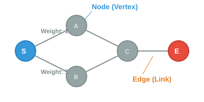

# 🚀 Day 12: 길찾기 알고리즘 기초 (그래프와 노드)

오늘의 목표는 "**게임 내 공간을 컴퓨터가 이해할 수 있는 수학적 모델(그래프)로 변환하고, 최단 경로 탐색을 위한 기초 지식을 쌓는다**"입니다.

---

## 1. 💡 이론: 그래프 (Graph)와 노드 (Node)
길찾기 알고리즘의 핵심은 현실의 복잡한 맵을 컴퓨터가 연산하기 쉬운 "**데이터의 집합**"으로 요약하는 것입니다.

<p align="center">
  
</p>

### 📍 그래프의 구성 요소
- **노드 (Node / Vertex)**: 지점 또는 위치를 의미합니다. 유니티에서는 타일 한 칸, 혹은 네비메쉬의 한 구역이 됩니다.
- **간선 (Edge / Link)**: 노드와 노드 사이의 연결 통로입니다. 길이 연결되어 있어야만 이동할 수 있습니다.
- **가중치 (Weight / Cost)**: 해당 길을 지나갈 때 드는 비용입니다. (예: 평지는 1, 진흙탕은 5)
- **방향성 (Direction)**: 한쪽으로만 갈 수 있는지(일방통행), 양쪽 다 가능한지(양방통행)를 나타냅니다.

> 💡 **핵심**: 길찾기란 시작점에서 목표점까지 "**가중치의 합이 최소**"가 되는 간선들의 조합을 찾아내는 과정입니다.

---

## 2. 💻 실습: 객체지향 기반 그래프 구조 구현
**미션:** 2차원 배열의 한계를 넘어, 노드와 간선의 관계를 객체(`class`)로 정의하고 인접한 노드들을 관리하는 구조를 만드세요.

<details>
<summary>코드 보기</summary>

```csharp
using UnityEngine;
using System.Collections.Generic;

// 1. 길찾기 지점을 나타내는 노드 클래스
public class Node
{
    public string name;
    public List<Edge> edges = new List<Edge>(); // 이 노드에서 뻗어나가는 길들

    public Node(string n) { name = n; }
}

// 2. 연결 통로와 비용을 나타내는 간선 클래스
public class Edge
{
    public Node target; // 도착지
    public int weight;  // 이동 비용

    public Edge(Node t, int w) { target = t; weight = w; }
}

public class GraphManager : MonoBehaviour
{
    void Start()
    {
        // 노드 생성
        Node startNode = new Node("Start");
        Node jungleNode = new Node("Jungle");
        Node goalNode = new Node("Goal");

        // 간선 연결 (길 만들기)
        // 시작점에서 정글로 가는 길 (비용 5)
        startNode.edges.Add(new Edge(jungleNode, 5));
        // 정글에서 목표 지점으로 가는 길 (비용 1)
        jungleNode.edges.Add(new Edge(goalNode, 1));

        // 데이터 분석 출력
        PrintGraph(startNode);
    }

    void PrintGraph(Node node)
    {
        Debug.Log($"현재 위치: **{node.name}**");
        foreach (var edge in node.edges)
        {
            Debug.Log($" - 연결된 곳: **{edge.target.name}** (이동 비용: **{edge.weight}**)");
        }
    }
}
```

</details>

---

## ✍️ 평가 문항 대비 퀴즈
1. **문제:** 길찾기 알고리즘을 수행하기 위해 게임 맵을 수학적 자료구조로 변환해야 합니다. 점(노드)과 이를 잇는 선(간선)으로 구성된 이 자료구조의 이름은 무엇입니까?
   - **정답:** 그래프 (Graph)
2. **문제:** 게임 기획에 따라 설계된 자료구조에 맞춰 게임 알고리즘을 설계해야 합니다. 노드 사이를 이동할 때 늪지대나 산과 같이 험난한 지형을 표현하기 위해 간선에 부여하는 비용을 무엇이라 부릅니까?
   - **정답:** 가중치 (Weight) 또는 비용 (Cost)
