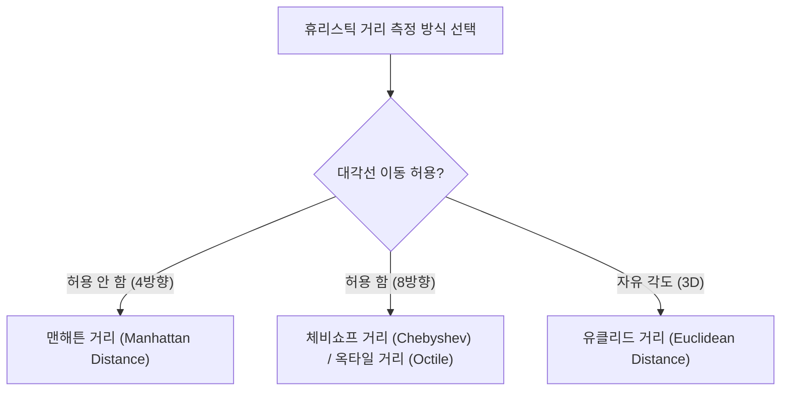
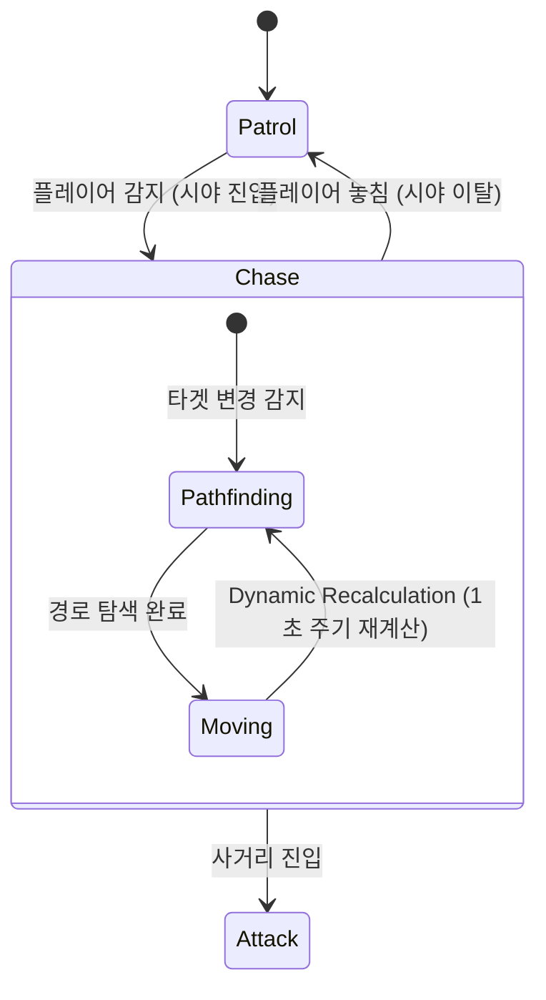

# 🚀 Day 15: 고급 길찾기 알고리즘 (A* Algorithm)과 예외 처리

오늘의 목표는 **"A* 길찾기 알고리즘의 비용 계산 원리(F = G + H)와 가중치 지형 탐색을 이해하고, FSM(유한 상태 머신)과의 연동 설계 및 길찾기 시스템 구현 시 발생 가능한 무한 루프와 널 포인터 결함을 분석하고 해결하는 디버깅 능력을 완수한다"**입니다.

---

## 1. 💡 이론 (30%): A* 알고리즘의 수학적 이해와 거리 척도

A* 알고리즘은 다익스트라(Dijkstra) 알고리즘에 **휴리스틱(Heuristic, 발견법)**을 결합하여 목적지 방향으로의 탐색 효율을 극대화한 최단 경로 알고리즘입니다.

### 1) 비용 함수: $F = G + H$
- **$G$ (시작점으로부터의 누적 비용)**: 시작 노드에서 현재 노드까지 도달하는 데 소요된 실제 이동 비용의 합입니다.
  - 평지 이동 비용은 `10`, 대각선 이동 비용은 `14`($\approx 10\sqrt{2}$)로 책정하는 것이 일반적입니다.
  - **지형 가중치(Terrain Weight)**가 반영될 경우, 늪지대나 모래밭 노드는 $G$ 값에 가중치($+W$)를 더해 가급적 우회하도록 유도합니다.
- **$H$ (휴리스틱 - 예상 남은 비용)**: 장애물을 고려하지 않고 현재 노드에서 목적지 노드까지 도달하는 데 걸릴 것으로 예상되는 추정 거리 비용입니다.

### 2) 휴리스틱 거리 측정 방식 (Distance Metric)
그리드 맵의 구조와 이동 규칙에 따라 적합한 휴리스틱 척도를 선택해야 최적 경로가 보장됩니다.



- **맨해튼 거리 (Manhattan Distance)**: 4방향(상하좌우) 이동만 허용되는 격자 지형에 적합합니다.
  $$H = D \times (|dx| + |dy|)$$
- **유클리드 거리 (Euclidean Distance)**: 장애물이 없는 3D 자유 각도 공간에 적합합니다.
  $$H = D \times \sqrt{dx^2 + dy^2}$$

---

## 2. 🤖 FSM (유한 상태 머신)과의 연동 설계

몬스터 AI의 행동 트리나 상태 머신에서 A* 알고리즘은 주로 **[Chase(추적)]** 상태에서 실행됩니다. 



### 📌 Dynamic Recalculation (동적 재계산) 최적화
실시간으로 움직이는 플레이어를 몬스터가 쫓아갈 때, 매 프레임($60\text{Hz}$)마다 A* 알고리즘을 수행하면 CPU에 막대한 연산 과부하가 걸립니다.
- **해결책**:
  1. **주기적 재계산**: 0.5초~1.0초 간격으로 `Coroutine`을 활용해 연산 주기를 분산시킵니다.
  2. **거리 임계값 설정**: 타겟(플레이어)의 현재 위치가 이전 탐색 목적지로부터 일정 거리(예: 2m) 이상 벗어났을 때만 경로를 갱신합니다.

---

## 3. 🔍 길찾기 시스템의 결함 예방 및 디버깅 가이드

A* 알고리즘 구현 시 가장 빈번하게 발생하는 **2대 치명적 결함**과 대처 방안을 반드시 숙지해야 합니다.

### 1) 결함 A: 목적지 도달 불가능 시의 무한 루프 (Infinite Loop)
- **증상**: 몬스터가 도달할 수 없는 꽉 막힌 방 안에 플레이어가 있거나 목적지가 벽 속에 위치한 경우, 오픈 리스트가 빌 때까지 탐색이 지속되거나 적절한 탈출 조건이 없어 유니티 에디터가 크래시(Freezing)됩니다.
- **방어 프로그래밍**:
  - 최대 루프 카운트(Max Safety Loop Count, 예: 2000회)를 설정하여 제한을 초과하면 탐색을 즉시 중단하고 실패 처리를 하도록 구현합니다.

### 2) 결함 B: 경로 탐색 실패 시의 널 참조 예외 (NullReferenceException)
- **증상**: 경로 탐색이 불가능하여 `null`이 반환되었음에도 불구하고, AI가 이동을 시도하며 `path[0]` 혹은 `parentNode`를 참조할 때 참조 오류가 발생하여 전체 AI 시스템이 먹통이 됩니다.
- **방어 프로그래밍**:
  - 경로 추적을 시작하기 전, 반환된 경로 리스트가 `null`이거나 `Count == 0` 인지 유효성 검사(Null Guard)를 철저히 수행합니다.

---

## 💻 4. 실습 (70%): 견고한 A* 길찾기 컴포넌트 스크립트

**미션:** 무한 루프 차단(Safety Loop) 기능과 예외 처리가 반영된 견고한 A* 탐색 스크립트(`RobustAStar.cs`)를 분석하고 이해하세요.

```csharp
using System;
using System.Collections.Generic;
using UnityEngine;

public class PathNode
{
    public bool isWalkable;
    public int gridX;
    public int gridY;
    public int penalty; // 지형 가중치 (0 = 평지, 10 = 진흙탕 등)

    public int gCost;
    public int hCost;
    public int fCost => gCost + hCost;

    public PathNode parent;

    public PathNode(bool walkable, int x, int y, int penaltyCost = 0)
    {
        isWalkable = walkable;
        gridX = x;
        gridY = y;
        penalty = penaltyCost;
    }
}

public class RobustAStar : MonoBehaviour
{
    private const int MAX_LOOP_LIMIT = 1000; // 무한 루프(크래시) 방지용 안전 장치

    /// <summary>
    /// 안전 장치가 장착된 A* 경로 찾기 기능
    /// </summary>
    public List<PathNode> FindPath(PathNode[,] grid, PathNode startNode, PathNode targetNode)
    {
        // 널 포인터 예외 예방 조치
        if (grid == null || startNode == null || targetNode == null)
        {
            Debug.LogError("[A*] 탐색 인자가 null입니다. 경로 탐색을 취소합니다.");
            return null;
        }

        if (!targetNode.isWalkable)
        {
            Debug.LogWarning("[A*] 목적지가 이동 불가능한 지형(벽)입니다.");
            return null;
        }

        List<PathNode> openSet = new List<PathNode>();
        HashSet<PathNode> closedSet = new HashSet<PathNode>();
        openSet.Add(startNode);

        int safetyCounter = 0;

        while (openSet.Count > 0)
        {
            // 안전 장치: 연산 한계 돌파 시 강제 차단하여 크래시 방지
            safetyCounter++;
            if (safetyCounter > MAX_LOOP_LIMIT)
            {
                Debug.LogError($"[A* Critical] 무한 루프 의심 상태 감지! 탐색 횟수가 {MAX_LOOP_LIMIT}회를 초과하여 탐색을 강제 중단합니다.");
                return null;
            }

            PathNode currentNode = openSet[0];
            for (int i = 1; i < openSet.Count; i++)
            {
                if (openSet[i].fCost < currentNode.fCost || 
                    (openSet[i].fCost == currentNode.fCost && openSet[i].hCost < currentNode.hCost))
                {
                    currentNode = openSet[i];
                }
            }

            openSet.Remove(currentNode);
            closedSet.Add(currentNode);

            // 목적지 도달 시 성공적으로 경로 생성 및 역추적 반환
            if (currentNode == targetNode)
            {
                return RetracePath(startNode, targetNode);
            }

            // 주변 8방향 이웃 노드 탐색 (여기서는 편의상 4방향 상하좌우만 예시)
            List<PathNode> neighbours = GetNeighbours(grid, currentNode);
            foreach (var neighbour in neighbours)
            {
                if (!neighbour.isWalkable || closedSet.Contains(neighbour))
                    continue;

                // 새로운 이동 비용에 지형 가중치(penalty)를 누적 결합
                int newMovementCostToNeighbour = currentNode.gCost + GetDistance(currentNode, neighbour) + neighbour.penalty;
                
                if (newMovementCostToNeighbour < neighbour.gCost || !openSet.Contains(neighbour))
                {
                    neighbour.gCost = newMovementCostToNeighbour;
                    neighbour.hCost = GetDistance(neighbour, targetNode); // 맨해튼 거리 사용
                    neighbour.parent = currentNode;

                    if (!openSet.Contains(neighbour))
                        openSet.Add(neighbour);
                }
            }
        }

        Debug.LogWarning("[A* Path Failed] 도달 가능한 최적 경로가 존재하지 않습니다.");
        return null; // 널 가드 작동을 위해 null 반환
    }

    private List<PathNode> RetracePath(PathNode startNode, PathNode endNode)
    {
        List<PathNode> path = new List<PathNode>();
        PathNode currentNode = endNode;

        while (currentNode != startNode)
        {
            path.Add(currentNode);
            currentNode = currentNode.parent; // 부모 역추적
        }
        path.Reverse();
        return path;
    }

    private int GetDistance(PathNode nodeA, PathNode nodeB)
    {
        int dstX = Mathf.Abs(nodeA.gridX - nodeB.gridX);
        int dstY = Mathf.Abs(nodeA.gridY - nodeB.gridY);
        return 10 * (dstX + dstY); // 맨해튼 거리 공식
    }

    private List<PathNode> GetNeighbours(PathNode[,] grid, PathNode node)
    {
        List<PathNode> neighbours = new List<PathNode>();
        int width = grid.GetLength(0);
        int height = grid.GetLength(1);

        int[] dx = { 0, 0, -1, 1 };
        int[] dy = { -1, 1, 0, 0 };

        for (int i = 0; i < 4; i++)
        {
            int checkX = node.gridX + dx[i];
            int checkY = node.gridY + dy[i];

            if (checkX >= 0 && checkX < width && checkY >= 0 && checkY < height)
            {
                neighbours.Add(grid[checkX, checkY]);
            }
        }
        return neighbours;
    }
}
```

---

## 🎯 NCS 능력단위 학습 가이드 & 평가 만족 요건

본 강의 내용은 **"게임 알고리즘 프로그래밍(NCS 0803020526_18v4)"**의 **경로 탐색 및 디버깅 분석**에 부합합니다.

| NCS 평가 준거 | 학습 대응 영역 | 만족 기법 및 로직 |
| :--- | :--- | :--- |
| **길찾기 알고리즘 구현** | 가중치를 고려한 장애물 회피 최단 경로 획득 | $F=G+H$ 수식 연동, 지형 페널티 가산 및 이웃 노드 갱신 로직 |
| **알고리즘 결함 디버깅** | 무한 루프, 에디터 크래시 및 널 포인터 결함 분석 | `MAX_LOOP_LIMIT` 안전 제어 도입 및 널 가드 예외 처리 코드 구성 |

---

## ✍️ 평가 문항 대비 핵심 퀴즈

1. **문제:** A* 알고리즘에서 장애물이 없다고 가정하고 현재 노드에서 목적지 노드까지의 예상 거리값을 리턴해 주어 탐색 방향성을 설정하는 핵심 비용 인자는 무엇인가요?
   - **정답:** 휴리스틱(Heuristic, $H$) 비용

2. **문제:** 길찾기 연산을 실시간 플레이어가 타겟일 때 매 프레임 호출하지 않고 주기적으로 분산 처리하거나 타겟의 거리가 임계값 이상 멀어졌을 때만 호출하는 최적화 기법을 무엇이라 합니까?
   - **정답:** 동적 재계산(Dynamic Recalculation)

3. **문제:** 길찾기가 막힌 지형에서 길을 찾지 못해 알고리즘 연산 루프가 무한히 돌며 게임 에디터가 먹통(Freezing)이 되는 치명적인 버그를 막기 위해 삽입해야 하는 프로그래밍 코드는 무엇인가요?
   - **정답:** 최대 루프 제한 횟수(Safety Loop Limit)를 정하고, 초과 시 루프를 강제로 탈출(`break` 또는 `return null`)하는 예외 처리 코드

