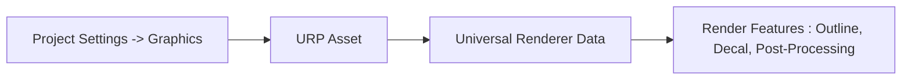

# 🚀 Day 01: 게임 엔진 개론 (Unity Engine Intro) 및 URP 프로젝트 빌드 설정

오늘의 목표는 **"상용 게임 엔진인 유니티(Unity)와 언리얼(Unreal)의 핵심 패러다임을 이해하고, 최신 Unity 6 에디터의 기하학 조작 단축키, URP(Universal Render Pipeline) 환경 설정 및 플랫폼별 빌드 타깃과 그래픽 API를 최적화하여 프로젝트를 생성하고 구성하는 능력을 배양한다"**입니다.

---

## 1. 💡 이론 (30%): 상용 게임 엔진의 패러다임 비교

게임 엔진은 물리 시뮬레이션, 렌더링 파이프라인, 사운드 믹싱, 애니메이션 등의 공통 기반 기술을 제공하는 고도화된 프레임워크입니다.

### 📍 유니티(Unity) vs 언리얼(Unreal)
| 특징 | 유니티 (Unity) | 언리얼 (Unreal) |
| :--- | :--- | :--- |
| **핵심 언어** | C# (컴파일러: Mono / IL2CPP) | C++ / Blueprints (비주얼 스크립팅) |
| **렌더링 특징** | SRP (Scriptable Render Pipeline) 커스터마이징 | Lumen (실시간 글로벌 일루미네이션), Nanite |
| **에디터 핵심 설계** | **컴포넌트 패턴 (Component-Based)**<br>모든 기능은 독립적인 컴포넌트로 분리되어 부착됨 | **상속 패턴 (Inheritance-Based)**<br>Actor에서 상속받아 세부 클래스를 구현하는 계층형 설계 |
| **최신 엔진 버전 특징** | **Unity 6**: Render Graph, GPU Resident Drawer, 더욱 가벼워진 런타임 성능 및 WebGL 강화 | **Unreal Engine 5**: 대규모 고해상도 지형 및 나나이트 기반 메시 최적화 |

---

## 2. 🛠️ Unity 6 에디터 구성 및 3D 기하학 조작

유니티 에디터는 유연한 도킹 레이아웃을 제공합니다. 3D 공간을 효율적으로 다루기 위해서는 조작 단축키(Gizmos)를 본능적으로 다룰 수 있어야 합니다.

### 📌 기하학 조작 (QWERTY) 단축키와 트랜스폼(Transform)
- **`Q` (Hand Tool)**: Scene 뷰 화면 자체를 이동(Pan)합니다.
- **`W` (Translate/Move)**: 3D 기하학 축(X, Y, Z)에 따라 물체를 평행 이동합니다.
- **`E` (Rotate)**: 물체를 각 축을 기준으로 회전시킵니다.
- **`R` (Scale)**: 물체의 크기를 조절합니다. center를 잡으면 3축이 균등하게 조절됩니다.
- **`T` (Rect Tool)**: 2D 및 UI(UGUI RectTransform) 요소를 다룰 때 너비와 높이를 직관적으로 조절합니다.
- **`Y` (Transform Tool)**: 이동, 회전, 크기 조절 피벗을 한 화면에 결합하여 보여줍니다.

---

## 3. 🎨 URP (Universal Render Pipeline)와 에셋 파이프라인

Unity 6는 기본 그래픽 파이프라인으로 **URP (Universal Render Pipeline)**를 권장합니다. URP는 멀티플랫폼에 적합하게 경량화되어 있으며, 셰이더 그래프(Shader Graph) 및 최신 Render Graph 아키텍처를 지원합니다.

### 📌 URP 셋업 및 그래픽스 에셋 구성 요소
1. **URP Asset (Pipeline Settings)**: 그림자 해상도, HDR 여부, 안티앨리어싱(MSAA) 등 렌더링 파이프라인의 **전역 옵션**을 제어하는 설정 파일입니다.
2. **Universal Renderer Data**: 실제로 어떤 렌더링 패스(Forward / Deferred)를 탈지, 어떤 렌더 퓨처(Renderer Feature)를 추가할지 정의하는 하위 세부 데이터 에셋입니다.



---

## 💻 4. 실습 (70%): 플랫폼별 빌드 타깃 및 그래픽 API 세팅

**미션:** 다양한 플랫폼(Windows, Mobile, WebGL)으로의 포팅 및 배포를 위해 빌드 설정(Build Settings)을 조정하고 그래픽 API의 하드웨어 가속 설정을 변경하는 실습을 진행하세요.

### ⚙️ 빌드 및 그래픽 API 설정 절차 (Unity 6 기준)

1. **빌드 플랫폼 스위칭 (Platform Switch)**
   - `File -> Build Settings`를 엽니다.
   - 현재 타깃 플랫폼을 **Windows (PC, Mac & Linux Standalone)** 또는 **Android / iOS**, **WebGL** 중 선택하고 **[Switch Platform]**을 누릅니다.
   - *팁: WebGL 플랫폼은 별도의 컴파일 도구 체인이 필요하며 모바일은 각 OS SDK가 구성되어야 활성화됩니다.*

2. **Player Settings에서 그래픽 API 수동 제어 (Graphics API Configuration)**
   - `Edit -> Project Settings -> Player` 탭으로 이동합니다.
   - **Other Settings** 섹션을 찾습니다.
   - **Auto Graphics API** 체크박스를 **해제**합니다.
   - 플랫폼에 맞추어 적합한 고성능/저전력 API를 수동으로 우선순위 정렬합니다.
     - **Windows Standalone**: Direct3D12 (최신), Vulkan (고성능), Direct3D11 (호환성)
     - **Android**: Vulkan (최신), OpenGL ES 3 (호환성)
     - **WebGL**: WebGL 2.0 (OpenGL ES 3.0 서브셋)

```csharp
using UnityEngine;
using UnityEngine.Rendering;

public class RenderPipelineInfo : MonoBehaviour
{
    void Start()
    {
        // 현재 활성화된 그래픽 API 종류 디버그 출력
        GraphicsDeviceType apiType = SystemInfo.graphicsDeviceType;
        Debug.Log($"<color=green>[System Info]</color> 현재 그래픽 API: {apiType}");

        // 현재 스크립터블 렌더 파이프라인 활성화 정보
        if (GraphicsSettings.currentRenderPipeline != null)
        {
            Debug.Log($"현재 활성화된 SRP: {GraphicsSettings.currentRenderPipeline.name}");
        }
        else
        {
            Debug.LogWarning("기본 Built-in 렌더 파이프라인이 사용 중입니다. URP 전환이 권장됩니다.");
        }
    }
}
```

---

## 🎯 NCS 능력단위 학습 가이드 & 평가 만족 요건

본 강의 내용은 **"게임엔진 응용 프로그래밍(NCS 0803020527_18v4)"**의 **수행준거 1.1 게임엔진 환경 설정**을 완벽하게 만족합니다.

| NCS 평가 준거 | 학습 대응 영역 | 만족 기법 및 로직 |
| :--- | :--- | :--- |
| **게임엔진 환경 설정** | 개발 환경 구성 및 타깃 플랫폼 설정 | URP 에셋 파이프라인 설정, 그래픽 API 수동 우선순위 튜닝 및 빌드 스위칭 실습 |
| **엔진 조작 기법 습득** | 에디터 인터페이스의 활용과 씬 컴포넌트 제어 | 기하학 트랜스폼 단축키 조작 숙달 및 컴포넌트 지향 객체 매핑 이해 |

---

## ✍️ 평가 문항 대비 핵심 퀴즈

1. **문제:** 유니티 엔진과 언리얼 엔진은 객체를 설계하는 아키텍처 관점에서 근본적인 차이가 있습니다. 유니티는 독립적인 모듈을 붙여나가는 어떤 설계 방식을 취하나요?
   - **정답:** 컴포넌트 기반 아키텍처 (Component-Based Architecture)

2. **문제:** 유니티 에디터에서 UI 컴포넌트(RectTransform)의 크기 및 회전 피벗을 기하학적으로 직관적이고 직각 방향으로 다듬을 수 있게 해주는 뷰포트 조작 단축키는 무엇인가요?
   - **정답:** T (Rect Tool)

3. **문제:** 렌더링 품질 제어(HDR, 그림자 맵 크기, 안티앨리어싱 등)를 에셋 단위로 프로필화하여 저장하고, 플랫폼 빌드 타깃에 따라 전환해 가며 그래픽 리소스를 전역 통제하는 URP의 핵심 에셋 이름은 무엇인가요?
   - **정답:** URP Asset (Universal Render Pipeline Asset)

