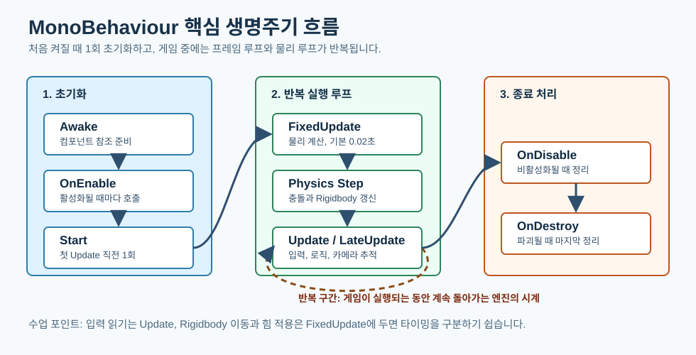

# DAY 07: Unity 스크립팅 생명주기와 Input System 이동

오늘의 목표는 Unity 스크립트를 "**정해진 시간표대로 움직이는 수업 도우미**"처럼 이해하고, `Update`, `FixedUpdate`, Input System 이벤트를 나누어 사용하는 기본 이동 코드를 작성하는 것입니다.

## 1. 핵심 개념: "엔진의 시계가 부르는 함수"

Unity는 스크립트의 함수를 아무 때나 부르지 않습니다. 오브젝트가 켜질 때, 첫 프레임이 시작되기 전, 매 프레임, 물리 계산 직전처럼 정해진 타이밍에 함수를 호출합니다. 그래서 입력은 자주 확인하는 `Update`에, 물리 이동은 일정한 간격의 `FixedUpdate`에 두면 역할이 분명해집니다.



그림을 읽을 때는 `Awake -> OnEnable -> Start`를 "**수업 시작 전 준비**"로 보고, 가운데 반복 구간을 "**수업이 진행되는 동안 계속 도는 엔진의 시계**"로 보면 됩니다.

### 이 단어는 무슨 뜻인가요?

- **Awake**: 오브젝트가 준비될 때 가장 먼저 한 번 호출됩니다.
- **Start**: 첫 프레임 업데이트 직전에 한 번 호출됩니다.
- **Update**: 화면 프레임마다 호출됩니다.
- **FixedUpdate**: 물리 계산 간격에 맞춰 호출됩니다.
- **Input System**: 키보드, 게임패드, 터치 입력을 액션 단위로 묶어 처리하는 Unity 입력 패키지입니다.

## 실습 예제: 물리 기반 이동 입력 받기

**미션:** Input System 이벤트에서 이동 입력을 받고, Rigidbody 이동은 `FixedUpdate`에서 처리합니다.

1. 플레이어 큐브에 `Rigidbody`를 붙입니다.
2. Player Input 컴포넌트를 추가하고 `Move` 액션을 `Vector2` 값으로 연결합니다.
3. 아래 스크립트를 플레이어에 붙입니다.

<details>
<summary>코드 보기</summary>

```csharp
using UnityEngine;
using UnityEngine.InputSystem;

[RequireComponent(typeof(Rigidbody))]
public class PhysicsPlayerController : MonoBehaviour
{
    [SerializeField] private float moveSpeed = 6f;

    private Rigidbody body;
    private Vector2 moveInput;

    void Awake()
    {
        body = GetComponent<Rigidbody>();
        body.constraints = RigidbodyConstraints.FreezeRotationX | RigidbodyConstraints.FreezeRotationZ;
    }

    public void OnMove(InputValue value)
    {
        moveInput = value.Get<Vector2>();
    }

    void FixedUpdate()
    {
        Vector3 direction = new Vector3(moveInput.x, 0f, moveInput.y);

        if (direction.sqrMagnitude > 1f)
        {
            direction.Normalize();
        }

        Vector3 nextVelocity = direction * moveSpeed;
        body.linearVelocity = new Vector3(nextVelocity.x, body.linearVelocity.y, nextVelocity.z);
    }
}
```

</details>

### 실행해보면

입력한 방향으로 Rigidbody가 움직입니다. 대각선 입력이 들어와도 방향 벡터를 정규화하기 때문에 한쪽 방향보다 지나치게 빨라지지 않습니다.

### 생각해보기

1. 입력을 `Update`에서 읽고 물리를 `FixedUpdate`에서 처리하면 어떤 점이 분명해질까요?
2. `direction.Normalize()`가 없다면 대각선 이동은 어떻게 달라질까요?

## 오늘의 정리

- Unity 생명주기는 스크립트 함수가 호출되는 시간표입니다.
- 입력과 물리 이동은 서로 다른 타이밍을 가지므로 역할을 나누는 편이 좋습니다.
- Input System은 여러 입력 장치를 액션 중심으로 묶어 처리합니다.
