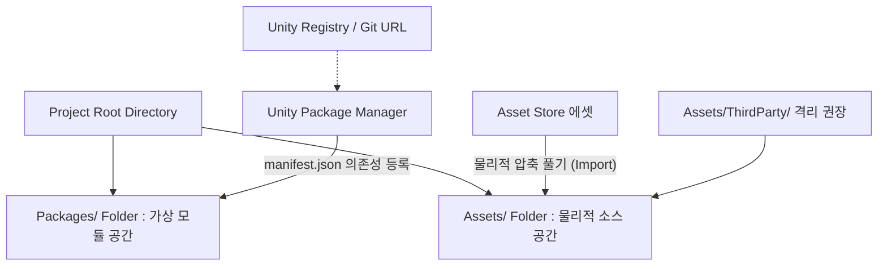

# 🚀 Day 10: 에셋 관리 아키텍처 - UPM 패키지와 Asset Store의 구분 및 격리

오늘의 목표는 **"Unity의 의존성 관리 도구인 UPM(Unity Package Manager)과 Asset Store 에셋의 물리적/시스템적 동작 차이를 명확히 구분하고, 버전 충돌과 협업 오류를 예방할 수 있는 실무 최적화 폴더 아키텍처를 설계하고 제어하는 능력을 완수한다"**입니다.

---

## 1. 💡 이론 (30%): 두 가지 에셋 라이브러리 도입 메커니즘의 차이

유니티 프로젝트의 규모가 커지면 외부 라이브러리, SDK, 외부 제작 3D 모델 에셋이 수십 기가바이트(GB) 규모로 늘어나며 의존성 관리가 깨지기 쉽습니다. 유니티는 이를 통제하기 위해 두 가지 메커니즘을 제공합니다.

### 📍 UPM (Unity Package Manager) vs Asset Store (.unitypackage)



| 비교 분석 항목 | UPM (Unity Package Manager) | Asset Store 및 전통적 SDK (.unitypackage) |
| :--- | :--- | :--- |
| **물리적 저장 위치** | 프로젝트 루트 외부의 글로벌 캐시 디렉토리에 보관됨 | 프로젝트 내부 `Assets/` 디렉토리에 물리 파일로 직접 해제됨 |
| **의존성 명세 기술** | **`Packages/manifest.json`** 텍스트 파일에 등록 및 선언 | 별도의 설정 파일 없이, 물리적인 폴더와 메타 파일(`.meta`)로 구성 |
| **Git 형상 관리 비용** | `.json` 파일 한 줄만 커밋하면 되므로 용량 증가가 전혀 없음 | 소스 코드 전체와 기가바이트 단위의 리소스가 형상 관리에 잡혀 용량 팽창 유발 |
| **버전 업그레이드** | UI 창이나 버전 해시 수정만으로 실시간 무결성 갱신 가능 | 기존 폴더를 덮어씌워 찌꺼기 파일이 남아 컴파일 에러 유발 가능성 높음 |

---

## 2. 📂 실무: 버전 충돌 방지를 위한 폴더 아키텍처 설계

외부 플러그인과 자사 개발 코드가 `Assets/` 폴더 아래에서 무분별하게 섞이면 유지보수가 사실상 불가능해집니다. 이를 예방하기 위해 전 세계 주요 스튜디오는 아래와 같은 **프로젝트 아키텍처 규칙**을 적용합니다.

### 📌 추천 프로젝트 폴더 아키텍처 도면

```
Assets/
├── _Project/               <-- [핵심] 자사 개발 고유 에셋 격리 공간 (Git 관리 대상)
│   ├── Animations/
│   ├── Prefabs/
│   ├── Scenes/
│   ├── Scripts/            <-- 순수 게임 로직 C# 코드
│   └── UI/
│
├── ThirdParty/             <-- [핵심] 에셋 스토어나 외부 SDK(.unitypackage) 전용 격리 공간
│   ├── DOTween/
│   ├── TextMesh Pro/
│   └── (수정/수정을 금하고 Read-only로 다루어야 하는 모든 외부 에셋)
│
└── StreamingAssets/        <-- 바이너리 원본 보존 폴더
```

---

## 💻 3. 실습 (70%): UPM 의존성 튜닝 및 외부 에셋 격리

**미션:** 1) `Packages/manifest.json` 파일을 분석하여 기하학 계산이나 유틸리티 모듈(예: Newtonsoft Json)을 수동으로 주입/갱신해보고, 2) 외부 패키지를 가져온 뒤 자사 코드 폴더와 물리적으로 분리하여 무결성을 검증하세요.

### ⚙️ 1단계: `manifest.json` 파일의 정교한 통제

유니티가 꺼져 있어도 프로젝트 루트 밑의 `Packages/manifest.json` 파일을 텍스트 에디터로 수정하면, 필요한 UPM 모듈을 강제할 수 있습니다.

```json
{
  "dependencies": {
    "com.unity.feature.development": "1.0.1",
    "com.unity.inputsystem": "1.7.0",
    "com.unity.render-pipelines.universal": "17.0.3",
    "com.unity.textmeshpro": "3.0.9",
    "com.unity.nuget.newtonsoft-json": "3.0.2",
    "com.unity.modules.physics": "1.0.0"
  }
}
```
* NewtonSoft-Json 같은 핵심 유틸리티는 Asset Store에서 받지 말고, 위와 같이 UPM 표준 패키지(`com.unity.nuget.newtonsoft-json`)로 매핑하여 사용하는 것이 버전 충돌을 원천 차단하는 정석입니다.*

### 🛠️ 2단계: 외부 에셋 연동 후 초기화 무결성 검증용 C# 모듈

외부 라이브러리(예: DOTween 등)가 성공적으로 타깃 폴더(`ThirdParty/`)에 로딩되었는지 검증하고 초기화하는 감시 컴포넌트를 작성합니다.

```csharp
using UnityEngine;

public class DependencyVerifier : MonoBehaviour
{
    void Awake()
    {
        Debug.Log("=== 외부 라이브러리 및 SDK 로드 상태 검증 ===");
        VerifyThirdPartyDependencies();
    }

    private void VerifyThirdPartyDependencies()
    {
        bool allPassed = true;

        // 1. TextMesh Pro 모듈 무결성 점검
#if UNITY_TMPRO
        Debug.Log("<color=green>[✓ TMP]</color> TextMesh Pro 라이브러리가 UPM을 통해 신뢰 가능한 상태로 바인딩되었습니다.");
#else
        Debug.LogError("[CRITICAL ERROR] TextMesh Pro 패키지가 manifest.json에 존재하지 않습니다!");
        allPassed = false;
#endif

        // 2. 신형 Input System 모듈 점검
#if UNITY_INPUT_SYSTEM
        Debug.Log("<color=green>[✓ InputSystem]</color> 신형 Input System API 패키지가 컴파일러에 활성화되어 있습니다.");
#else
        Debug.LogError("[CRITICAL ERROR] 신형 Input System 패키지가 UPM 활성화 목록에 누락되었습니다!");
        allPassed = false;
#endif

        if (allPassed)
        {
            Debug.Log("<color=cyan>[의존성 완료]</color> 모든 외부 모듈 및 패키지가 아키텍처 규칙에 부합하게 활성화되었습니다.");
        }
    }
}
```

---

## 🎯 NCS 능력단위 학습 가이드 & 평가 만족 요건

본 강의 내용은 **"게임엔진 응용 프로그래밍(NCS 0803020527_18v4)"**의 **수행준거 1.2 외부 플러그인 및 에셋 라이브러리 연동**을 완벽하게 만족합니다.

| NCS 평가 준거 | 학습 대응 영역 | 만족 기법 및 로직 |
| :--- | :--- | :--- |
| **외부 라이브러리 연동** | 에셋 스토어 에셋 및 UPM 패키지 활용 환경 제어 | UPM `manifest.json` 의존성 커스텀 선언 및 C# 지시자 검증 |
| **개발 프로젝트 아키텍처** | 협업 및 리소스 충돌 방지 폴더 구조 수립 | `Assets/_Project`와 `Assets/ThirdParty`의 물리 분할 격리 기법 수립 |

---

## ✍️ 평가 문항 대비 핵심 퀴즈

1. **문제:** 프로젝트의 용량 확장을 막고 라이브러리 파일들을 외부 전역 캐시에 격리해 두며, 오직 `Packages/manifest.json` 텍스트 명세 파일로 의존성을 통제하는 유니티의 패키지 관리 도구는 무엇입니까?
   - **정답:** UPM (Unity Package Manager)

2. **문제:** 에셋 스토어나 외부 SDK(.unitypackage)를 직접 가져올 때 프로젝트의 자사 소스 코드와 충돌하지 않도록 명확하게 격리하여 폴더 구조를 설계하는 격리 전용 디렉토리 이름은 무엇으로 지정하는 것이 실무 표준인가요?
   - **정답:** ThirdParty (또는 _ThirdParty)

3. **문제:** UPM에서 외부 모듈을 관리할 때, 프로젝트 의존성의 이름과 정확한 빌드 버전을 JSON 키-값 쌍 형태로 직접 선언하여 빌드 체계를 명시하는 텍스트 명세서 파일의 이름은 무엇인가요?
   - **정답:** manifest.json (Packages/manifest.json)
