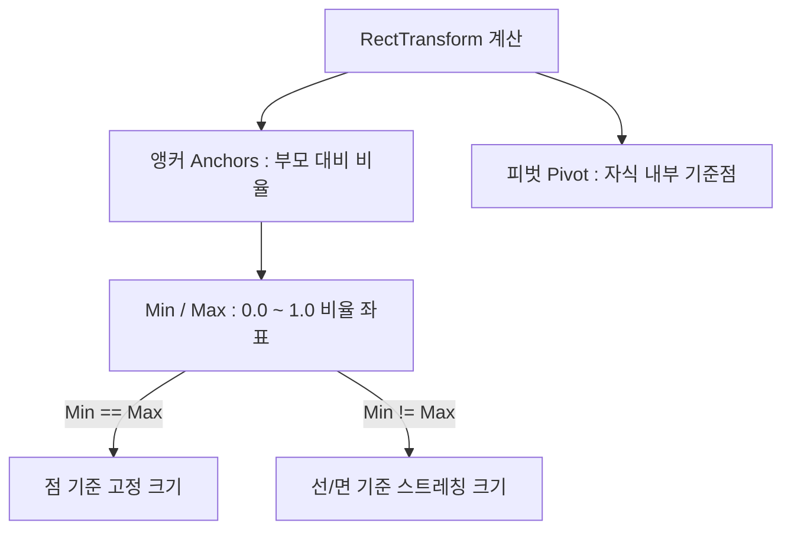

# 🚀 Day 11: 유니티 UI/UX 시스템 - UGUI 프레임워크와 반응형 인터페이스

오늘의 목표는 **"유니티의 표준 UGUI(Unity Graphical User Interface) 시스템을 활용하여, Canvas 해상도 변화에 적응하는 반응형 UI를 구성하고 RectTransform의 앵커(Anchor)와 피벗(Pivot) 동작 원리를 수학적으로 마스터하며, C# 이벤트 인터페이스를 상속받아 고도화된 UI 상호작용 및 애니메이션을 직접 구현하는 능력을 완수한다"**입니다.

---

## 1. 💡 이론 (30%): UGUI의 렌더 아키텍처와 반응형 대응

유니티 UGUI는 씬 그래프 상에서 독립적인 캔버스 컴포넌트를 기준으로 픽셀 평면에 메시를 생성하여 UI를 렌더링합니다.

### 1) Canvas 3대 렌더 모드 (Render Mode)
- **Screen Space - Overlay**: 화면 해상도에 맞춰 항상 가장 상단에 2D로 그립니다. 물리 카메라나 라이팅의 영향을 받지 않는 표준 HUD(Heads-up Display)에 사용됩니다.
- **Screen Space - Camera**: 특정 UI 전용 카메라를 기준으로 그립니다. UI 앞에 3D 이펙트를 띄우거나 파티클을 섞을 때 유용합니다.
- **World Space**: 3D 공간 상에 캔버스를 평면 오브젝트처럼 배치합니다. 몬스터 머리 위의 HP 바, VR 환경의 상호작용 디스플레이 등에 필수적입니다.

### 2) Canvas Scaler와 반응형 해상도 셋업
모바일 기기나 모니터의 다양한 해상도 종횡비(Aspect Ratio)에 대응하기 위해 Canvas Scaler 컴포넌트의 설정은 매우 중요합니다.
- **UI Scale Mode**: **`Scale With Screen Size`**로 고정합니다.
- **Reference Resolution**: 타깃 개발 기준 해상도(예: `1920 x 1080` FHD)를 지정합니다.
- **Screen Match Mode**: **`Match Width Or Height`**로 두고, 세로 지향 게임은 `Width (0)`, 가로 지향 게임은 `Height (1)`에 매칭하여 잘림 현상을 방지합니다.

---

## 2. 📊 RectTransform의 수학적 원리: 앵커(Anchor)와 피벗(Pivot)

UI 요소의 위치와 크기는 3D 오브젝트의 `Transform` 대신 **`RectTransform`** 컴포넌트로 제어됩니다.



- **앵커 (Anchors - Min/Max)**:
  - 부모 UI 사각형의 크기를 기준으로 자식 UI가 배치될 **비율 기준선(0.0 ~ 1.0)**을 지정합니다.
  - `Anchor Min`과 `Max`가 같은 지점에 뭉쳐 있으면(Point) 자식은 **고정 크기(Width/Height)**를 유지합니다.
  - `Anchor Min`과 `Max`가 찢어지면(Stretch) 자식 UI는 부모 창의 크기 변화에 연동해 **늘어나고 줄어드는 반응형 가변 크기**를 가집니다.
- **피벗 (Pivot)**:
  - UI 자식 객체 자체의 회전, 크기 변화, 좌표 계산의 **기준점(0,0 ~ 1,1)**입니다.
  - 기본값은 정중앙인 `(0.5, 0.5)`이며, 좌측 상단 기준 정렬을 원할 시 `(0.0, 1.0)`으로 변경합니다.

---

## 3. ✍️ TextMesh Pro (TMP)와 SDF 렌더링

Unity 6에서 UI 텍스트는 기존 비트맵 방식의 Text 대신 **TextMesh Pro(TMP)** 사용이 강제됩니다.
- **SDF (Signed Distance Field)**: TMP는 폰트 문자의 아웃라인 경계선으로부터의 거리를 벡터 맵 형태로 텍스처에 기록합니다. 이 덕분에 텍스트를 극도로 확대하거나 회전해도 픽셀이 깨지지 않고 래스터화(Anti-aliasing)되어 극상의 폰트 품질을 보장합니다.

---

## 💻 4. 실습 (70%): 커스텀 이벤트 인터페이스 상속 UI 제어 스크립팅

**미션:** 단순 `Button` 컴포넌트의 `onClick` 이벤트 방식 외에, C# 클래스에서 유니티 네이티브 EventSystem의 상호작용 인터페이스들을 상속받아 마우스 호버(Hover) 시 버튼의 크기가 부드럽게 커지고 클릭 시 특수 연산이 구동되는 고급 커스텀 버튼 컴포넌트(`InteractiveUIButton.cs`)를 구현하세요.

### 🛠️ 커스텀 UI 스크립트

```csharp
using UnityEngine;
using UnityEngine.EventSystems; // 이벤트 핸들러 패키지 필수
using UnityEngine.UI;
using TMPro;

[RequireComponent(typeof(Image))]
public class InteractiveUIButton : MonoBehaviour, IPointerEnterHandler, IPointerExitHandler, IPointerClickHandler
{
    [Header("시각 연출 설정")]
    [SerializeField] private Color hoverColor = Color.cyan;
    [SerializeField] private float hoverScaleFactor = 1.1f;
    [SerializeField] private float transitionSpeed = 10f;

    [Header("UI 구성품")]
    [SerializeField] private TextMeshProUGUI buttonText;

    private Image buttonImage;
    private Color originalColor;
    private Vector3 originalScale;
    private Vector3 targetScale;
    private Color targetColor;

    void Awake()
    {
        buttonImage = GetComponent<Image>();
        originalColor = buttonImage.color;
        originalScale = transform.localScale;
        
        targetScale = originalScale;
        targetColor = originalColor;
    }

    void Update()
    {
        // Lerp를 이용해 매 프레임 호버 상태에 따라 부드러운 스케일/색상 애니메이션 연출
        transform.localScale = Vector3.Lerp(transform.localScale, targetScale, Time.deltaTime * transitionSpeed);
        buttonImage.color = Color.Lerp(buttonImage.color, targetColor, Time.deltaTime * transitionSpeed);
    }

    /// <summary>
    /// 1. IPointerEnterHandler 상속: 마우스 커서가 UI 영역에 진입했을 때 발동
    /// </summary>
    public void OnPointerEnter(PointerEventData eventData)
    {
        targetScale = originalScale * hoverScaleFactor;
        targetColor = hoverColor;
        
        if (buttonText != null)
        {
            buttonText.fontStyle = FontStyles.Bold; // 텍스트 볼드 강조
        }
    }

    /// <summary>
    /// 2. IPointerExitHandler 상속: 마우스 커서가 UI 영역을 벗어났을 때 발동
    /// </summary>
    public void OnPointerExit(PointerEventData eventData)
    {
        targetScale = originalScale;
        targetColor = originalColor;
        
        if (buttonText != null)
        {
            buttonText.fontStyle = FontStyles.Normal; // 텍스트 원상 복귀
        }
    }

    /// <summary>
    /// 3. IPointerClickHandler 상속: 마우스 클릭이 완료된 순간 발동 (터치 호환)
    /// </summary>
    public void OnPointerClick(PointerEventData eventData)
    {
        // 왼쪽 마우스 클릭만 허용 (EventSystem 세부 검증)
        if (eventData.button == PointerEventData.InputButton.Left)
        {
            ExecuteUIButtonLogic();
        }
    }

    private void ExecuteUIButtonLogic()
    {
        // 펑 튀는 애니메이션 순간 부여
        transform.localScale = originalScale * 0.9f; 
        Debug.Log($"<color=yellow>[UI Event]</color> '{gameObject.name}' 커스텀 버튼이 클릭되었습니다.");
    }
}
```

---

## 🎯 NCS 능력단위 학습 가이드 & 평가 만족 요건

본 강의 내용은 **"게임엔진 응용 프로그래밍(NCS 0803020527_18v4)"**의 **수행준거 3.1 UI 프레임워크 구축**을 완벽하게 만족합니다.

| NCS 평가 준거 | 학습 대응 영역 | 만족 기법 및 로직 |
| :--- | :--- | :--- |
| **UI 프레임워크 구축** | 디바이스 해상도 변화에 종속되지 않는 UI 배치 및 설계 | Canvas Scaler 최적화 및 RectTransform 앵커/피벗 수식적 반응형 설계 |
| **UI 상호작용 이벤트 제어** | 마우스/터치 신호를 해독하여 애니메이션 및 비즈니스 로직 제어 | EventSystem 인터페이스(`IPointerClickHandler` 등) 구현을 통한 C# 객체 지향 UI 핸들러 구축 |

---

## ✍️ 평가 문항 대비 핵심 퀴즈

1. **문제:** 모바일이나 모니터 등 다양한 종횡비(Aspect Ratio)의 해상도 환경에서도 UI 구조물이 찌그러지거나 잘리지 않도록 Canvas Scaler에서 종横 비율 조정을 자동화하는 핵심 모드(Scale Mode)는 무엇인가요?
   - **정답:** Scale With Screen Size

2. **문제:** RectTransform에서 부모 UI의 크기 변화에 대한 비율적 기준점을 설정하는 앵커(Anchors)의 Min 값과 Max 값이 서로 다르게 설정되어 있을 때 UI 요소는 어떻게 렌더링되나요?
   - **정답:** 부모의 크기가 변함에 따라 늘어나거나 줄어드는 **스트레칭(Stretch) 반응형 크기**를 가집니다.

3. **문제:** C# 스크립트에서 단순 `Button` 컴포넌트를 사용하지 않고 직접 마우스 클릭, 호버, 릴리즈 등 세부적인 UI 트리거 이벤트를 수신하기 위해 상속받아야 하는 유니티 네이티브 UI 이벤트 인터페이스 3개는 무엇인가요?
   - **정답:** `IPointerClickHandler`, `IPointerEnterHandler`, `IPointerExitHandler`

