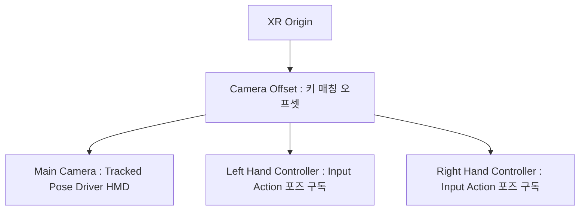

# 🚀 Day 13: 가상현실 프로그래밍 기초 - OpenXR과 XRIT v3.x 텔레포트 이동 구현

오늘의 목표는 **"가상현실(VR)의 입체시 렌더링 원리와 6자유도(6DoF) 트래킹 물리 패러다임을 이해하고, OpenXR 표준 규격 및 최신 XR Interaction Toolkit(XRIT) v3.x를 기반으로 XR Origin 카메라 릭을 설정하고 텔레포트(Teleportation) 이동 시스템을 설계하고 구현하는 능력을 완수한다"**입니다.

---

## 1. 💡 이론 (30%): VR의 물리적 원리와 OpenXR 표준

가상현실 콘텐츠는 사용자에게 인위적인 감각 정보를 제공하여 실제 공간에 있는 듯한 몰입감을 부여하는 물리적 상호작용의 집합체입니다.

### 1) 입체시(Stereoscopy)와 6자유도(6DoF) 트래킹
- **입체시 (Stereoscopy)**: 인간의 두 눈 사이의 물리적 거리(IPD, Interpupillary Distance)에 의한 양안시차(Binocular Disparity)를 모사하기 위해, 좌측 눈용 카메라와 우측 눈용 카메라에서 투영 영역을 다르게 연산하여 **2회 렌더링(Double Rendering)**을 수행합니다. 이로 인해 GPU 드로우콜(Draw Call) 및 렌더 픽셀 연산량이 일반 3D 게임의 2배 이상 요구되며 고도의 프레임 유지(최소 `72 ~ 90Hz`)가 멀미 예방의 필수 조건입니다.
- **6자유도 (6DoF, Degrees of Freedom)**: 
  - **3DoF (Pitch, Yaw, Roll)**: 회전각만 추적 (예: 고개를 양옆, 위아래로 돌림)
  - **6DoF (3DoF + X, Y, Z)**: 물리적 위치 이동까지 완벽 추적 (예: 씬 안에서 걸어 다니고 몸을 숙임)

### 2) OpenXR 및 XRIT v3.x 아키텍처
기존에는 Oculus, HTC Vive, Valve Index 등 디바이스 개발사마다 전용 SDK를 연동해야 했으나, 현재는 크로노스 그룹(Khronos Group) 주도의 **OpenXR** 국제 표준 표준 규격을 사용해 원-소스 멀티-디바이스(One-Source Multi-Device) 빌드가 가능합니다.
유니티는 OpenXR 위에서 동작하는 상호작용 추상화 프레임워크인 **XR Interaction Toolkit (XRIT) v3.x**를 제공합니다.

---

## 2. 🏗️ XR Origin (VR 카메라 릭) 컴포넌트 구조 분석

VR 하드웨어의 좌표계와 Unity 씬 내 가상 좌표계를 매핑해 주는 핵심 구조물입니다.



- **XR Origin**: 가상 월드 내에서 플레이어 앵커 역할을 수행하며, HMD가 트래킹하는 원점 위치를 통제합니다.
- **Tracked Pose Driver**: HMD 및 컨트롤러 장치로부터 실시간으로 전송되는 원격 물리 좌표와 회전값을 유니티의 `Transform` 컴포넌트로 1:1 주입(Update)해 주는 구동 장치입니다.

---

## 💻 3. 실습 (70%): XRIT v3.x 기반 텔레포트 이동 시스템 구축

**미션:** 공간 왜곡 멀미(VR Motion Sickness)를 차단하기 위해 화면을 순간 이동시키는 **텔레포트(Teleportation)** 이동을 설계하세요. 지면에 `Teleportation Area`를 배치하고, 특정 중요 스팟에 안착시키는 `Teleportation Anchor`를 구성하는 실습 스크립트를 분석하세요.

### 🛠️ 텔레포트 매니저 컴포넌트 (`VRTeleportationSystem.cs`)

```csharp
using UnityEngine;
using UnityEngine.XR.Interaction.Toolkit;
using UnityEngine.XR.Interaction.Toolkit.Locomotion.Teleportation; // XRIT v3.x Locomotion 네임스페이스

public class VRTeleportationSystem : MonoBehaviour
{
    [Header("XRIT 로코모션 구성품")]
    [SerializeField] private TeleportationProvider teleportationProvider;
    [SerializeField] private XROrigin xrOrigin;

    void Start()
    {
        if (teleportationProvider == null)
        {
            teleportationProvider = FindFirstObjectByType<TeleportationProvider>();
        }

        if (xrOrigin == null)
        {
            xrOrigin = FindFirstObjectByType<XROrigin>();
        }

        VerifyLocomotionConfiguration();
    }

    private void VerifyLocomotionConfiguration()
    {
        if (teleportationProvider != null && xrOrigin != null)
        {
            Debug.Log("<color=green>[Locomotion OK]</color> XRIT v3.x 기반 텔레포트 프로바이더 및 XR Origin 릭이 연동되었습니다.");
        }
        else
        {
            Debug.LogError("[CRITICAL ERROR] XRIT 텔레포트 물리 컴포넌트 구성을 확인할 수 없습니다. 하이러키를 점검하세요.");
        }
    }

    /// <summary>
    /// 외부 이벤트나 특정 트리거에 의한 강제 텔레포트 이동 시뮬레이션
    /// </summary>
    public void ExecuteForceTeleport(Vector3 targetWorldPosition, Quaternion targetRotation)
    {
        if (teleportationProvider == null) return;

        TeleportRequest request = new TeleportRequest()
        {
            destinationPosition = targetWorldPosition,
            destinationRotation = targetRotation,
            matchOrientation = MatchOrientation.TargetAndCameraUp
        };

        // 텔레포트 프로바이더를 통해 안전한 물리적 좌표 이동 비동기 큐잉
        teleportationProvider.QueueTeleportRequest(request);
        Debug.Log($"<color=cyan>[Teleport Requested]</color> 목적지: {targetWorldPosition}으로의 물리 텔레포트 발동.");
    }
}
```

---

## 🎯 NCS 능력단위 학습 가이드 & 평가 만족 요건

본 강의 내용은 **"게임엔진 응용 프로그래밍(NCS 0803020527_18v4)"**의 **수행준거 4.1 XR 개발 환경 구성 및 물리 제어**를 완벽하게 충족합니다.

| NCS 평가 준거 | 학습 대응 영역 | 만족 기법 및 로직 |
| :--- | :--- | :--- |
| **XR 기기 연동 및 포지셔닝** | HMD 및 컨트롤러 트래킹 데이터 바인딩 | `OpenXR` 프레임워크 셋업 및 `XR Origin` 릭, `Tracked Pose Driver` 연동 |
| **가상 공간 이동 제어** | 가상 이동 시 발생하는 물리 왜곡 및 멀미 억제 | `TeleportationProvider` 및 `TeleportRequest`를 통한 물리 불연속 텔레포트 구현 |

---

## ✍️ 평가 문항 대비 핵심 퀴즈

1. **문제:** VR 장비를 착용했을 때 고개의 좌우 회전뿐만 아니라 실제 가상 공간에서 몸을 굽히고 앞뒤좌우로 걷는 물리적인 6자유도 트래킹을 뜻하는 물리 용어의 약칭은 무엇인가요?
   - **정답:** 6DoF (6 Degrees of Freedom)

2. **문제:** 기기별(Meta, HTC, Valve 등) SDK가 파편화되어 생기는 포팅 낭비를 예방하기 위해, Khronos Group이 정의한 XR 디바이스 제어 업계 국제 표준 규격의 이름은 무엇인가요?
   - **정답:** OpenXR

3. **문제:** XRIT v3.x에서 플레이어가 어지러움 없이 지형을 이동할 수 있도록 지면에 설치하는 반응형 컴포넌트로, 특정 면적 안의 어디든 조준하여 순간 이동할 수 있도록 지형 영역을 정의하는 컴포넌트 이름은 무엇인가요?
   - **정답:** Teleportation Area

