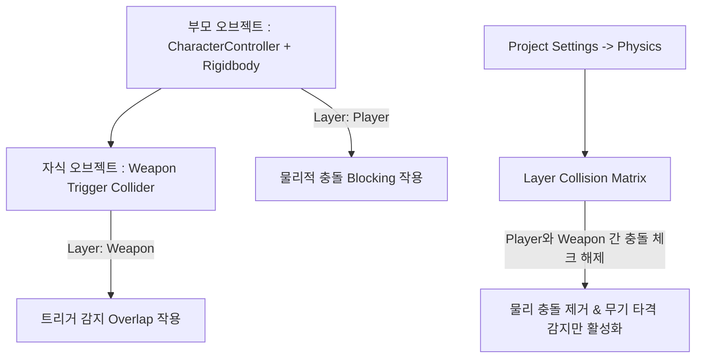

# 🚀 Day 14: VR 상호작용과 물리 최적화 - 그랩(Grab) 및 레이어 매트릭스 설계

오늘의 목표는 **"XR Interaction Toolkit(XRIT) v3.x 기반의 Direct/Ray 그랩 상호작용을 구축하고, 부모 Rigidbody와 자식 Trigger Collider 간의 물리적 상충 현상을 해결하는 레이어 매트릭스 설계를 적용하며, HMD 없이 완성 테스트를 수행할 수 있는 XR Device Simulator의 활용법을 완수한다"**입니다.

---

## 1. 💡 이론 (30%): 그랩(Grab) 메커니즘과 물리 반응 모델

가상현실에서 가장 기본적인 상호작용은 가상 손 컨트롤러로 오브젝트를 잡고(Grab), 휘두르고, 던지는 조작입니다.

### 1) Direct Interactor vs Ray Interactor
- **Direct Interactor**: 사용자의 가상 손 콜라이더가 오브젝트에 직접 닿았을 때 집는 근접 상호작용입니다.
- **Ray Interactor**: 손끝에서 투사되는 포인터 레이(Raycast)를 조준하여 멀리 있는 물체를 끌어당기거나 원격 제어하는 방식입니다.

### 2) XR Grab Interactable 핵심 물리 속성
물체를 잡았을 때 어떻게 반응할지는 `XR Grab Interactable` 컴포넌트의 아래 세 가지 핵심 속성으로 제어됩니다.
1. **Attach Transform**: 잡았을 때 컨트롤러의 기준 피벗과 정렬될 물체의 특정 가상 트랜스폼입니다. 이를 공백으로 두면 물체를 잡는 순간 컨트롤러 정중앙으로 물체 중심이 툭 튀며 순간 이동하는 어색함이 연출되므로, 손잡이 위치를 가상 오브젝트로 생성하여 바인딩해야 합니다.
2. **Movement Type**:
   - **`Kinematic`**: 잡혀 있는 동안 물리 연산을 무시하고 컨트롤러 트랜스폼을 강제 추적합니다. 벽이나 다른 물체를 뚫고 지나갈 수 있어 시각적 어색함이 있으나 가장 안정적입니다.
   - **`Velocity Tracking`**: 물리 엔진을 사용하여 컨트롤러의 속도와 회전력을 오브젝트에 역으로 주입합니다. 잡힌 물체가 벽에 부딪치면 뚫지 못하고 튕겨 나가므로 극도로 사실적인 물리 상호작용을 유도합니다.

---

## 2. 🛡️ [핵심 설계] 부모 Rigidbody와 자식 Trigger Collider의 물리적 충돌 해결

게임 개발 중 가장 빈번하게 겪는 물리 설계의 실수가 바로 **"부모 Rigidbody & 자식 Trigger Collider 간의 원치 않는 충돌 간섭"**입니다.



### 📌 물리적 상충 현상분석
유니티의 `CharacterController`나 부모 `Rigidbody`가 있는 상태에서, 자식 오브젝트에 적을 감지하거나 휘두르는 무기용 `Trigger Collider`를 부착하는 경우가 많습니다.
- **오동작**: 만약 부모의 레이어 설정이 충돌이 일어나는 레이어(`Player` 등)로 통째로 잡혀 있으면, **자식의 트리거 영역까지 네이티브 물리 엔진이 장애물(Blocking)로 오인식**하여 캐릭터가 밟고 올라타거나, 서로를 밀쳐내는 이상 현상이 일어납니다.
- **해결책 (레이어 매트릭스 격리)**:
  1. **레이어 세분화**: 캐릭터 본체용 레이어(`Player`, `Monster`)와 무기 트리거 전용 레이어(`PlayerWeapon`, `MonsterWeapon`)를 별도로 생성합니다.
  2. **매트릭스 튜닝**: `Project Settings -> Physics -> Layer Collision Matrix`로 이동합니다.
  3. **충돌 규칙 주입**: 
     - `Player` 레이어와 `PlayerWeapon` 레이어 간의 교차 충돌 체크박스를 **해제**합니다.
     - `Player` 본체 간 충돌은 활성화하여 벽이나 캐릭터끼리는 막히되, 무기 트리거는 방해 없이 적의 피격 범위만 부드럽게 관통 및 감지하도록 제어합니다.

---

## 💻 3. 실습 (70%): XR Device Simulator 활용 HMD-less 상호작용 완성 테스트

**미션:** 매번 무거운 VR HMD 헤드셋을 쓰고 빌드할 필요 없이, PC 키보드와 마우스의 조합으로 가상 컨트롤러의 Pose와 Grip 입력을 모사하여 그랩 및 레이 충돌을 에디터 내에서 완성 테스트하는 프로세스를 구성하세요.

### ⚙️ XR Device Simulator 테스트 절차
1. `Package Manager -> XR Interaction Toolkit`의 Samples 탭에서 **XR Device Simulator** 프리팹 에셋을 가져와 씬에 배치합니다.
2. 에디터를 실행(`Play Mode`)합니다.
3. **시뮬레이터 조작 매핑**:
   - **`SpaceBar` (누른 상태)**: 마우스를 움직이면 **우측 가상 컨트롤러**가 화면 상에서 움직이고 회전합니다. (Left Ctrl은 좌측 손)
   - **`W, A, S, D` / `Q, E`**: 가상 HMD 머리를 물리적으로 이동하고 고개를 돌립니다.
   - **`마우스 오른쪽 버튼` (누름)**: 가상 손의 **Grip(그랩)** 신호를 보내므로, `XR Grab Interactable`이 붙은 물체를 잡아서 들어 올리고 테스트할 수 있습니다.

### 🛠️ 그랩 완료 시 이벤트 무결성 검증 C# 코드

```csharp
using UnityEngine;
using UnityEngine.XR.Interaction.Toolkit;
using UnityEngine.XR.Interaction.Toolkit.Interactables; // XRIT v3.x Interactable 네임스페이스

[RequireComponent(typeof(XRGrabInteractable))]
public class GrabEventListener : MonoBehaviour
{
    private XRGrabInteractable grabInteractable;

    void Awake()
    {
        grabInteractable = GetComponent<XRGrabInteractable>();
    }

    void OnEnable()
    {
        // XRIT v3.x 표준 그랩 시작/종료 이벤트 구독
        grabInteractable.selectEntered.AddListener(OnGrabbed);
        grabInteractable.selectExited.AddListener(OnReleased);
    }

    void OnDisable()
    {
        grabInteractable.selectEntered.RemoveListener(OnGrabbed);
        grabInteractable.selectExited.RemoveListener(OnReleased);
    }

    private void OnGrabbed(SelectEnterEventArgs args)
    {
        string interactorName = args.interactorObject.transform.name;
        Debug.Log($"<color=green>[Grab Success]</color> '{gameObject.name}' 오브젝트가 '{interactorName}'에 의해 정상 파지되었습니다.");
        
        // Velocity Tracking 기법 하드웨어 전송 확인
        if (grabInteractable.movementType == XRBaseInteractable.MovementType.VelocityTracking)
        {
            Debug.Log("[Physics Info] Velocity Tracking 적용 완료: 사실적인 벽면 충돌 상호작용이 동작합니다.");
        }
    }

    private void OnReleased(SelectExitEventArgs args)
    {
        Debug.Log($"<color=orange>[Grab Released]</color> '{gameObject.name}'의 파지가 해제되었습니다.");
    }
}
```

---

## 🎯 NCS 능력단위 학습 가이드 & 평가 만족 요건

본 강의 내용은 **"게임엔진 응용 프로그래밍(NCS 0803020527_18v4)"**의 **수행준거 4.2 XR 상호작용 및 무결성 테스트**를 완벽하게 충족합니다.

| NCS 평가 준거 | 학습 대응 영역 | 만족 기법 및 로직 |
| :--- | :--- | :--- |
| **XR 기기 상호작용 구현** | 물체 파지, 집기 및 투척 물리 구현 | `XRGrabInteractable` 바인딩, `MovementType` 물리 모델 제어 |
| **물리 엔진 무결성 설계** | 부모/자식 충돌 꼬임 현상 해결 및 레이어 제어 | `Layer Collision Matrix`를 이용한 캐릭터 본체와 무기 트리거 레이어 격리 설계 |
| **HMD 연동 완성 테스트** | 장비 부재 상황 하의 에뮬레이션 테스트 체계 | `XR Device Simulator`를 이용한 가상 HMD/컨트롤러 에디터 내 조작 테스트 기법 수립 |

---

## ✍️ 평가 문항 대비 핵심 퀴즈

1. **문제:** 유니티의 캐릭터 컨트롤러나 부모 Rigidbody 레이어가 충돌 레이어로 설정되어 있을 때, 자식 오브젝트의 Trigger 영역까지 장애물로 잘못 인식하여 캐릭터를 밀쳐내는 치명적 결함을 해결하기 위해 조율해야 하는 유니티 설정 창의 테이블은 무엇인가요?
   - **정답:** 레이어 충돌 매트릭스 (Layer Collision Matrix / Physics 설정)

2. **문제:** `XR Grab Interactable`에서 물체를 잡았을 때 컨트롤러의 위치에 따라 강제로 좌표를 이동하는 대신, 물리 엔진의 힘과 가속도를 역산 주입하여 벽을 뚫지 못하게 사실적으로 연산하는 움직임 모드(Movement Type)는 무엇인가요?
   - **정답:** Velocity Tracking

3. **문제:** VR 실제 HMD 하드웨어가 없는 개발 PC 환경에서도 키보드와 마우스 매핑을 통해 머리의 포즈 및 가상 손의 그랩 신호를 입력 모사하여 신속히 길찾기 및 그랩 연산을 검증할 수 있게 지원하는 XRIT 패키지 프리팹은 무엇인가요?
   - **정답:** XR Device Simulator

