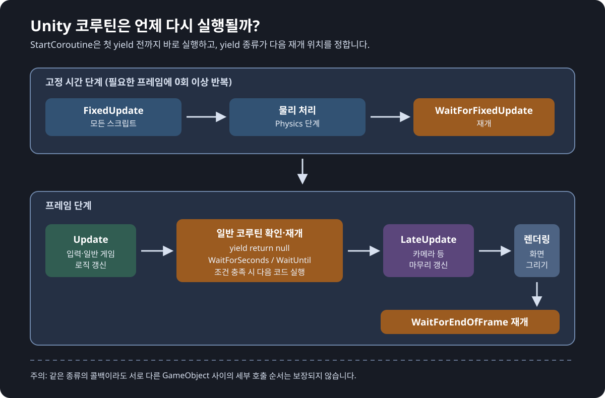

# Unity 코루틴 게임플레이 가이드

> 이 문서는 `DAY07_UNITY_SCRIPTING.md`를 학습한 뒤 읽는 게임엔진 과목 별첨 자료입니다. 코루틴을 이용해 "잠시 기다린 뒤 다음 행동을 실행하는" 게임플레이 기능을 직접 만듭니다.

## 학습 목표

이 문서를 마치면 다음을 할 수 있습니다.

- 코루틴이 Unity의 프레임 흐름 안에서 어떻게 실행되는지 설명합니다.
- `IEnumerator`, `StartCoroutine`, `yield return`을 사용해 시간 순서가 있는 기능을 만듭니다.
- 상황에 맞는 대기 명령을 고릅니다.
- 중복 실행, 중지, 일시정지처럼 자주 발생하는 문제를 막습니다.
- 쿨다운, 지속 효과, 문 열기, 비동기 씬 로딩에 코루틴을 적용합니다.

## 시작 전 확인

- Unity 6 프로젝트와 C# 스크립트를 만들 수 있어야 합니다.
- `MonoBehaviour`, `Start`, `Update`, `Time.deltaTime`의 역할을 알고 있어야 합니다.
- 이 문서는 `DAY07_UNITY_SCRIPTING.md` 다음에 학습하는 것을 권장합니다.

---

## 1. 코루틴이 필요한 이유

게임에는 "지금 실행하고, 잠시 기다린 뒤, 다음 행동을 실행하는" 일이 많습니다.

- 상자를 연 뒤 1초 후 아이템을 지급합니다.
- 공격 뒤 0.5초 동안 다시 공격하지 못하게 합니다.
- 포션을 사용한 뒤 5초 동안만 이동 속도를 높입니다.
- 씬을 읽어 오는 동안 로딩 화면을 표시합니다.

이런 흐름을 `Update` 하나에 모두 넣으면 시간 변수와 조건문이 계속 늘어납니다. 코루틴은 행동 순서를 위에서 아래로 적고, 필요한 지점에서 잠시 멈췄다가 다음 프레임에 이어서 실행하게 해 줍니다.

코루틴은 **별도의 스레드가 아닙니다.** Unity가 프레임을 처리하는 중에 "여기서 잠시 멈춤"이라고 표시한 작업을 다음 조건이 만족될 때 다시 호출하는 방식입니다. 그래서 게임 화면을 멈추지 않습니다.

`Thread.Sleep()`은 Unity의 주 실행 흐름을 멈출 수 있으므로 게임플레이 대기 처리에 사용하지 않습니다.

### 핵심 용어

| 용어 | 쉬운 뜻 |
| :--- | :--- |
| 코루틴 (Coroutine) | 중간에 쉬었다가 이어서 실행할 수 있는 작업 목록입니다. |
| `IEnumerator` | 코루틴 메서드가 반환하는 형식입니다. |
| `yield return` | "이 조건까지 기다린 뒤 다음 줄을 실행하세요"라는 표시입니다. |
| Yield Instruction | `WaitForSeconds`처럼 코루틴의 대기 조건을 나타내는 객체입니다. |

---

## 2. 가장 작은 코루틴 만들기

아래 스크립트는 게임을 시작하고 2초 뒤에 메시지를 출력합니다.

```csharp
using System.Collections;
using UnityEngine;

public class CoroutineHello : MonoBehaviour
{
    private void Start()
    {
        StartCoroutine(PrintAfterDelay());
    }

    private IEnumerator PrintAfterDelay()
    {
        Debug.Log("코루틴 시작");

        yield return new WaitForSeconds(2f);

        Debug.Log("2초 뒤에 실행");
    }
}
```

### 코드를 읽는 순서

1. `Start`는 게임 오브젝트가 시작될 때 `StartCoroutine`을 호출합니다.
2. `PrintAfterDelay`는 첫 번째 `Debug.Log`까지 실행합니다.
3. `yield return new WaitForSeconds(2f)`에서 2초를 기다리도록 Unity에 요청합니다.
4. 기다리는 동안에도 다른 `Update`, 입력, 렌더링은 계속 실행됩니다.
5. 2초가 지나면 마지막 `Debug.Log`를 실행하고 코루틴이 끝납니다.

`IEnumerator` 메서드를 그냥 호출하면 코루틴이 실행되지 않습니다. 반드시 `StartCoroutine(...)`으로 Unity에 등록해야 합니다.

---

## 3. 어떤 것을 기다릴까요?

`yield return` 뒤에는 "언제 다시 실행할지"를 알려 주는 값을 둡니다.

| 코드 | 다시 실행되는 시점 | 사용 예 |
| :--- | :--- | :--- |
| `yield return null;` | 다음 프레임 | 한 프레임마다 부드럽게 수치 바꾸기 |
| `yield return new WaitForSeconds(1f);` | 게임 시간 기준 1초 뒤 | 공격 쿨다운, 문 열기 연출 |
| `yield return new WaitForSecondsRealtime(1f);` | 일시정지와 관계없이 실제 1초 뒤 | 일시정지 메뉴의 안내 메시지 |
| `yield return new WaitForFixedUpdate();` | 다음 물리 갱신 직전 | 물리 단계와 맞춰야 하는 처리 |
| `yield return new WaitUntil(() => isReady);` | 조건이 참이 된 뒤 | 애니메이션 또는 준비 상태 대기 |
| `yield return operation;` | 비동기 작업이 끝난 뒤 | 씬, 리소스 로딩 대기 |

### Unity 프레임 안의 재개 위치



코루틴은 매 프레임 아무 때나 실행되는 마법이 아닙니다. Unity가 정해 둔 실행 순서 안에서, `yield`가 요청한 위치에 다시 호출합니다.

- `StartCoroutine`은 **첫 `yield return` 전까지 즉시 실행**됩니다.
- `yield return null`, 시간이 끝난 `WaitForSeconds`, 조건이 참이 된 `WaitUntil`은 일반적으로 모든 `Update`가 끝난 뒤 재개됩니다.
- `WaitUntil`과 `WaitWhile`의 조건 함수는 정확히 `Update` 뒤, `LateUpdate` 전에 검사됩니다.
- `WaitForFixedUpdate`는 모든 `FixedUpdate` 호출이 끝난 고정 시간 단계에서 재개됩니다.
- `WaitForEndOfFrame`은 카메라와 GUI 렌더링까지 끝난 뒤에 재개됩니다.

따라서 다른 스크립트의 `Update`가 값을 바꾼 다음 그 값을 확인하고 싶다면 `WaitUntil`이 알맞을 수 있습니다. 반대로 정확히 특정 객체의 `Update`가 먼저 실행되어야 한다면 코루틴 타이밍에 기대지 말고, 명시적인 메서드 호출이나 이벤트로 순서를 설계합니다.

### `yield return null`로 부드럽게 크기 바꾸기

```csharp
using System.Collections;
using UnityEngine;

public class ScaleUpOverTime : MonoBehaviour
{
    [SerializeField] private float duration = 1f;

    private void Start()
    {
        StartCoroutine(ScaleUp());
    }

    private IEnumerator ScaleUp()
    {
        Vector3 startScale = transform.localScale;
        Vector3 targetScale = startScale * 1.5f;
        float elapsed = 0f;

        while (elapsed < duration)
        {
            elapsed += Time.deltaTime;
            float progress = elapsed / duration;
            transform.localScale = Vector3.Lerp(startScale, targetScale, progress);

            yield return null;
        }

        transform.localScale = targetScale;
    }
}
```

반복문 안의 `yield return null`이 중요합니다. 이 줄이 없으면 반복문 전체가 한 프레임에 끝나서 변화가 보이지 않습니다.

---

## 4. 시간 배율과 일시정지

`Time.timeScale = 0f`로 게임을 일시정지하면 `Time.deltaTime`은 0이 됩니다. `WaitForSeconds`도 게임 시간의 영향을 받으므로 일시정지 중에는 기다림이 진행되지 않습니다.

반대로 `WaitForSecondsRealtime`은 실제 시간을 기준으로 하므로 일시정지 중에도 진행됩니다.

```csharp
using System.Collections;
using UnityEngine;

public class PauseMessage : MonoBehaviour
{
    private IEnumerator ShowMessageForRealTime()
    {
        Debug.Log("메시지 표시");
        yield return new WaitForSecondsRealtime(2f);
        Debug.Log("일시정지 중이어도 2초 뒤에 숨김");
    }
}
```

게임 안의 공격, 이동, 버프에는 보통 `WaitForSeconds`를 사용합니다. 메뉴 안내, 접근성 알림처럼 게임이 멈춰도 진행되어야 하는 UI에는 `WaitForSecondsRealtime`을 검토합니다.

---

## 5. 실습 1: 상자를 열고 보상 주기

**미션:** 플레이어가 상자를 열면 1초 동안 열리는 연출을 보여 준 뒤 보상을 지급합니다. 상자가 열리는 동안에는 다시 열 수 없습니다.

```csharp
using System.Collections;
using UnityEngine;

public class TreasureChest : MonoBehaviour
{
    [SerializeField] private GameObject reward;
    [SerializeField] private float openDelay = 1f;

    private bool isOpening;
    private bool isOpened;

    public void Open()
    {
        if (isOpening || isOpened)
        {
            return;
        }

        StartCoroutine(OpenSequence());
    }

    private IEnumerator OpenSequence()
    {
        isOpening = true;
        Debug.Log("상자를 엽니다.");

        yield return new WaitForSeconds(openDelay);

        reward.SetActive(true);
        isOpened = true;
        isOpening = false;
        Debug.Log("보상을 지급했습니다.");
    }
}
```

### 확인하기

1. 빈 GameObject에 `TreasureChest`를 붙입니다.
2. 보상으로 사용할 Cube를 만들고 처음에는 비활성화합니다.
3. `reward` 칸에 Cube를 연결합니다.
4. 임시로 다른 스크립트나 Inspector 버튼에서 `Open()`을 호출합니다.
5. 여러 번 호출해도 보상이 한 번만 활성화되는지 확인합니다.

`isOpening`과 `isOpened`는 코루틴 자체보다 게임 규칙을 지키기 위한 상태값입니다. 코루틴을 시작했다는 사실만으로는 "이미 보상을 받은 상자인가?"를 표현할 수 없습니다.

---

## 6. 코루틴을 시작하고 안전하게 멈추기

코루틴을 멈춰야 할 때는 반환받은 `Coroutine` 참조를 보관하는 방법이 가장 읽기 쉽습니다.

```csharp
using System.Collections;
using UnityEngine;

public class AutoCloseDoor : MonoBehaviour
{
    [SerializeField] private float closeDelay = 3f;

    private Coroutine closeRoutine;

    public void OpenDoor()
    {
        Debug.Log("문 열기");

        if (closeRoutine != null)
        {
            StopCoroutine(closeRoutine);
        }

        closeRoutine = StartCoroutine(CloseAfterDelay());
    }

    private IEnumerator CloseAfterDelay()
    {
        yield return new WaitForSeconds(closeDelay);
        Debug.Log("문 닫기");
        closeRoutine = null;
    }

    private void OnDisable()
    {
        if (closeRoutine != null)
        {
            StopCoroutine(closeRoutine);
            closeRoutine = null;
        }
    }
}
```

### 중지할 때의 규칙

- 같은 문을 다시 열었다면 이전의 "문 닫기 예약"은 취소해야 합니다.
- `StopAllCoroutines()`는 이 컴포넌트에서 실행 중인 모든 코루틴을 멈춥니다. 다른 기능까지 멈출 수 있으므로 기본 선택으로 쓰지 않습니다.
- 문자열로 메서드 이름을 전달하는 `StartCoroutine("MethodName")` 방식은 오타를 찾기 어렵고 인자를 다루기 불편합니다. 이 문서의 메서드 호출 방식을 사용합니다.
- 컴포넌트만 비활성화해도 코루틴이 원하는 방식으로 정리된다고 가정하지 않습니다. 비활성화 시 정리가 필요하면 `OnDisable`에서 직접 멈춥니다.
- GameObject가 비활성화되거나 소멸되면 연결된 코루틴도 계속 사용할 수 없습니다. 다시 활성화할 때 필요한 상태는 별도로 초기화합니다.

---

## 7. 실습 2: 공격 쿨다운 만들기

**미션:** 공격을 실행하면 0.5초 동안 다시 공격할 수 없게 만듭니다.

```csharp
using System.Collections;
using UnityEngine;

public class SimpleAttack : MonoBehaviour
{
    [SerializeField] private float cooldown = 0.5f;

    private bool canAttack = true;
    private Coroutine cooldownRoutine;

    public void TryAttack()
    {
        if (!canAttack)
        {
            return;
        }

        Debug.Log("공격 실행");
        canAttack = false;
        cooldownRoutine = StartCoroutine(ResetCooldown());
    }

    private IEnumerator ResetCooldown()
    {
        yield return new WaitForSeconds(cooldown);
        canAttack = true;
        cooldownRoutine = null;
        Debug.Log("다시 공격할 수 있습니다.");
    }
}
```

이 예제에서 중요한 것은 코루틴이 아니라 `canAttack`입니다. 입력을 받았을 때 먼저 현재 상태를 확인하고, 코루틴은 상태를 되돌릴 시점을 예약합니다.

---

## 8. 실습 3: 지속 시간 포션 만들기

**미션:** 포션을 사용하면 5초 동안 이동 속도를 높이고, 시간이 지나면 원래 속도로 되돌립니다.

```csharp
using System.Collections;
using UnityEngine;

public class TimedSpeedBuff : MonoBehaviour
{
    [SerializeField] private float normalSpeed = 5f;
    [SerializeField] private float buffedSpeed = 8f;
    [SerializeField] private float buffDuration = 5f;

    private Coroutine buffRoutine;
    public float CurrentSpeed { get; private set; }

    private void Awake()
    {
        CurrentSpeed = normalSpeed;
    }

    public void UsePotion()
    {
        if (buffRoutine != null)
        {
            StopCoroutine(buffRoutine);
        }

        buffRoutine = StartCoroutine(ApplySpeedBuff());
    }

    private IEnumerator ApplySpeedBuff()
    {
        CurrentSpeed = buffedSpeed;
        Debug.Log("속도 증가");

        yield return new WaitForSeconds(buffDuration);

        CurrentSpeed = normalSpeed;
        buffRoutine = null;
        Debug.Log("속도 원래대로");
    }

    private void OnDisable()
    {
        if (buffRoutine != null)
        {
            StopCoroutine(buffRoutine);
            buffRoutine = null;
        }

        CurrentSpeed = normalSpeed;
    }
}
```

포션을 여러 번 마셨을 때 이전 코루틴을 멈추고 시간을 새로 시작합니다. 이것을 **지속 시간 갱신 방식**이라고 부를 수 있습니다. 효과를 여러 겹 쌓는 방식은 규칙이 달라지므로, 먼저 이 단순한 방식을 완성한 뒤 확장합니다.

---

## 9. 비동기 씬 로딩 기다리기

코루틴은 Unity의 `AsyncOperation`이 끝날 때까지 기다릴 수 있습니다. 로딩이 긴 작업에서도 화면을 멈추지 않는 이유를 확인하기 좋은 예제입니다.

```csharp
using System.Collections;
using UnityEngine;
using UnityEngine.SceneManagement;

public class SceneLoader : MonoBehaviour
{
    public void LoadGameScene()
    {
        StartCoroutine(LoadSceneSequence());
    }

    private IEnumerator LoadSceneSequence()
    {
        AsyncOperation operation = SceneManager.LoadSceneAsync("GameScene");

        while (!operation.isDone)
        {
            float progress = Mathf.Clamp01(operation.progress / 0.9f);
            Debug.Log($"로딩 진행도: {progress:P0}");

            yield return null;
        }
    }
}
```

`GameScene`은 실제 Build Settings에 등록한 씬 이름으로 바꿉니다. 매 프레임 `Debug.Log`를 출력하면 Console이 너무 빨리 쌓일 수 있으므로, 실제 UI에서는 진행도 값을 Slider나 Text에 표시합니다.

---

## 10. 코루틴과 다른 도구 고르기

| 하고 싶은 일 | 먼저 고려할 도구 | 이유 |
| :--- | :--- | :--- |
| 매 프레임 이동 입력 확인 | `Update` | 매 프레임 계속 확인해야 합니다. |
| 3초 뒤 문 닫기 | 코루틴 | 순서와 대기 시간이 코드에 잘 드러납니다. |
| 물리 힘 적용 | `FixedUpdate` | 물리 갱신 주기와 맞춥니다. |
| 정교한 캐릭터 동작 전환 | Animator | 애니메이션 상태 전환을 관리합니다. |
| 서버 요청, 파일 처리 등 복잡한 비동기 작업 | 후속 비동기 설계 학습 | 취소, 오류, 결과 처리가 더 중요해질 수 있습니다. |

코루틴은 모든 문제를 해결하는 도구가 아닙니다. 특히 `Update`에서 매 프레임 `StartCoroutine`을 호출하면 매 프레임 새로운 작업이 생겨 성능과 상태가 모두 망가질 수 있습니다.

---

## 11. 자주 하는 실수

### `yield return`을 빼먹기

반복문 안에 대기 지점이 없으면 한 프레임에 반복문이 끝납니다. 화면에 부드러운 변화가 보이지 않고 게임이 잠시 멈춘 것처럼 느껴질 수 있습니다.

### 같은 코루틴을 계속 시작하기

버튼을 누를 때마다 버프 코루틴을 새로 만들면, 먼저 시작한 코루틴이 나중에 속도를 원래대로 바꿔 버릴 수 있습니다. `Coroutine` 참조나 상태값으로 하나만 실행되게 관리합니다.

### 상태 복구를 빼먹기

상호작용 중 입력을 막았다면, 코루틴이 끝날 때 반드시 다시 입력을 허용해야 합니다. 오브젝트가 비활성화될 가능성도 있다면 `OnDisable`에서 기본 상태를 복구합니다.

### 무한 반복 코루틴을 무심코 만들기

`while (true)`는 필요할 수 있지만, 언제 끝날지와 언제 멈출지를 함께 설계해야 합니다. 종료 조건 또는 `OnDisable` 정리를 먼저 작성합니다.

---

## 12. 미니 프로젝트: 안전한 회복 구역

다음 조건을 모두 만족하는 회복 구역을 만들어 보세요.

1. 플레이어가 Trigger 안에 들어오면 1초마다 체력을 5 회복합니다.
2. Trigger 밖으로 나가면 회복 코루틴이 멈춥니다.
3. 같은 플레이어가 다시 들어와도 회복 코루틴이 하나만 실행됩니다.
4. 게임을 일시정지하면 회복도 멈춥니다.
5. Console에 회복 횟수와 현재 체력을 출력해 동작을 확인합니다.

### 확장 과제

- 회복 중에는 파티클을 재생하고, 나가면 정지합니다.
- 체력이 최대치라면 코루틴을 멈춥니다.
- UI에 다음 회복까지 남은 시간을 표시합니다.

---

## 확인 질문

1. 코루틴과 별도 스레드는 어떻게 다른가요?
2. `WaitForSeconds`와 `WaitForSecondsRealtime`은 언제 각각 사용하나요?
3. 코루틴을 반복문 안에서 사용할 때 `yield return null`이 필요한 이유는 무엇인가요?
4. 포션 효과 코루틴을 여러 번 시작하면 어떤 문제가 생길 수 있나요?
5. `Update`, `FixedUpdate`, 코루틴 중 무엇을 쓸지 판단하는 기준은 무엇인가요?

## 오늘의 정리

- 코루틴은 Unity 프레임 흐름 안에서 기다림과 실행 순서를 만드는 도구입니다.
- `IEnumerator` 메서드는 `StartCoroutine`으로 시작하고, `yield return`으로 다음 실행 조건을 지정합니다.
- 코루틴에는 시간뿐 아니라 프레임, 조건, 비동기 작업 완료를 기다리는 방법이 있습니다.
- 코루틴을 사용할 때는 중복 실행, 중지 시점, 상태 복구를 함께 설계해야 합니다.
- 쿨다운, 지속 효과, 상호작용 연출, 씬 로딩은 코루틴을 연습하기 좋은 게임플레이 기능입니다.
