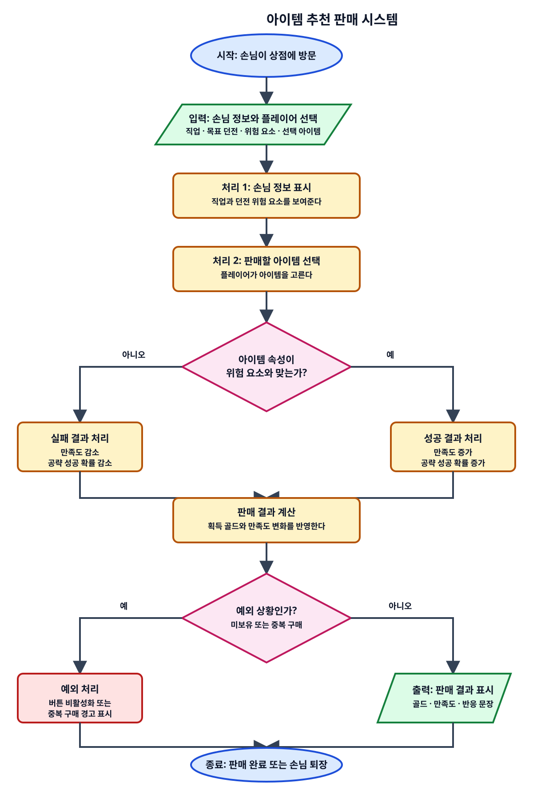

# DAY 02: 시스템 흐름도와 규칙 설계

오늘은 시스템이 어떤 순서로 작동하는지 흐름도로 정리합니다. 시스템 기획서는 말로만 쓰면 해석이 갈릴 수 있기 때문에, 순서와 조건을 눈으로 볼 수 있게 만들어야 합니다.

## 1. 핵심 개념: "놀이 규칙을 길 안내판으로 만들기"

놀이공원 줄을 생각해봅시다. 입구에서 표를 확인하고, 줄을 서고, 차례가 오면 탑승하고, 끝나면 출구로 나갑니다. 중간에 키 제한이 있거나 점검 중이면 다른 길로 안내됩니다.

게임 시스템도 비슷합니다. 시작 조건, 처리 순서, 조건 분기, 결과가 있습니다. 흐름도는 이 길을 안내판처럼 보여주는 문서입니다.

### 이 단어는 무슨 뜻인가요?

- **흐름도**: 시스템이 어떤 순서로 진행되는지 나타낸 그림 또는 단계 목록입니다.
- **조건 분기**: 어떤 조건에 따라 결과가 갈라지는 지점입니다.
- **예외 상황**: 일반적인 흐름에서 벗어나는 특수 상황입니다.
- **시작 조건**: 시스템이 작동하기 위해 먼저 만족되어야 하는 조건입니다.
- **종료 조건**: 시스템 처리가 끝났다고 판단하는 조건입니다.

## 2. 흐름도에 꼭 들어갈 것

흐름도는 예쁘게 그리는 것보다 빠뜨리지 않는 것이 중요합니다.

| 항목 | 질문 |
| :--- | :--- |
| 시작 | 언제 시스템이 시작되는가? |
| 입력 | 어떤 정보가 들어오는가? |
| 처리 | 어떤 순서로 판단하는가? |
| 조건 | 무엇에 따라 결과가 달라지는가? |
| 출력 | 플레이어에게 무엇이 보이는가? |
| 예외 | 실패, 취소, 부족, 중복 상황은 어떻게 되는가? |

## 문서 실습: 텍스트 흐름도 작성

**미션:** DAY 01에서 고른 핵심 시스템 하나를 단계별 흐름으로 작성합니다.

```text
시스템 이름:

1. 시작 조건
-

2. 입력 정보
-

3. 기본 흐름
1)
2)
3)
4)

4. 조건 분기
- 조건 A:
- 결과 A:
- 조건 B:
- 결과 B:

5. 예외 상황
- 예외 1:
- 처리:
- 예외 2:
- 처리:

6. 종료 조건
-

7. 플레이어에게 보여줄 결과
-
```

### 작성 예시

```text
시스템 이름: 아이템 추천 판매 시스템

1. 시작 조건
- 손님이 상점에 방문한다.

2. 입력 정보
- 손님 직업, 목표 던전, 현재 위험 요소, 플레이어가 선택한 아이템

3. 기본 흐름
1) 손님 정보가 표시된다.
2) 플레이어가 판매할 아이템을 선택한다.
3) 시스템이 손님 직업과 던전 위험 요소를 비교한다.
4) 판매 결과와 만족도 변화가 표시된다.

4. 조건 분기
- 조건 A: 아이템 속성이 던전 위험 요소와 맞는다.
- 결과 A: 만족도 증가, 공략 성공 확률 증가
- 조건 B: 아이템 속성이 맞지 않는다.
- 결과 B: 만족도 감소, 공략 실패 확률 증가

5. 예외 상황
- 예외 1: 플레이어가 해당 아이템을 보유하지 않음
- 처리: 판매 버튼을 비활성화하고 부족 메시지를 표시한다.
- 예외 2: 손님이 이미 같은 아이템을 구매함
- 처리: 중복 구매 경고를 표시한다.

6. 종료 조건
- 판매가 완료되거나 손님이 상점을 떠난다.

7. 플레이어에게 보여줄 결과
- 획득 골드, 만족도 변화, 손님의 짧은 반응 문장
```

### 생각해보기

1. 예외 상황을 문서에 적지 않으면 어떤 문제가 생길까요?
2. 흐름도는 개발자만 보는 문서일까요?
3. 시작 조건과 종료 조건이 불분명한 시스템은 어떤 버그가 생기기 쉬울까요?

## 순서도로 그려 보기

앞의 작성 예시를 순서도로 옮기면 다음과 같습니다. 화살표를 따라가며 시스템의 기본 흐름과 조건 분기, 예외 처리를 확인해 보세요.

직접 순서도를 그려 보려면 [draw.io](https://www.drawio.com/)를 사용할 수 있습니다. 웹에서 바로 실행할 수 있으므로 별도 프로그램을 설치하지 않아도 됩니다.



### 순서도 요소의 의미

| 도형 | 이름 | 의미 | 이 예시에서의 사용 |
| :--- | :--- | :--- | :--- |
| 타원형 | 시작/끝 | 시스템의 시작 지점이나 종료 지점을 나타냅니다. | 손님이 상점에 방문하는 순간과 판매가 끝나거나 손님이 떠나는 순간 |
| 평행사변형 | 입력/출력 | 시스템에 들어오는 정보나 플레이어에게 보여주는 결과를 나타냅니다. | 손님 정보·선택 아이템 입력, 골드·만족도·반응 문장 출력 |
| 직사각형 | 처리 | 시스템이 수행하는 작업이나 계산을 나타냅니다. | 정보 표시, 아이템 선택, 성공·실패 처리, 판매 결과 계산 |
| 마름모 | 조건/판단 | 조건에 따라 흐름이 둘 이상으로 갈라지는 판단 지점을 나타냅니다. | 아이템 속성이 위험 요소와 맞는지, 예외 상황인지 판단 |
| 빨간색 직사각형 | 예외 처리 | 보통 흐름에서 벗어난 상황과 그 대응을 나타냅니다. | 아이템 미보유 시 버튼 비활성화, 중복 구매 경고 |
| 화살표 | 흐름선 | 작업이 진행되는 방향과 다음 단계를 나타냅니다. | 위에서 아래로 진행하며, `예`와 `아니오` 결과에 따라 좌우로 분기 |

> 색상은 학습을 돕기 위한 보조 표시입니다. 실제 순서도를 그릴 때는 색상보다 도형의 모양과 도형 안의 문장을 먼저 확인하세요.

## 오늘의 정리

- 시스템 흐름도는 시스템의 시작, 입력, 처리, 조건, 출력을 한눈에 보이게 합니다.
- 조건 분기와 예외 상황은 시스템 문서에서 특히 중요합니다.
- 텍스트 흐름도만으로도 개발자와 기획자가 같은 규칙을 공유할 수 있습니다.
