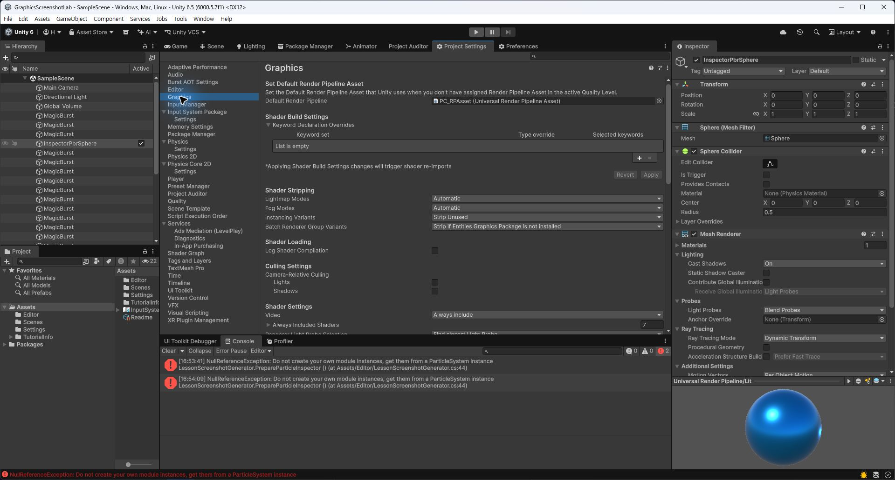
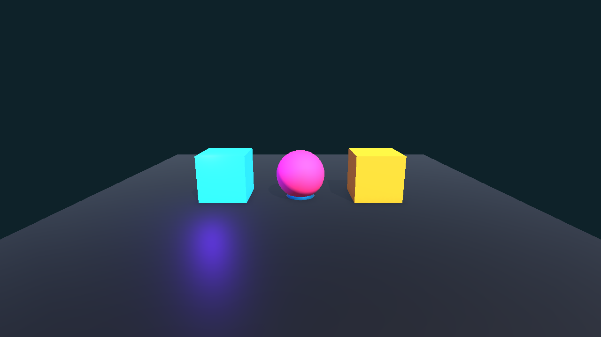

# DAY 01: Unity 6 렌더링 파이프라인과 URP 기초

오늘의 목표는 Unity가 게임 월드를 화면에 그리는 과정을 "**무대 뒤 조명실에서 장면을 순서대로 켜는 일**"로 이해하는 것입니다.

## NCS 연결

- 능력단위: `0803020531_18v4 게임 그래픽 프로그래밍`
- 능력단위 요소: 셰이더 프로그래밍하기
- 관련 학습 내용: 렌더링, 렌더링 파이프라인, 게임 엔진 그래픽 출력
- Unity 6 재구성: URP 프로젝트에서 카메라, 라이트, 머티리얼, 렌더러 설정을 확인합니다.

## 1. 핵심 개념: "화면은 한 번에 그려지지 않는다"

Unity 화면은 카메라가 보는 오브젝트를 모아 GPU가 처리한 결과입니다. 오브젝트는 메시, 머티리얼, 라이트, 카메라, 렌더 파이프라인 설정을 거쳐 화면에 나타납니다.

### 이 단어는 무슨 뜻인가요?

- **렌더링**: 3D 공간의 데이터를 2D 화면 이미지로 바꾸는 과정입니다.
- **렌더 파이프라인**: 어떤 순서와 규칙으로 화면을 그릴지 정한 작업 흐름입니다.
- **URP**: Universal Render Pipeline의 줄임말입니다. Unity 6 수업에서 기본으로 사용할 경량 범용 렌더 파이프라인입니다.
- **GPU**: 그래픽 계산을 주로 담당하는 장치입니다.
- **Draw Call**: CPU가 GPU에게 "이 오브젝트를 그려 줘"라고 요청하는 단위입니다.

## 2. Unity 6 그래픽 실험 씬 만들기

1. Unity 6에서 URP 템플릿 프로젝트를 만듭니다.
2. `GraphicsLab` 씬을 생성합니다.
3. Plane, Sphere, Cube를 배치합니다.
4. Directional Light와 Camera가 있는지 확인합니다.
5. 오브젝트마다 다른 머티리얼을 적용합니다.

## 3. Inspector에서 확인할 것

| 대상 | 확인 항목 | 의미 |
| :--- | :--- | :--- |
| Camera | Projection, Clear Flags, Clipping Planes | 어떤 범위를 어떤 방식으로 볼지 정합니다. |
| Light | Type, Intensity, Color, Shadows | 화면의 밝기와 그림자 품질을 정합니다. |
| Mesh Renderer | Materials, Shadow Casting | 어떤 머티리얼로 그릴지 정합니다. |
| URP Asset | Render Scale, Quality, Shadows | 프로젝트 전체 렌더링 품질을 정합니다. |

## 스크린샷 체크포인트

- `Images/day01_urp_project_settings.png`: Project Settings의 Graphics 또는 Quality 설정 화면
- `Images/day01_graphics_lab_scene.png`: Plane, Sphere, Cube, Light가 배치된 씬 화면

## 실습 미션

`GraphicsLab` 씬에서 같은 Sphere 3개를 만들고, 라이트 강도와 머티리얼 색을 바꾸어 화면 인상이 어떻게 달라지는지 캡처합니다.

## 오늘의 정리

- 게임 그래픽은 오브젝트만으로 만들어지지 않고 카메라, 라이트, 머티리얼, 렌더 파이프라인이 함께 만든 결과입니다.
- URP 설정은 수업 전체의 기본 그래픽 규칙입니다.
- 다음 시간에는 머티리얼과 텍스처를 이용해 표면의 느낌을 바꿉니다.
