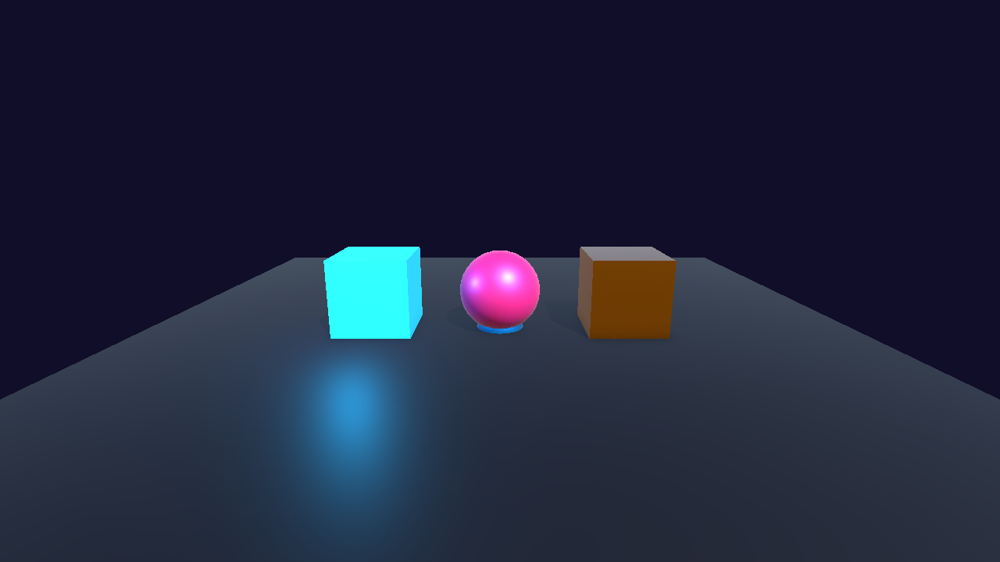
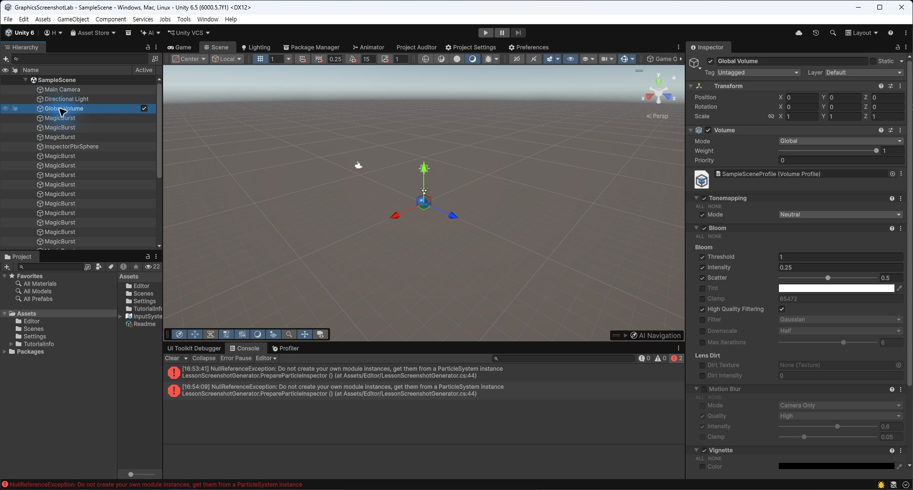

# DAY 03: 조명, 그림자, 카메라와 색 보정

오늘의 목표는 조명과 카메라를 "**게임 장면의 촬영 감독**"처럼 이해하고, 같은 오브젝트도 빛과 색 보정에 따라 다르게 보인다는 점을 확인하는 것입니다.

## NCS 연결

- 능력단위 요소: 셰이더 프로그래밍하기
- 관련 학습 내용: 조명 모델, 렌더링 품질 향상
- Unity 6 재구성: URP Light, Shadow, Volume, Camera 설정을 사용합니다.

## 1. 핵심 개념: "보이는 것은 물체와 빛의 합작이다"

게임 화면에서 색은 머티리얼 혼자 결정하지 않습니다. 빛의 방향, 색, 세기, 그림자, 카메라 노출, 후처리가 함께 결과를 만듭니다.

### 이 단어는 무슨 뜻인가요?

- **Directional Light**: 태양처럼 한 방향에서 전체 씬을 비추는 빛입니다.
- **Point Light**: 전구처럼 한 지점에서 사방으로 퍼지는 빛입니다.
- **Spot Light**: 손전등처럼 원뿔 모양으로 비추는 빛입니다.
- **Shadow**: 빛이 막혀 어두워진 영역입니다.
- **Volume**: 색 보정, Bloom, Vignette 같은 후처리 효과를 담는 설정 묶음입니다.

## 2. 실습: 낮, 저녁, 던전 조명 만들기

1. 같은 씬을 복제해 `Lighting_Day`, `Lighting_Sunset`, `Lighting_Dungeon` 상태를 만듭니다.
2. Directional Light의 Rotation, Color, Intensity를 조절합니다.
3. Point Light를 추가해 횃불처럼 배치합니다.
4. Global Volume을 만들고 Bloom, Color Adjustments를 추가합니다.

## 주요 설정

| 설정 | 사용 목적 |
| :--- | :--- |
| Light Intensity | 전체 밝기 조절 |
| Shadow Strength | 그림자의 진하기 조절 |
| Bloom | 밝은 부분이 번져 보이는 효과 |
| Color Adjustments | 장면의 색감과 대비 조절 |
| Camera Clipping Planes | 카메라가 보는 거리 범위 조절 |

## 스크린샷 체크포인트

- `Images/day03_lighting_variants.png`: 같은 씬을 낮/저녁/던전 조명으로 비교한 화면
- `Images/day03_volume_profile.png`: Volume Profile에 Bloom과 Color Adjustments가 추가된 화면

## 오늘의 정리

- 조명은 오브젝트의 입체감과 분위기를 만듭니다.
- 그림자와 후처리는 화면의 완성도를 높이지만 성능 비용도 있습니다.
- 다음 시간부터 Shader Graph로 직접 표면 계산을 만들어 봅니다.
