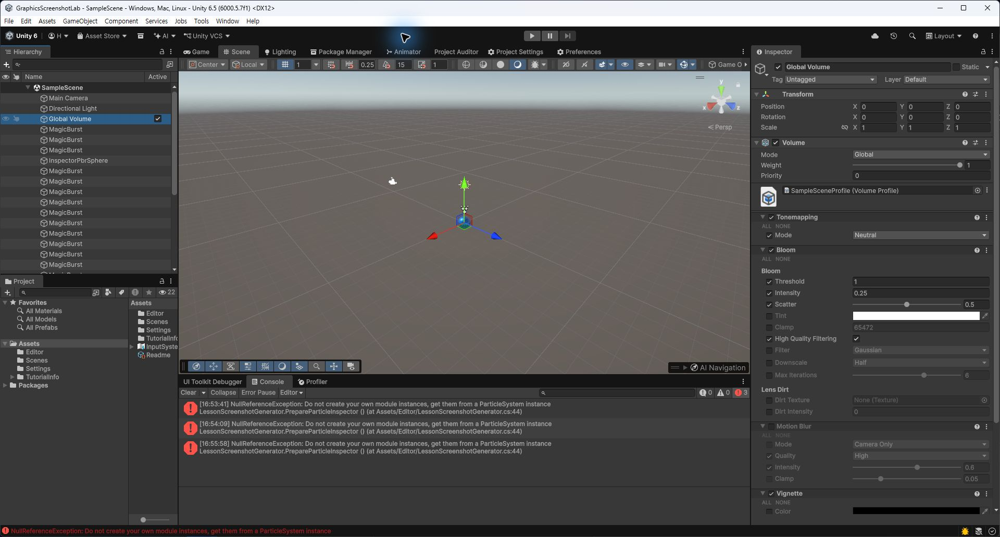
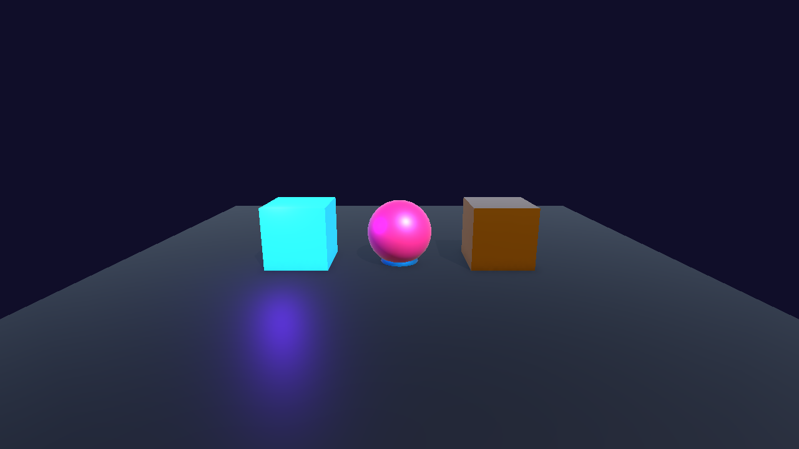

# DAY 09: Particle System 기초

오늘의 목표는 이펙트를 "**작은 조각을 많이 뿌려 하나의 현상처럼 보이게 하는 기술**"로 이해하는 것입니다.

## NCS 연결

- 능력단위 요소: 이펙트 프로그래밍하기
- 관련 학습 내용: 게임 이펙트 구성 방법 이해 및 사용
- Unity 6 재구성: Built-in Particle System으로 폭발, 먼지, 히트 효과를 만듭니다.

## 1. Particle은 무엇인가요?

불꽃, 연기, 먼지, 마법 가루처럼 작은 이미지나 메시가 많이 모여 하나의 현상처럼 보이는 효과를 파티클 이펙트라고 합니다.

### 이 단어는 무슨 뜻인가요?

- **Particle**: 화면에 뿌려지는 작은 입자입니다.
- **Emitter**: 파티클이 생성되는 위치와 모양입니다.
- **Lifetime**: 파티클 하나가 살아 있는 시간입니다.
- **Emission**: 파티클이 얼마나 자주 생성되는지 정하는 설정입니다.
- **Renderer**: 파티클이 어떤 이미지나 메시로 보일지 정합니다.

## 2. 실습: 히트 이펙트 만들기

1. 빈 GameObject를 만들고 Particle System을 추가합니다.
2. Duration을 짧게 설정하고 Looping을 끕니다.
3. Start Lifetime, Start Speed, Start Size를 조절합니다.
4. Color over Lifetime으로 처음은 밝고 끝은 투명하게 만듭니다.
5. Shape를 Sphere 또는 Cone으로 바꿔 퍼지는 방향을 조절합니다.

## 3. 이펙트를 놓을 3D 공간 분석하기

이펙트는 혼자 예쁘게 보이면 끝이 아닙니다. 같은 폭발도 캐릭터 발밑, 무기 끝, 벽 표면, 아주 먼 배경에 놓일 때 필요한 크기와 방향이 다릅니다. 만들기 전에 "어디에서, 누구에게, 언제 보여 줄 것인가"를 정합니다.

| 분석 항목 | 히트 이펙트 예시 | Unity 6에서 확인할 것 |
| :--- | :--- | :--- |
| 발생 위치 | 공격이 맞은 대상의 중심 또는 충돌 지점 | Transform 또는 Raycast Hit Point |
| 방향 | 타격 방향 반대쪽으로 불꽃이 퍼진다. | Rotation, Shape Module 방향 |
| 크기 | 캐릭터 키의 약 1/4 안에서 보인다. | Start Size와 씬 오브젝트 Scale 비교 |
| 카메라 거리 | 플레이어가 알아볼 수 있지만 화면을 가리지 않는다. | Game View에서 카메라와 겹침 확인 |
| 지속 시간 | 맞았다는 사실만 전달하고 곧 사라진다. | Start Lifetime과 Stop Action |
| 게임 규칙 | 실제 피격이 확정된 한 번에만 재생한다. | 피격 이벤트와 중복 재생 여부 |

이 표는 교수계획서의 "3D 그래픽 요소와 공간 배치 분석"을 Unity 실습으로 바꾼 것입니다. 이펙트의 위치·크기·방향·시간을 게임 장면과 규칙에 맞게 정하면, 장식이 아니라 플레이를 읽게 해 주는 신호가 됩니다.

## 주요 모듈

| 모듈 | 역할 |
| :--- | :--- |
| Main | 기본 시간, 속도, 크기 |
| Emission | 생성 개수와 빈도 |
| Shape | 생성 위치와 방향 |
| Color over Lifetime | 시간에 따른 색 변화 |
| Size over Lifetime | 시간에 따른 크기 변화 |
| Renderer | 표시 방식과 머티리얼 |

## 스크린샷 체크포인트

- `Images/day09_particle_system_modules.png`: Particle System 모듈이 펼쳐진 Inspector
- `Images/day09_hit_effect_scene.png`: 히트 이펙트가 재생되는 Scene 또는 Game 화면

## 오늘의 정리

- 파티클은 작은 입자 여러 개로 큰 현상을 표현합니다.
- Particle System은 Inspector 설정만으로도 많은 이펙트를 만들 수 있습니다.
- 이펙트는 발생 위치, 방향, 크기, 지속 시간, 게임 규칙을 함께 정해야 장면에 자연스럽게 들어갑니다.
- 다음 시간에는 파티클 이펙트를 프리팹으로 만들고 재사용합니다.
