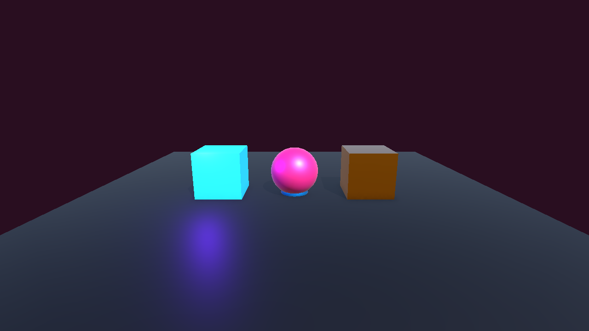
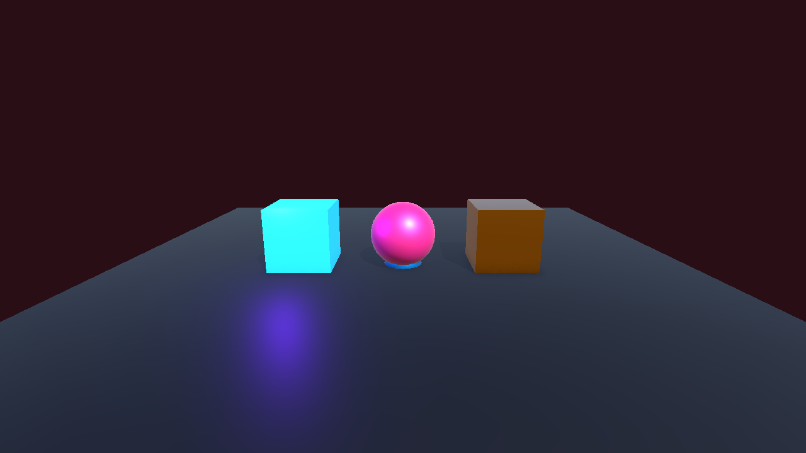

# DAY 11: 이펙트와 게임 코드 연동

오늘의 목표는 이펙트를 "**게임 사건이 일어났다는 신호등**"처럼 사용하고, 입력이나 충돌이 발생했을 때 알맞은 위치에서 재생하는 것입니다.

## NCS 연결

- 능력단위 요소: 이펙트 프로그래밍하기
- 관련 학습 내용: 게임 엔진에서 이펙트를 코드로 출력
- Unity 6 재구성: C# 스크립트에서 Particle System Prefab을 생성하고 재생합니다.

## 1. 코드 연동의 기본 흐름

```text
게임 사건 발생 -> 위치 결정 -> 이펙트 생성 -> 재생 -> 일정 시간 뒤 제거
```

예를 들어 공격이 맞았다면 맞은 위치에 `FX_HitSpark`를 만들고 재생합니다.

## 실습 예제: 클릭 위치에 이펙트 재생

**미션:** 마우스로 바닥을 클릭하면 해당 위치에 파티클 이펙트를 재생합니다.

### Input System 설정

Player 오브젝트 또는 빈 GameObject에 `PlayerInput` 컴포넌트를 추가하고 다음 Action을 준비합니다.

| Action 이름 | Action Type | Binding 예시 | 역할 |
| :--- | :--- | :--- | :--- |
| `Point` | Value / Vector2 | `<Pointer>/position` | 마우스 또는 터치 위치를 읽습니다. |
| `Click` | Button | `<Mouse>/leftButton` | 클릭 입력을 받습니다. |

`PlayerInput`의 Behavior는 `Send Messages`로 설정합니다. 그러면 Action 이름에 맞춰 `OnPoint`, `OnClick` 메서드가 호출됩니다.

<details>
<summary>코드 보기</summary>

```csharp
using UnityEngine;
using UnityEngine.InputSystem;

public class ClickEffectSpawner : MonoBehaviour
{
    [SerializeField] private Camera targetCamera;
    [SerializeField] private ParticleSystem effectPrefab;
    [SerializeField] private LayerMask groundMask;

    private Vector2 pointerPosition;

    public void OnPoint(InputValue value)
    {
        pointerPosition = value.Get<Vector2>();
    }

    public void OnClick(InputValue value)
    {
        if (!value.isPressed)
        {
            return;
        }

        Ray ray = targetCamera.ScreenPointToRay(pointerPosition);

        if (Physics.Raycast(ray, out RaycastHit hit, 100f, groundMask))
        {
            ParticleSystem effect = Instantiate(effectPrefab, hit.point, Quaternion.identity);
            effect.Play();
            Destroy(effect.gameObject, effect.main.duration + effect.main.startLifetime.constantMax);
        }
    }
}
```

</details>

## 코드 읽기

- `OnPoint`는 `PlayerInput`의 `Point` Action이 보낸 화면 좌표를 저장합니다.
- `OnClick`은 `Click` Action이 눌렸을 때만 이펙트를 생성합니다.
- `targetCamera.ScreenPointToRay`는 화면 클릭 위치에서 씬으로 광선을 쏩니다.
- `Physics.Raycast`는 광선이 바닥에 닿았는지 확인합니다.
- `Instantiate`는 이펙트 프리팹을 클릭 위치에 만듭니다.
- `Destroy`는 이펙트가 끝난 뒤 오브젝트를 정리합니다.

## 스크린샷 체크포인트

- `Images/day11_effect_code_inspector.png`: `ClickEffectSpawner`에 Camera, Prefab, LayerMask가 연결된 Inspector
- `Images/day11_effect_spawn_result.png`: 클릭 위치에 이펙트가 재생된 화면





## 오늘의 정리

- 이펙트는 게임 사건과 연결될 때 의미가 생깁니다.
- Unity 6 수업 예제에서는 Input System과 `PlayerInput`을 사용합니다.
- 생성한 이펙트는 재생 후 정리해야 씬이 지저분해지지 않습니다.
- 다음 시간에는 GPU 기반 대량 이펙트를 다루는 Visual Effect Graph를 시작합니다.
