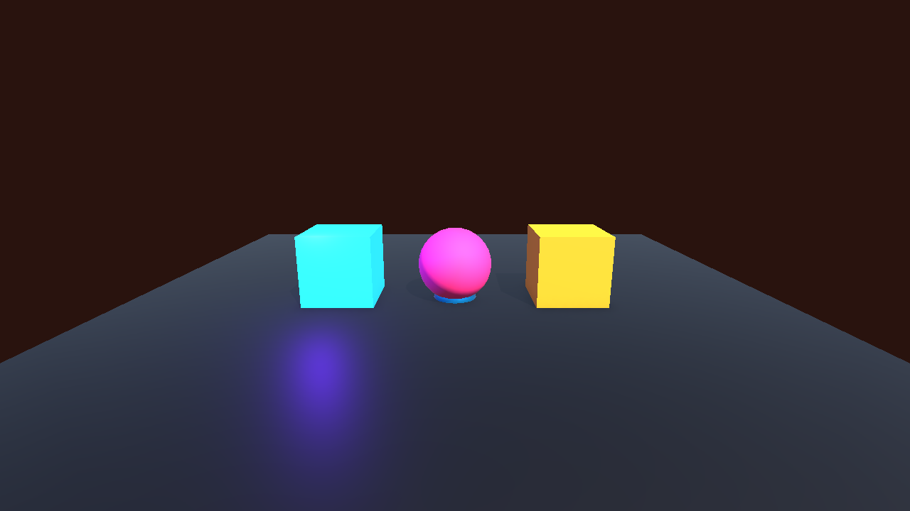
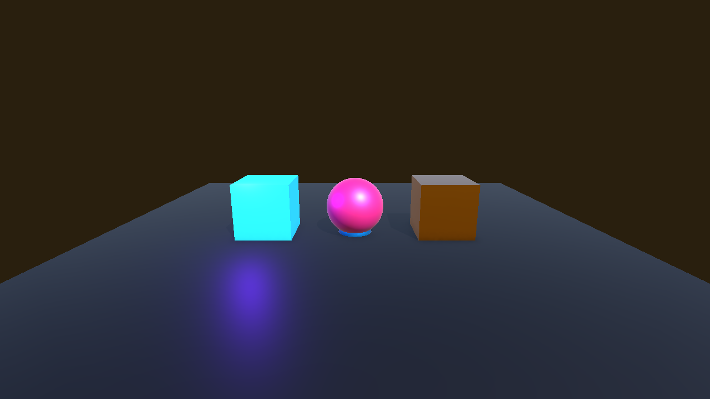
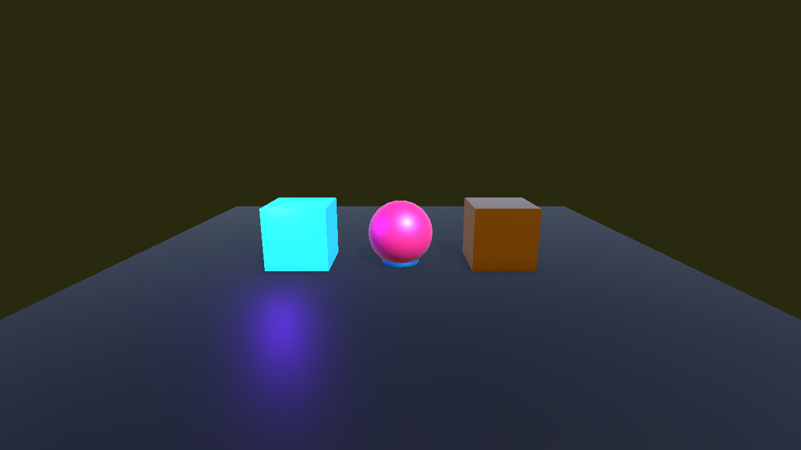
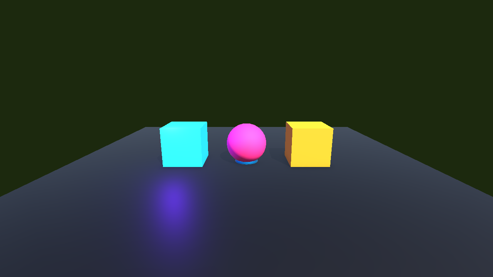

# DAY 12: Visual Effect Graph 입문

오늘의 목표는 Visual Effect Graph를 "**GPU에서 대량 파티클을 계산하는 이펙트 제작판**"으로 이해하고, 간단한 GPU 파티클 효과를 만드는 것입니다.

## NCS 연결

- 능력단위 요소: 이펙트 프로그래밍하기
- 관련 학습 내용: 게임 이펙트 구성 방법 이해 및 사용
- Unity 6 재구성: Visual Effect Graph로 많은 입자를 사용하는 이펙트를 제작합니다.

## 1. Visual Effect Graph는 언제 쓰나요?

Unity 6 공식 문서에 따르면 Visual Effect Graph는 대규모 비주얼 이펙트를 만들기 위한 패키지이며, GPU에서 파티클 동작을 시뮬레이션해 Built-in Particle System보다 더 많은 파티클을 다룰 수 있습니다. 많은 입자와 세밀한 커스터마이즈가 필요할 때 VFX Graph를 사용합니다.

### Particle System과 비교

| 구분 | Particle System | Visual Effect Graph |
| :--- | :--- | :--- |
| 계산 중심 | CPU/엔진 컴포넌트 기반 | GPU 시뮬레이션 중심 |
| 장점 | 배우기 쉽고 작은 이펙트에 적합 | 대량 파티클과 복잡한 효과에 강함 |
| 예시 | 히트, 회복, 작은 폭발 | 마법 폭풍, 에너지장, 대량 먼지 |

## 2. 실습: GPU Spark 이펙트

1. Package Manager에서 Visual Effect Graph가 사용 가능한지 확인합니다.
2. `Create > Visual Effects > Visual Effect Graph`를 선택합니다.
3. `VFX_GpuSpark` 에셋을 만듭니다.
4. 씬에 Visual Effect 오브젝트를 추가하고 에셋을 연결합니다.
5. Spawn Rate, Velocity, Color, Lifetime을 조절합니다.

## 3. Visual Effect Graph 창 사용법

VFX Graph는 Shader Graph와 비슷하게 노드를 연결하지만, 더 큰 단위인 Context 흐름을 먼저 읽어야 합니다.

| 영역 | 하는 일 | 학생이 자주 하는 작업 |
| :--- | :--- | :--- |
| Blackboard | 외부에서 조절할 프로퍼티를 만듭니다. | Spawn Rate, Color, Size 노출 |
| Graph Area | Context와 Operator를 배치합니다. | 블록 추가, 값 연결 |
| Context | Spawn, Initialize, Update, Output 같은 큰 처리 단계입니다. | 파티클의 생명 주기 구성 |
| Block | Context 안에 들어가는 세부 명령입니다. | Set Velocity, Set Color, Set Size |
| Operator | 값을 계산하는 노드입니다. | Random Number, Vector, Multiply |
| Visual Effect 컴포넌트 | 씬에서 VFX Graph 에셋을 재생합니다. | 에셋 연결, 프로퍼티 값 조절 |

VFX Graph는 "**입자 공장 라인**"처럼 보면 좋습니다. Spawn에서 입자를 만들고, Initialize에서 초기 상태를 붙이고, Update에서 살아 있는 동안 움직이고, Output에서 화면에 보여 줍니다.

## 4. VFX Graph 기본 블록

| 영역 | 역할 |
| :--- | :--- |
| Spawn | 입자가 언제 얼마나 생길지 정합니다. |
| Initialize | 처음 위치, 속도, 수명, 크기를 정합니다. |
| Update | 살아 있는 동안 움직임과 변화를 계산합니다. |
| Output | 최종적으로 화면에 어떻게 보일지 정합니다. |

### Context 읽는 순서

```text
Spawn -> Initialize Particle -> Update Particle -> Output Particle
```

- **Spawn**: "몇 개를 태어나게 할까?"
- **Initialize**: "태어날 때 위치, 속도, 크기, 수명은?"
- **Update**: "살아 있는 동안 중력, 회전, 색 변화는?"
- **Output**: "최종적으로 점, 사각형, 메시 중 무엇으로 보일까?"

## 5. GPU Spark 만들기 상세 절차

### 1단계: Spawn 설정

1. Spawn Context에서 Constant Spawn Rate를 찾습니다.
2. Rate 값을 `80` 정도로 둡니다.
3. 너무 많으면 `20`, 더 화려하게 보려면 `200`처럼 바꿔 봅니다.

### 2단계: Initialize 설정

Initialize Particle Context에 다음 Block을 추가합니다.

| Block | 값 예시 | 결과 |
| :--- | :--- | :--- |
| Set Lifetime Random | 0.4 ~ 1.2 | 입자마다 사라지는 시간이 달라집니다. |
| Set Position Shape | Sphere 또는 Circle | 입자가 시작되는 영역을 정합니다. |
| Set Velocity Random | 위쪽 또는 바깥 방향 | 불꽃처럼 퍼집니다. |
| Set Size Random | 0.03 ~ 0.12 | 입자 크기가 조금씩 달라집니다. |

### 3단계: Update 설정

Update Particle Context에는 살아 있는 동안의 변화를 넣습니다.

| Block | 사용 이유 |
| :--- | :--- |
| Add Force | 위로 솟거나 아래로 떨어지는 느낌을 줍니다. |
| Drag | 시간이 지나며 속도가 줄어들게 합니다. |
| Age over Lifetime | 수명 비율을 이용해 색이나 크기 변화를 만들 때 사용합니다. |

### 4단계: Output 설정

Output Particle Context에서 다음을 확인합니다.

- Output 타입이 Quad인지 확인합니다.
- Color를 주황색 또는 하늘색으로 설정합니다.
- Blend Mode는 밝게 보이는 이펙트라면 Additive 계열을 고려합니다.
- Texture를 넣으면 점이 아니라 불꽃 조각처럼 보이게 할 수 있습니다.

## 6. 씬에 배치하고 재생 확인하기

1. Hierarchy에서 `Create Empty`로 `VFX_GpuSpark_Player`를 만듭니다.
2. `Visual Effect` 컴포넌트를 추가합니다.
3. Asset Template 또는 Asset 슬롯에 `VFX_GpuSpark`를 연결합니다.
4. 오브젝트 위치를 카메라 앞이나 바닥 위로 옮깁니다.
5. Play 모드에서 입자가 보이는지 확인합니다.

보이지 않으면 먼저 씬 카메라가 이펙트 위치를 보고 있는지 확인합니다. 그 다음 Bounds, Spawn Rate, Output Color, Visual Effect 컴포넌트의 에셋 연결을 확인합니다.

## 7. 자주 막히는 지점

| 증상 | 확인할 것 |
| :--- | :--- |
| 아무것도 보이지 않음 | Visual Effect 컴포넌트에 Graph 에셋이 연결되어 있는지 확인 |
| Scene 뷰에는 보이는데 Game 뷰에는 안 보임 | 카메라 위치와 Clipping Plane 확인 |
| 입자가 너무 빨리 사라짐 | Lifetime 값을 늘림 |
| 입자가 한 점에만 뭉침 | Position Shape 또는 Velocity 설정 확인 |
| 편집 중 결과가 이상함 | 그래프 저장 후 Visual Effect 컴포넌트가 최신 에셋을 쓰는지 확인 |

## 스크린샷 체크포인트

- `Images/day12_vfx_graph_basic.png`: Spawn, Initialize, Update, Output이 보이는 VFX Graph
- `Images/day12_vfx_component.png`: Visual Effect 컴포넌트에 에셋이 연결된 Inspector
- `Images/day12_vfx_initialize_blocks.png`: Lifetime, Position, Velocity, Size Block이 보이는 Initialize Context
- `Images/day12_vfx_output_particle.png`: Output Particle 설정 화면









## 오늘의 정리

- Visual Effect Graph는 대량 파티클과 복잡한 이펙트에 적합합니다.
- VFX Graph는 Spawn, Initialize, Update, Output 흐름으로 읽습니다.
- Context는 큰 단계, Block은 단계 안의 세부 명령, Operator는 값을 계산하는 도구입니다.
- 다음 시간에는 VFX Graph의 노출 프로퍼티와 성능 조절을 다룹니다.
