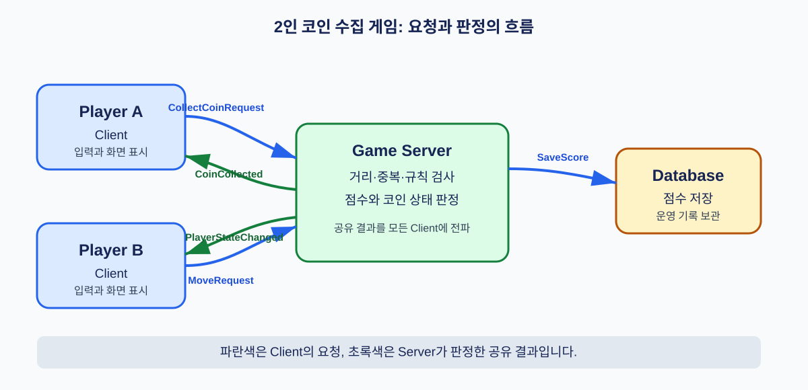

# DAY 02: 네트워크 게임 서버와 프로토콜 설계

오늘은 게임 화면보다 먼저, 누가 어떤 규칙을 판단하고 어떤 데이터를 주고받을지 설계합니다. 게임 서버는 경기의 심판, 클라이언트는 각 선수의 화면과 조작기라고 생각하면 됩니다.

## 1. 핵심 개념: "게임 규칙을 한곳에서 판단하는 심판"

- **클라이언트 (Client)**: 플레이어의 입력을 받고 화면을 보여 주는 프로그램입니다.
- **서버 (Server)**: 여러 클라이언트가 공유해야 하는 규칙과 데이터를 판단하는 프로그램입니다.
- **서버 권한 (Server Authority)**: 점수, 아이템 획득 같은 중요한 결과를 서버가 최종 결정하는 방식입니다.

## 2. 안내형 실습: 코인 수집 게임 서버 구성도

**미션:** 2명이 코인을 수집하는 게임의 서버 구성도와 데이터 흐름을 작성합니다.

그림의 파란색 화살표는 Client가 Server에 보내는 요청이고, 초록색 화살표는 Server가 판정한 결과입니다. 이 순서를 보며 아래 구성도를 직접 그립니다.

1. 종이 또는 문서에 `Player A Client`, `Player B Client`, `Game Server`, `Database` 네 상자를 그립니다.
2. Client에서 Game Server로 `MoveRequest`, `CollectCoinRequest` 화살표를 그립니다.
3. Game Server에서 Database로 `SaveScore` 화살표를 그립니다.
4. Game Server에서 두 Client로 `PlayerStateChanged`, `CoinCollected` 화살표를 그립니다.
5. 각 화살표 옆에 "누가 요청하고, 누가 최종 판단하는가"를 한 문장으로 씁니다.

### 완료 확인

- [ ] 점수와 코인 제거는 Client가 아닌 Game Server에서 결정한다고 표시했다.
- [ ] 두 Client가 같은 결과를 받는 화살표가 있다.
- [ ] Database를 실시간 이동 처리 대신 저장 역할로 구분했다.

## 3. 안내형 실습: 프로토콜과 모듈 명세 완성

**미션:** 방금 그린 화살표를 코드가 사용할 수 있는 메시지 약속으로 바꿉니다.

### 이 단어는 무슨 뜻인가요?

- **프로토콜 (Protocol)**: 송신자와 수신자가 데이터의 의미·순서·형식을 함께 정한 약속입니다.
- **패킷 (Packet)**: 네트워크로 보내는 하나의 데이터 묶음입니다.
- **모듈 (Module)**: 하나의 책임을 맡도록 나눈 프로그램 부품입니다.

1. 아래 표를 문서에 복사합니다.

| 메시지 이름 | 방향 | 필드 | Server 처리 |
| :--- | :--- | :--- | :--- |
| `CollectCoinRequest` | Client → Server | `playerId`, `coinId` | 거리와 이미 획득됐는지 검사 |
| `CoinCollected` | Server → All Clients | `playerId`, `coinId`, `score` | 코인 제거와 점수 화면 갱신 |

2. `CollectCoinRequest`에 점수 값을 넣지 않은 이유를 한 문장으로 씁니다.
3. `NetworkInputModule`, `GameRuleModule`, `DatabaseModule`, `UiModule` 네 모듈을 적고 책임을 한 줄씩 작성합니다.
4. 잘못된 `coinId`가 들어왔을 때 Server가 보낼 오류 메시지 이름을 정합니다.

### 완료 확인

- [ ] 요청 메시지와 결과 메시지가 구분되어 있다.
- [ ] Server가 검사할 조건을 적었다.
- [ ] 각 모듈이 한 가지 중심 책임을 가진다.

## 응용 실습: 다른 장르로 바꾸기

`2인 레이싱` 또는 `협동 보스전` 중 하나를 골라 같은 구성도와 메시지 명세표를 작성하세요. Server가 반드시 판정해야 할 데이터 3개를 적으세요.

## 오늘의 정리

- 네트워크 게임은 화면을 동기화하는 일만이 아니라, 공유 규칙을 공정하게 판정하는 구조입니다.
- 데이터 흐름을 프로토콜·패킷·모듈 명세로 바꾸면 구현 전에 역할과 오류 처리를 확인할 수 있습니다.
- 다음 DAY에는 이 설계를 바탕으로 HTTP와 HTTPS를 사용한 로그인 요청 흐름을 확인합니다.
