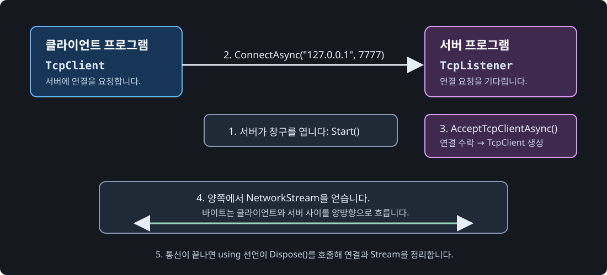

# DAY 04: TCP 비동기 서버와 클라이언트

오늘은 TCP로 한 명의 클라이언트가 서버에 연결하고 메시지를 주고받게 만듭니다.

오늘의 학습 순서는 다음과 같습니다. 먼저 TCP 연결의 역할을 이해하고, 다음으로 연결된 뒤 데이터를 읽고 쓰는 방법을 익힌 뒤, `PING`/`PONG` 실습으로 확인합니다. 마지막에는 실제 게임 서비스가 연결한 사용자를 어떻게 인증하는지 참고 사례로 살펴봅니다.

## 1. 핵심 개념: "받았다는 확인이 있는 등기 배송"

### TCP는 무엇을 보장할까?

**TCP (Transmission Control Protocol, 전송 제어 프로토콜)** 는 두 프로그램이 연결을 만든 뒤, 보낸 바이트가 순서대로 도착하도록 관리하는 전송 방식입니다. 도착하지 않은 데이터가 있으면 다시 보내고, 수신 순서가 바뀌면 원래 순서로 맞춥니다.

TCP는 "번호표가 붙은 등기 배송"과 비슷합니다. 배송 기사는 상대방이 받을 수 있는지 먼저 확인하고, 1번 상자 다음에 2번 상자를 전달합니다. 이 과정 때문에 로그인, 채팅, 구매처럼 한 번의 누락도 곤란한 데이터에 잘 맞습니다.

### 소켓, IP 주소, 포트: "건물·호수·창구"

**소켓 (Socket)** 은 프로그램이 네트워크로 데이터를 보내고 받기 위해 운영 체제에 만드는 통신 접점입니다. 코드에서 직접 `Socket` 클래스를 다룰 수도 있지만, 이 수업에서는 더 사용하기 쉬운 `TcpListener`와 `TcpClient`가 소켓의 복잡한 부분을 감싸 줍니다.

**IP 주소 (Internet Protocol address)** 는 네트워크에서 컴퓨터를 찾는 주소입니다. `127.0.0.1`은 **루프백 주소 (loopback address)** 로, 내 컴퓨터 자신을 뜻합니다. 따라서 오늘 실습의 서버와 클라이언트는 한 컴퓨터 안에서 통신합니다.

**포트 (Port)** 는 한 컴퓨터 안에서 목적지 프로그램을 구분하는 0~65535 범위의 번호입니다. IP 주소가 "게임 회사 건물 주소"라면, 포트는 "그 건물 안의 접수 창구 번호"입니다. 같은 IP 주소라도 포트가 다르면 서로 다른 프로그램으로 연결할 수 있습니다.

**엔드포인트 (endpoint)** 는 IP 주소와 포트를 묶은 통신 상대의 주소입니다. 예를 들어 `127.0.0.1:7777`은 "내 컴퓨터의 7777번 창구"라는 뜻입니다. 클라이언트와 서버는 반드시 같은 엔드포인트의 포트 번호를 약속해야 연결됩니다.



### `TcpListener`와 `TcpClient`는 각각 무엇을 하나?

- **`TcpListener`**: 서버가 특정 IP 주소와 포트에서 TCP 연결 요청을 기다리게 하는 객체입니다. `Start()`로 창구를 열고, `AcceptTcpClientAsync()`로 실제 클라이언트가 올 때까지 기다립니다. 연결을 수락하면 그 클라이언트와만 통신할 `TcpClient`를 돌려줍니다.
- **`TcpClient`**: 클라이언트가 서버에 연결하거나, 서버가 수락한 한 명의 클라이언트와 통신할 때 사용하는 객체입니다. `ConnectAsync()`에 IP 주소와 포트를 전달해 연결하고, 성공한 뒤 `GetStream()`으로 데이터 통로를 얻습니다.
- **`NetworkStream`**: 연결이 성공한 두 `TcpClient` 사이에서 바이트가 흐르는 통로입니다. 연결 전에는 만들 수 없고, 연결이 끝나면 `Dispose()`로 함께 정리해야 합니다.

서버는 `TcpListener` 하나로 접수 창구를 열고, 접속한 사람마다 `TcpClient`를 하나씩 얻습니다. 오늘 실습은 한 명만 받지만, 실제 게임 서버는 반복문으로 여러 연결을 받아 각 클라이언트를 관리합니다.

### 프로토콜은 "서로 지키는 대화 약속"

**프로토콜 (protocol)** 은 통신하는 양쪽이 지키기로 한 규칙입니다. 이 단어는 문맥에 따라 두 수준에서 사용됩니다.

- **전송 프로토콜**: TCP나 UDP처럼 데이터를 어떤 성질로 옮길지 정합니다. TCP는 순서와 도착을 관리하고, UDP는 빠르게 독립된 데이터 묶음을 보냅니다.
- **응용 프로토콜**: 게임 프로그램이 메시지를 어떤 형식으로 해석할지 정합니다. 예를 들어 이 실습의 `PING`과 `PONG`, 그리고 줄바꿈은 "한 줄이 한 메시지"라는 약속입니다. DAY06의 `TYPE|VALUE`도 응용 프로토콜입니다.

TCP가 데이터를 순서대로 전달해도, "이 바이트가 로그인 요청인지 채팅인지"까지 알아주지는 않습니다. 그래서 게임 개발자는 메시지 종류, 데이터 순서, 길이 또는 끝 표시, 오류 처리 규칙을 별도로 정해야 합니다.

### 게임에서는 어디에 필요할까?

| 개념 | 필요한 상황 | 예시 |
| :--- | :--- | :--- |
| IP 주소와 포트 | 클라이언트가 서버를 찾아 연결할 때 | 라이브 서버 주소와 게임 서버 포트로 접속합니다. |
| `TcpListener` | 서버가 접속 요청을 받을 때 | 로그인 서버 또는 채팅 서버가 접수 창구를 엽니다. |
| `TcpClient` | 클라이언트가 서버와 한 연결을 유지할 때 | 콘솔 클라이언트가 채팅 서버에 연결합니다. |
| 전송 프로토콜 TCP | 순서와 도착이 중요한 지속 연결이 필요할 때 | 로그인 뒤 게임 서버와의 연결, 채팅, 반드시 도착해야 하는 게임 메시지를 전달합니다. |
| 응용 프로토콜 | 받은 바이트의 의미를 정할 때 | `LOGIN|player01`, `CHAT|안녕하세요`처럼 메시지를 구분합니다. |

> 포트 번호만 안다고 아무 서버에 연결할 수 있는 것은 아닙니다. 방화벽, 서버 실행 상태, IP 주소, TCP/UDP 종류, 그리고 양쪽의 응용 프로토콜 약속까지 모두 맞아야 정상 통신합니다.

## 2. Stream, Reader, Writer 이해하기: "바이트 파이프와 통역사"

- **Stream (스트림)**: 데이터가 한쪽에서 다른 쪽으로 순서대로 흐르는 통로입니다. 네트워크에서는 기본적으로 바이트 (byte) 단위가 흐릅니다.
- **`NetworkStream`**: `TcpClient`가 연결된 상대와 바이트를 주고받도록 제공하는 Stream입니다. `client.GetStream()`으로 가져옵니다.
- **`StreamReader`**: Stream의 바이트를 문자로 해석해 문자열로 읽는 도구입니다. 이 실습에서는 `ReadLineAsync()`로 줄바꿈 전까지 읽습니다.
- **`StreamWriter`**: 문자열을 바이트로 바꿔 Stream에 쓰는 도구입니다. `WriteLineAsync()`는 문자열 끝에 줄바꿈을 함께 씁니다.
- **`AutoFlush`**: Writer 내부에 잠시 쌓인 데이터를 바로 Stream으로 내보내는 설정입니다. 이 실습에서는 메시지를 보낸 직후 상대가 받을 수 있도록 `true`로 둡니다.

### 자주 만나는 Stream 종류

`Stream`은 공통 규칙이고, 실제로 어디에서 바이트를 읽고 쓰는지에 따라 구현체가 달라집니다.

| 타입 | 바이트가 흐르는 곳 | 사용하는 상황 | 이 과정과의 연결 |
| :--- | :--- | :--- | :--- |
| `FileStream` | 디스크의 파일 | 저장 파일, 로그 파일, 설정 파일 읽기·쓰기 | 서버 리포트나 패치 파일을 다룰 때 사용할 수 있습니다. |
| `MemoryStream` | 메모리 | 전송 전 데이터를 메모리에 조립하거나 테스트하기 | 패킷 바이트를 만들고 검사하는 데 사용할 수 있습니다. |
| `NetworkStream` | 연결된 TCP 상대 | Client와 Server 사이의 바이트 송수신 | DAY04에서 직접 사용합니다. |
| `BufferedStream` | 다른 Stream의 앞 | 작은 읽기·쓰기를 모아 입출력 횟수 줄이기 | 파일·네트워크 처리량을 측정한 뒤 필요할 때 검토합니다. |

아래처럼 사용 장소는 달라도 변수 타입을 `Stream`으로 받으면 공통 읽기·쓰기 규칙을 적용할 수 있습니다.

```csharp
using System.IO;
using System.Net.Sockets;
using System.Threading.Tasks;

class Program
{
    static async Task Main()
    {
        // FileStream은 디스크 파일에서 바이트를 읽는 Stream입니다.
        using FileStream fileStream = File.OpenRead("server-log.txt");

        // MemoryStream은 메모리 안에서 바이트를 읽고 쓰는 Stream입니다.
        using MemoryStream memoryStream = new();

        // TcpClient는 ConnectAsync가 성공한 뒤에만 NetworkStream을 얻을 수 있습니다.
        using TcpClient client = new();
        await client.ConnectAsync("127.0.0.1", 7777);
        using NetworkStream networkStream = client.GetStream();
    }
}
```

> 위 예시의 `File.OpenRead("server-log.txt")`는 같은 프로젝트 폴더에 해당 파일이 있어야 하고, `ConnectAsync`는 DAY04 서버가 먼저 실행 중이어야 성공합니다. 세 Stream을 모두 실행하는 실습이 아니라, 사용하는 장소와 연결 순서를 비교하기 위한 코드입니다.

```text
Client 문자열 "PING\n"
    ↓ StreamWriter가 문자열을 바이트로 변환
NetworkStream ─────────────→ NetworkStream
    ↓ StreamReader가 바이트를 문자열로 해석
Server 문자열 "PING"
```

### TCP에서는 메시지 경계를 직접 정합니다

TCP는 순서 있는 **바이트 흐름**을 보장하지만, `"PING"` 한 번을 보냈다고 수신자가 한 번의 읽기로 정확히 `"PING"`만 받는다고 보장하지는 않습니다. 데이터가 나뉘거나 여러 메시지가 붙어 올 수 있습니다.

이 실습은 한 줄의 끝을 나타내는 줄바꿈을 메시지 경계로 사용합니다. 그래서 송신자는 `WriteLineAsync()`를 쓰고, 수신자는 `ReadLineAsync()`를 씁니다. DAY06에서는 이 약속을 `TYPE|VALUE` 형태의 프로토콜로 확장합니다.

## 3. 안내형 실습: 한 줄 채팅

**미션:** 서버는 받은 한 줄을 `서버 수신:`으로 출력하고, 클라이언트는 응답을 받습니다.

1. `TcpServerLab`, `TcpClientLab` 콘솔 프로젝트 두 개를 만듭니다.
2. 서버 `Program.cs`를 아래 코드로 모두 바꿉니다.

```csharp
using System;
using System.IO;
using System.Net;
using System.Net.Sockets;
using System.Threading.Tasks;

class Program
{
    static async Task Main()
    {
        // TcpListener는 지정한 IP 주소와 포트에서 TCP 연결을 기다리는 서버입니다.
        TcpListener listener = new(IPAddress.Loopback, 7777);
        listener.Start();
        Console.WriteLine("클라이언트 연결 대기");

        // AcceptTcpClientAsync는 Client가 연결될 때까지 비동기로 기다립니다.
        using TcpClient client = await listener.AcceptTcpClientAsync();
        // NetworkStream은 연결된 Client와 바이트를 주고받는 통로입니다.
        using NetworkStream stream = client.GetStream();
        // StreamReader와 StreamWriter는 스트림을 한 줄 문자열로 읽고 씁니다.
        using StreamReader reader = new(stream);
        using StreamWriter writer = new(stream) { AutoFlush = true };

        // ReadLineAsync는 줄바꿈이 포함된 메시지 한 줄을 비동기로 받습니다.
        string? message = await reader.ReadLineAsync();
        Console.WriteLine($"서버 수신: {message}");
        // WriteLineAsync는 메시지 끝에 줄바꿈을 붙여 전송합니다.
        await writer.WriteLineAsync("PONG");
        listener.Stop();
    }
}
```

3. 클라이언트 `Program.cs`를 아래 코드로 모두 바꿉니다.

```csharp
using System;
using System.IO;
using System.Net.Sockets;
using System.Threading.Tasks;

class Program
{
    static async Task Main()
    {
        // TcpClient는 TCP 서버에 연결하는 클라이언트 객체입니다.
        using TcpClient client = new();
        // ConnectAsync는 IP 주소와 포트를 가진 서버에 비동기로 연결합니다.
        await client.ConnectAsync("127.0.0.1", 7777);
        using NetworkStream stream = client.GetStream();
        using StreamReader reader = new(stream);
        using StreamWriter writer = new(stream) { AutoFlush = true };

        await writer.WriteLineAsync("PING");
        string? response = await reader.ReadLineAsync();
        Console.WriteLine($"서버 응답: {response}");
    }
}
```

4. 첫 PowerShell 창에서 `dotnet run --project TcpServerLab`을 실행합니다.
5. 두 번째 PowerShell 창에서 `dotnet run --project TcpClientLab`을 실행합니다.

### 코드에서 `using`을 확인하세요

`TcpClient`, `NetworkStream`, `StreamReader`, `StreamWriter`는 통신이 끝난 뒤 닫아야 하는 `IDisposable` 자원입니다. 코드의 `using TcpClient client = ...;` 선언은 `Main` 메서드가 끝날 때 `Dispose()`를 호출해 연결과 스트림을 정리합니다. Server와 Client 양쪽에서 이 선언을 빼지 않은 이유를 확인하세요.

### 실행해보면

- 서버: `클라이언트 연결 대기` 다음 `서버 수신: PING`
- 클라이언트: `서버 응답: PONG`

### 흔한 오류

| 증상 | 확인할 것 |
| :--- | :--- |
| 연결 거부 | 서버를 먼저 실행했는지, 양쪽 포트가 `7777`인지 확인합니다. |
| 대기 상태로 멈춤 | 클라이언트가 줄바꿈을 포함해 메시지를 보냈는지 확인합니다. |
| 주소 사용 불가 | 이전 서버가 종료됐는지, 같은 포트를 다른 프로그램이 쓰지 않는지 확인합니다. |

## 4. 실무 확장: 실제 게임 서비스의 인증 연결 흐름

> 이 절은 구현 실습이 아니라, 오늘 만든 TCP 연결이 실제 서비스에서 어떤 인증 절차와 이어지는지 이해하기 위한 참고 사례입니다.

오늘 실습은 `PING`과 `PONG`만 주고받지만, 실제 게임 서버는 새 연결을 수락한 순간부터 그 연결을 플레이어로 신뢰하지 않습니다. `AcceptTcpClientAsync()`는 7777번 포트에 도착한 **다음 TCP 연결 하나**를 수락할 뿐이며, 로그인했던 사용자인지까지 판단하지 않습니다.

실제 서비스에서는 보통 **HTTPS (Hypertext Transfer Protocol Secure)** 로 로그인한 뒤, 게임 서버의 TCP 연결에서 토큰을 다시 확인합니다. 여기서 **액세스 토큰 (access token)** 은 인증 서버가 로그인 성공 후 발급하는, 짧은 시간 동안 유효한 사용자 확인표입니다. **PlayerId** 는 게임 서버가 플레이어를 식별하기 위해 쓰는 고유 번호입니다.

```text
클라이언트                                인증 서버와 게임 서버

HTTPS 로그인 요청 ───────────────────────→ 인증 서버가 계정 확인
             ← accessToken, 게임 서버 주소 ─

TCP ConnectAsync() ──────────────────────→ 게임 서버의 TcpListener
                                           AcceptTcpClientAsync()로 새 연결 수락

첫 메시지: AUTH|accessToken ─────────────→ 토큰 검증
             ← AUTH_OK|PlayerId ─────────  성공한 연결만 PlayerId와 등록

MOVE, CHAT, ATTACK 등 게임 메시지 ───────→ 인증 성공 뒤에만 처리
```

`AUTH`는 이 예시에서 "인증 요청"을 뜻하도록 정한 응용 프로토콜의 메시지 타입입니다. `MOVE`, `CHAT`, `ATTACK`도 각각 이동, 채팅, 공격 요청을 구분하는 예시 메시지 타입입니다.

### 인증 연결 처리 의사코드

```text
[클라이언트]

HTTPS로 아이디와 비밀번호를 인증 서버에 보낸다
로그인에 성공하면 accessToken과 게임 서버 주소를 받는다

TcpClient로 게임 서버에 ConnectAsync() 한다
첫 메시지로 AUTH|accessToken을 보낸다

AUTH_OK|PlayerId를 받으면 게임을 시작한다
AUTH_FAIL을 받으면 연결을 닫고 로그인 화면으로 돌아간다

[게임 서버]

TcpListener에서 AcceptTcpClientAsync()로 새 연결을 수락한다
첫 메시지를 받는다

만약 첫 메시지가 AUTH가 아니라면
    연결을 종료한다

accessToken을 검증한다

만약 토큰이 유효하지 않다면
    AUTH_FAIL을 보낸 뒤 연결을 종료한다

토큰이 유효하다면
    토큰의 PlayerId와 현재 TcpClient를 연결 목록에 등록한다
    AUTH_OK|PlayerId를 보낸다
    이후에만 MOVE, CHAT, ATTACK 메시지를 처리한다
```

DAY03에서는 학습용 HTTPS 인증 서버로 토큰을 발급하고 콘솔 클라이언트로 로그인하는 흐름까지 구현했습니다. 다만 실제 서비스 수준의 비밀번호 해시, 데이터베이스 연결, 토큰 만료·재발급, **TLS (Transport Layer Security)** 인증서 운영은 이 과정의 구현 범위 밖입니다. 비밀번호를 TCP 게임 메시지로 보내지 않고, HTTPS 로그인으로 얻은 토큰을 첫 인증 메시지에서 검증한다는 서비스 구조를 기억하세요. 자세한 프로토콜 선택은 [게임에서 사용하는 네트워크 프로토콜 참고 안내](Supplement/GAME_NETWORK_PROTOCOL_REFERENCE.md)를 확인하세요.

## 응용 실습: 두 번째 메시지

클라이언트가 `PING` 뒤 `HELLO`를 한 번 더 보내고, 서버가 각각 응답하도록 확장하세요. 이때 Server와 Client 모두 `ReadLineAsync()`를 두 번 호출하거나 반복문으로 바꿔야 합니다.

## 오늘의 정리

- TCP는 연결을 먼저 만들고 순서 있는 데이터를 교환합니다.
- `await`로 연결·수신을 기다리면 대기 중인 코드를 명확하게 읽을 수 있습니다.
