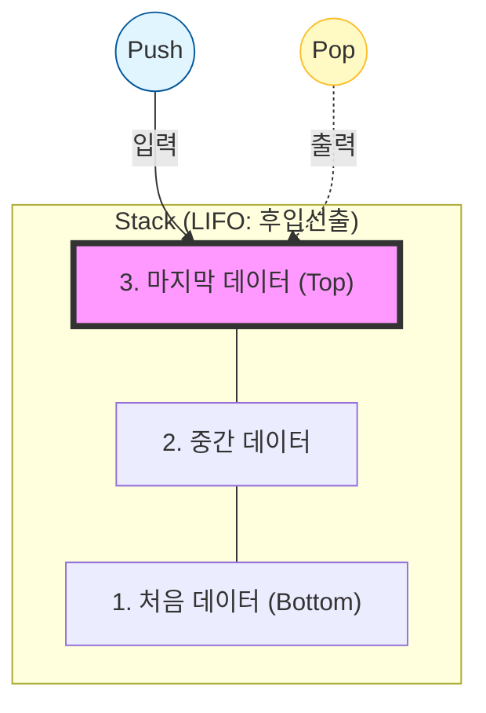
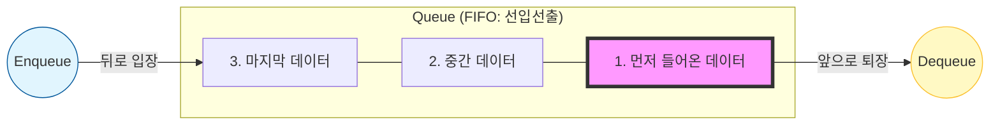

# 🚀 9일차: 줄을 서시오! (Stack과 Queue)

오늘의 목표는 **"상황에 맞는 최적의 데이터 바구니(자료구조)를 선택하고, 실제 게임의 '인벤토리'와 '대화창' 로직을 이해한다"**입니다.

---

## 1. Stack(스택): "프링글스 통"
나중에 들어온 데이터가 먼저 나가는 구조입니다. (**LIFO**: Last-In, First-Out)



- **`Push()`**: 통에 감자칩을 넣습니다.
- **`Pop()`**: 맨 위에 있는 감자칩을 꺼냅니다. (데이터가 통에서 사라집니다!)
- **`Peek()`**: 맨 위에 뭐가 있는지 훔쳐보기만 합니다. (데이터는 그대로 유지)

### 💻 실습 예제: 게임 뒤로 가기(Undo) 기능
**미션:** Stack을 이용해 페이지 방문 기록을 관리하고 뒤로 가기(Undo) 기능을 구현합니다.
<details><summary>코드 보기</summary>

```csharp
using System;
using System.Collections.Generic;

namespace Day09
{
    internal class Program
    {
        static void Main(string[] args)
        {
            Stack<string> pageHistory = new Stack<string>();

            // 1. 페이지 방문
            pageHistory.Push("메인 화면");
            pageHistory.Push("상점");
            pageHistory.Push("아이템 상세 보기");

            // 2. 뒤로 가기 버튼 클릭
            Console.WriteLine("현재 위치: " + pageHistory.Peek());
            
            string prev = pageHistory.Pop(); // "아이템 상세 보기" 탈출!
            Console.WriteLine("{0}에서 나왔습니다. 이전으로 돌아갑니다.", prev);
            
            Console.WriteLine("현재 위치: " + pageHistory.Peek());
        }
    }
}
```

</details>

---

## 2. Queue(큐): "맛집 대기줄"
먼저 들어온 데이터가 먼저 나가는 정직한 구조입니다. (**FIFO**: First-In, First-Out)



- **`Enqueue()`**: 줄의 맨 뒤에 서는 것입니다.
- **`Dequeue()`**: 맨 앞 사람을 입장시키는 것입니다. (줄에서 사라집니다!)

### 💻 실습 예제: 게임 서버 대기열 / 대화창
**미션:** Queue를 사용해 입력된 채팅 메시지를 순서대로 처리하는 대화창 시스템을 시뮬레이션합니다.
<details><summary>코드 보기</summary>

```csharp
using System;
using System.Collections.Generic;

namespace Day09
{
    internal class Program
    {
        static void Main(string[] args)
        {
            Queue<string> chatQueue = new Queue<string>();

            // 1. 대화 입력
            chatQueue.Enqueue("안녕하세요!");
            chatQueue.Enqueue("파티 구합니다.");
            chatQueue.Enqueue("즐겜하세요~");

            // 2. 대화 순서대로 출력
            while (chatQueue.Count > 0)
            {
                string message = chatQueue.Dequeue();
                Console.WriteLine("[채팅]: " + message);
            }
        }
    }
}
```

</details>

---

## 3. 실전 활용: 인벤토리 아이템 찾기
단순히 담는 것을 넘어, 원하는 아이템을 **검색하고 삭제**하는 로직입니다.

### 💻 실습 예제: 특정 아이템 버리기
**미션:** List 인벤토리에서 특정 아이템의 존재 여부를 확인하고 삭제하는 기능을 구현합니다.
<details><summary>코드 보기</summary>

```csharp
List<string> inventory = new List<string> { "검", "방패", "포션", "물약" };

// "방패"라는 글자를 포함하는 아이템이 있는지 확인
if (inventory.Contains("방패"))
{
    inventory.Remove("방패");
    Console.WriteLine("방패를 버렸습니다.");
}
```

</details>

---

## 4. 9일차 미션: "퀘스트 알림창 만들기"
다음 조건에 맞는 프로그램을 만들어보세요.

1. `Queue<string>` 타입의 `quests` 변수를 만듭니다.
2. 사용자로부터 3개의 퀘스트 이름을 입력받아 큐에 넣습니다. (예: "슬라임 잡기", "꽃 전달하기" 등)
3. 이후, 사용자가 엔터를 칠 때마다 퀘스트를 하나씩 꺼내어 "[완료] : 퀘스트이름" 형식을 출력합니다.
4. 모든 퀘스트를 완료하면 "모든 임무 완료!"를 출력하고 종료하세요.

---

**Tip**: **Stack**은 거꾸로 되돌릴 때, **Queue**는 들어온 순서대로 처리할 때 쓴다는 점을 기억하세요!

---

## 5. 9일차 심화 미션: "전투 로그와 턴 시스템"

**[미션 목표]**
LIFO(후입선출) 구조의 `Stack`과 FIFO(선입선출) 구조의 `Queue`를 실제 게임 시스템에 적용해 봅니다. 이를 통해 각 자료구조의 특징에 적합한 로직(로그 기록, 순서 관리)을 설계하는 능력을 기릅니다.

---

### 1) 요구 사항

#### 1. 최근 전투 로그 (`Stack<string>`)
* `Stack<string> combatLog = new Stack<string>();`을 생성합니다.
* **로그 기록**: 플레이어가 공격하거나 데미지를 입을 때마다 해당 내용을 문자열로 저장합니다. (예: "플레이어가 슬라임에게 10의 데미지를 입혔습니다.")
* **최근 로그 보기**: 사용자가 "로그"를 입력하면 가장 최근에 발생한 사건 5개를 역순(최신순)으로 출력합니다.

#### 2. 행동 순서 관리 (`Queue<Character>`)
* `Queue<Character> turnOrder = new Queue<Character>();`를 생성합니다. (Character는 Player와 Monster의 공통 부모 클래스 혹은 인터페이스)
* **턴 등록**: 전투 시작 시 플레이어와 모든 몬스터 객체를 큐에 넣습니다.
* **턴 진행**: 큐에서 맨 앞의 객체를 꺼내(`Dequeue`) 행동을 수행하게 하고, 행동이 끝나면 다시 큐의 맨 뒤에 넣습니다(`Enqueue`).

---

### 2) 프로그래밍 힌트
* `Stack`은 나중에 들어간 데이터가 먼저 나오므로, 전투 로그의 '최신순 출력'에 매우 적합합니다.
* `Queue`는 먼저 들어간 데이터가 먼저 나오므로, 공평하게 돌아가는 '턴 시스템'을 구현할 때 필수적입니다.
* `Peek()` 메서드를 사용하면 데이터를 꺼내지 않고도 맨 위(혹은 맨 앞)에 무엇이 있는지 확인할 수 있습니다.


**[심화 과제 (선택 사항)]**
- **죽은 캐릭터 제외**: 턴이 돌아온 캐릭터의 체력이 0 이하라면, 행동을 시키지 않고 큐에 다시 넣지도 않는 예외 처리를 추가해 보세요.
- **로그 파일 저장**: 전투가 종료될 때 `Stack`에 쌓인 모든 로그를 파일로 저장하거나 한꺼번에 출력하는 기능을 고민해 보세요.

---
## ✍️ 9일차 핵심 퀴즈
1. "나중에 들어온 것이 먼저 나간다"는 특징을 가진 자료구조는 무엇인가요?
2. 큐(Queue)에서 데이터를 넣을 때와 뺄 때 사용하는 메소드 이름은 각각 무엇인가요?
