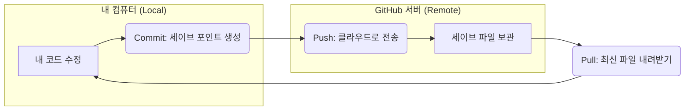
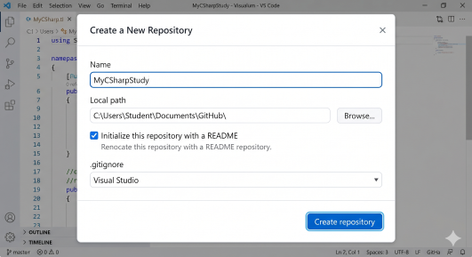
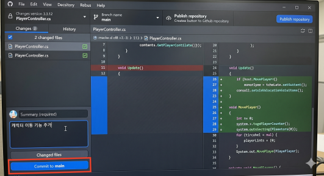

# 🚀 Git & GitHub 입문: 코드 타임머신 타기

오늘의 목표는 "**버전 관리의 개념을 이해하고, GitHub Desktop을 사용하여 내 코드를 안전하게 저장하고 공유하는 법을 배운다**"입니다.

---

## 1. 💡 Git과 GitHub, 무엇인가요?

### 🎮 Git (깃): "게임의 세이브 포인트"
게임을 하다가 중요한 순간에 '**세이브**'를 하는 것과 같습니다. 코드를 짜다가 실수를 해서 어제로 돌아가고 싶을 때, Git이 저장해둔 세이브 포인트(커밋)로 언제든지 돌아갈 수 있습니다.

### ☁️ GitHub (깃허브): "세이브 파일 클라우드"
내 컴퓨터에만 있는 세이브 파일을 인터넷 전용 공간(클라우드)에 올리는 곳입니다. 컴퓨터가 고장 나도 세이브 파일은 안전하며, 다른 사람과 함께 게임(협업)을 할 때도 필수적입니다.

---

## 2. 📚 꼭 알아야 할 Git 용어

| 용어 | 뜻 | 비유 |
| :--- | :--- | :--- |
| **Repository (저장소)** | 프로젝트가 들어있는 폴더 | **게임 팩/CD** |
| **Commit (커밋)** | 현재 상태를 기록하는 행위 | **세이브 하기** |
| **Push (푸시)** | 내 컴퓨터의 커밋을 서버로 올림 | **세이브 파일 클라우드 업로드** |
| **Pull (풀)** | 서버의 커밋을 내 컴퓨터로 가져옴 | **최신 세이브 파일 다운로드** |
| **Fetch (패치)** | 서버에 새로운 변경사항이 있는지 확인 | **업데이트 확인** |
| **Sync (싱크)** | 푸시와 풀을 한 번에 해서 상태를 맞춤 | **동기화** |
| **Branch (브랜치)** | 원래 코드에서 갈라져 나온 작업 줄기 | **멀티 엔딩을 위한 평행 세계** |

### 🔄 한 눈에 보는 Git의 흐름 (다이어그램)

---

## 3. 🛠️ GitHub Desktop 설치 및 세팅

터미널에 복잡한 명령어를 치는 대신, 마우스 클릭만으로 Git을 쓸 수 있는 **GitHub Desktop**을 사용해 봅시다.

### 1) 설치하기
1. [desktop.github.com](https://desktop.github.com/) 접속
2. **[Download for Windows]** 버튼 클릭 후 설치 파일을 실행합니다.

### 2) 로그인하기
1. 설치가 완료되면 **[Sign in to GitHub.com]** 버튼을 클릭합니다.
2. 웹 브라우저가 열리면 본인의 GitHub 계정으로 로그인하고 권한을 승인합니다.

---

## 4. 🖱️ GitHub Desktop 실전 사용법

### 1) 새 저장소(Repository) 만들기
내 코드를 관리할 전용 폴더를 만드는 과정입니다.

1. 메뉴에서 `File` -> `New repository`를 클릭합니다.
2. **Name**: 프로젝트 이름을 정합니다. (예: `MyCSharpStudy`)
3. **Local path**: 내 컴퓨터 어디에 저장할지 정합니다.
4. **Initialize this repository with a README**: 체크하면 설명 파일이 함께 생성됩니다.
5. **[Create repository]** 클릭!

---

### 2) 커밋(Commit): 세이브 포인트 만들기
코드를 수정했다면 기록을 남겨야 합니다.

1. VS Code나 라이더에서 코드를 수정하고 저장합니다.
2. GitHub Desktop의 왼쪽 **Changes** 탭에 방금 수정한 파일들이 뜹니다.
3. 하단의 **Summary** 칸에 무엇을 수정했는지 간단히 적습니다. (예: `캐릭터 이동 기능 추가`)
4. 파란색 **[Commit to main]** 버튼을 클릭합니다.

---

### 3) 푸시(Push): 클라우드에 올리기
커밋은 내 컴퓨터에만 저장된 상태입니다. 인터넷(GitHub)에도 올려야 안전합니다.

1. 상단에 있는 **[Publish repository]** (처음 한 번) 또는 **[Push origin]** 버튼을 클릭합니다.
2. 이제 GitHub 웹사이트의 내 계정에서도 코드를 확인할 수 있습니다!

---

### 4) 풀(Pull): 다른 사람의 내용 가져오기
협업 중이거나 다른 컴퓨터에서 작업한 내용을 가져올 때 사용합니다.

1. 상단의 **[Fetch origin]** 버튼을 눌러 업데이트가 있는지 확인합니다.
2. 업데이트가 있다면 **[Pull origin]** 버튼으로 바뀝니다. 클릭하면 내 컴퓨터 코드가 최신 상태가 됩니다.

---

## ✍️ 핵심 요약
1. 코드를 수정했다면? -> **Commit** (내 컴퓨터 저장)
2. 인터넷에 저장하고 싶다면? -> **Push** (서버 업로드)
3. 서버의 최신 코드를 받고 싶다면? -> **Pull** (내 컴퓨터 다운로드)

---
## ✍️ Git 핵심 퀴즈
1. 내 컴퓨터의 작업 내용을 GitHub 서버로 올리는 명령은 무엇인가요?
2. Git에서 "세이브 포인트를 만든다"는 뜻의 단어는 무엇인가요?
3. GitHub Desktop에서 버튼 한 번으로 푸시와 풀을 동시에 하는 행위를 무엇이라 부르나요?
