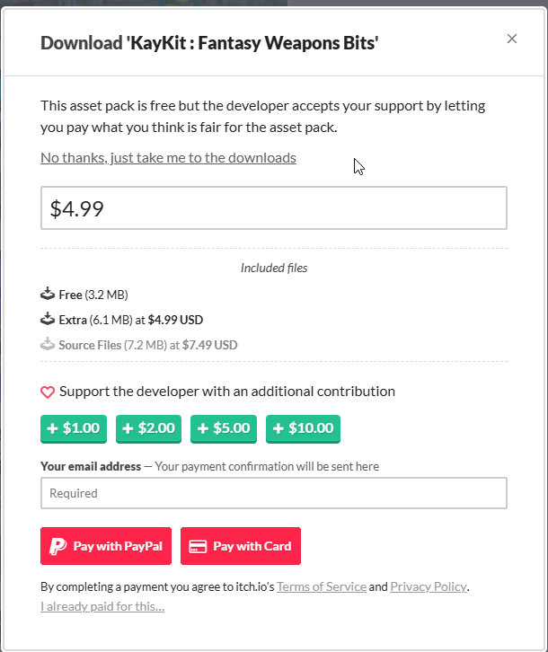

# 무료 에셋 가이드

## 왜 캐쥬얼 / 스타일라이즈드인가?

이 과제는 **기능 구현과 설계**가 핵심입니다.
캐쥬얼·스타일라이즈드 아트 스타일을 권장하는 이유는 다음과 같습니다.

**에셋 수급이 쉽다**

로우폴리·캐쥬얼 에셋은 CC0 무료 소스가 풍부합니다. Kenney, KayKit, Quaternius 등에서 캐릭터·환경·아이템을 한 세트로 맞출 수 있어 에셋 찾느라 시간 낭비할 일이 적습니다.

**스타일 통일이 쉽다**

리얼리스틱 에셋은 출처가 다르면 질감·조명·스케일이 안 맞아서 어색해집니다. 로우폴리·카툰 스타일은 출처가 달라도 톤이 비슷해서 섞어 써도 자연스럽습니다.

**아트 디테일 부담이 줄어든다**

리얼리스틱으로 가면 텍스처 해상도, 라이팅 세팅, 포스트프로세싱 등에 시간을 뺏기기 쉽습니다. 캐쥬얼 스타일은 이런 부분의 기대치가 낮아서 기능 구현에 집중할 수 있습니다.

**퍼포먼스 부담이 적다**

로우폴리 에셋은 폴리곤 수와 텍스처 크기가 작아서 최적화 고민 없이 프로토타이핑에 집중할 수 있습니다. 팀 프로젝트에서 병합 시 빌드 시간도 짧아집니다.

**게임플레이가 더 잘 보인다**

화려한 그래픽에 묻히지 않고, 구현한 기능(AI 패턴, 콤보, 트리거 시스템 등)이 더 명확하게 드러납니다. 채점하는 입장에서도 기능 확인이 편합니다.

---

## CC0 라이선스란?

CC0 (Creative Commons Zero)는 **저작권을 완전히 포기**한 퍼블릭 도메인 라이선스입니다.

- 상업적 사용 가능
- 수정 / 재배포 가능
- **깃허브 공개 리포에 포함 가능**
- 크레딧 표기 의무 없음

> 기간 한정 무료(Fab 격주 무료 등)는 CC0가 아닙니다.
이런 에셋은 깃허브에 올리면 라이선스 위반이므로 주의하세요.
> 

---

## 추천 무료 에셋 소스

### 스켈레톤(리깅) 포함

| 소스 | 스켈레톤 | 라이선스 | 스타일 | 비고 |
| --- | --- | --- | --- | --- |
| [Mixamo](https://www.mixamo.com/) | ✅ 포함 | 무료
(재배포 불가) | 다양 | Adobe ID만 있으면 무료, 캐릭터 + 애니메이션 풍부. `.gitignore` 처리 필요 |
| [Quaternius](https://quaternius.com/) | ✅ 일부 포함 | CC0 | 로우폴리 | 캐릭터·몬스터·환경 에셋, 애니메이션 포함 팩 있음 |
| [KayKit](https://kaylousberg.itch.io/) | ✅ 일부 포함 | CC0 | 로우폴리 캐쥬얼 | 캐릭터팩, 던전팩, 중세팩 등 시리즈 |
| [Kenney Animated Characters](https://kenney.nl/assets/category:3D?search=animat) | ✅ 포함 (자체 스켈레톤) | CC0 | 로우폴리 | 기본 애니메이션 3종 포함, UE 스켈레톤과 리타겟팅 필요 |

### 스켈레톤 미포함 (환경·소품·아이템)

| 소스 | 라이선스 | 스타일 | 비고 |
| --- | --- | --- | --- |
| [Kenney](https://kenney.nl/assets) | CC0 | 로우폴리 | 4만개+ 에셋, 환경·UI·아이템·이펙트 등 매우 풍부 |
| [Poly Pizza](https://poly.pizza/) | CC0 | 로우폴리 | 수천 개 3D 모델, 검색 편리 |
| [OpenGameArt](https://opengameart.org/) | CC0 필터 가능 | 다양 | 2D/3D 혼합, CC0 태그로 필터해서 사용 |
| [itch.io](http://itch.io) [CC0](https://itch.io/game-assets/assets-cc0/tag-low-poly) | CC0 | 로우폴리 | KayKit 시리즈 등 다수 |

---

## 아트 스타일 가이드라인

- **캐쥬얼 / 스타일라이즈드 권장** (로우폴리, 카툰 등)
- 에셋 퀄리티는 채점 대상이 아닙니다
- 기능 구현과 설계가 핵심입니다
- 에셋 간 스타일 통일만 신경 쓰면 충분합니다

---

## [ITCH.IO](http://ITCH.IO) 다운로드 가이드

- 상단의 No thanks를 눌러줍니다.
- 서포트 금액에 따라 다운로드 받을 수 있는 폭이 달라집니다.
- 여유가 생기면 개발자를 위해 구매를 해줍시다.

[크롭아웃 샘플 프로젝트](https://www.unrealengine.com/ko/blog/cropout-casual-rts-game-sample-project)

---

## FBX 임포트 설정 참고자료

[언리얼 FBX 임포트 설정 초보 가이드: 스태틱 메시와 스켈레탈 메시 구분 등 - 유정통 3D](https://yujungtong.com/%EC%96%B8%EB%A6%AC%EC%96%BC-fbx-%EC%9E%84%ED%8F%AC%ED%8A%B8-%EC%84%A4%EC%A0%95/)

[언리얼 엔진에서 FBX를 사용하여 스켈레탈 메시 임포트하기 | 언리얼 엔진 5.6 문서 | Epic Developer Community](https://dev.epicgames.com/documentation/ko-kr/unreal-engine/importing-skeletal-meshes-using-fbx-in-unreal-engine?application_version=5.6)

- Mixamo 리타게팅은 다들 잘 알고 있고, 특강 / 쪽문서로도 제공이 자주 됬으니 생략